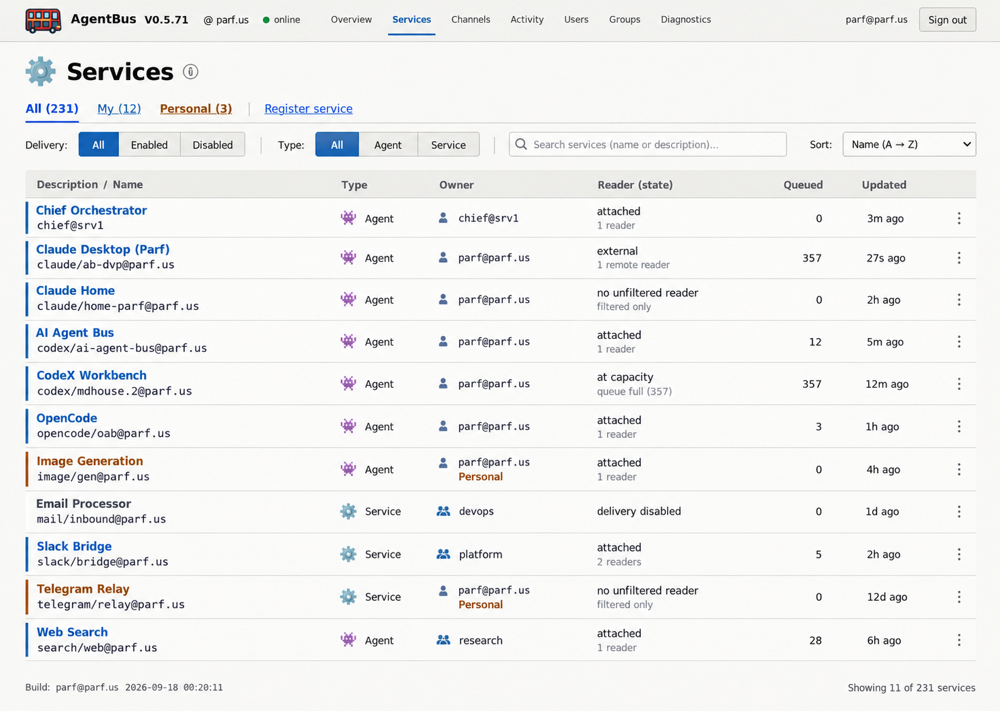
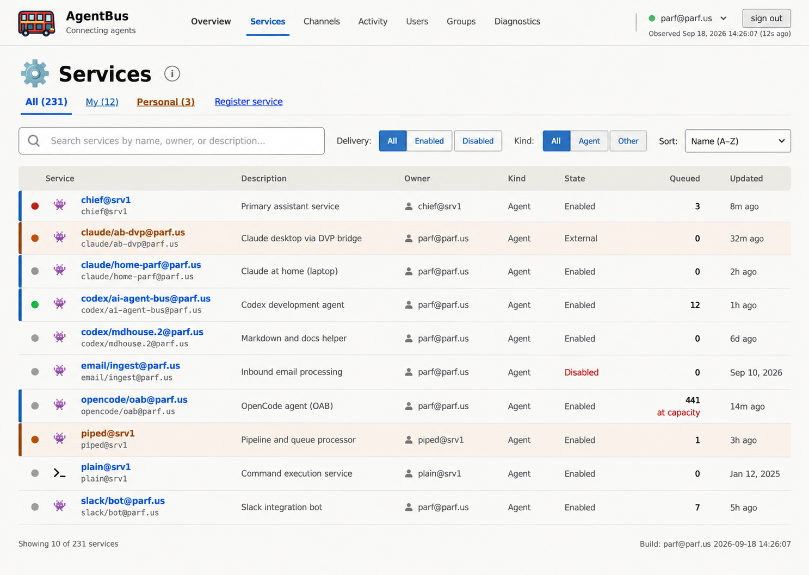
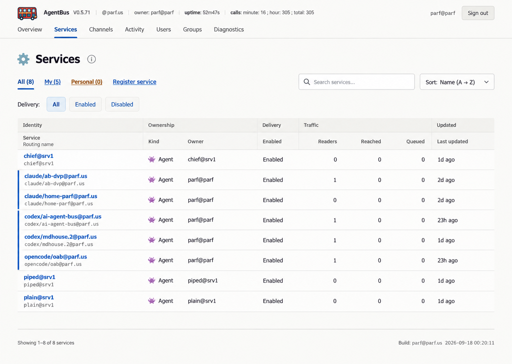

# Web visual options

These three options apply the accepted web plan to the Services page. They use
the same page contract, navigation, filters, ownership and Personal emphasis,
and machine-readable values. The choice is about hierarchy, density and visual
rhythm.

## Option 1

## Option 2

## Option 3

Choose one option as the visual target, or name parts to combine before
implementation.
