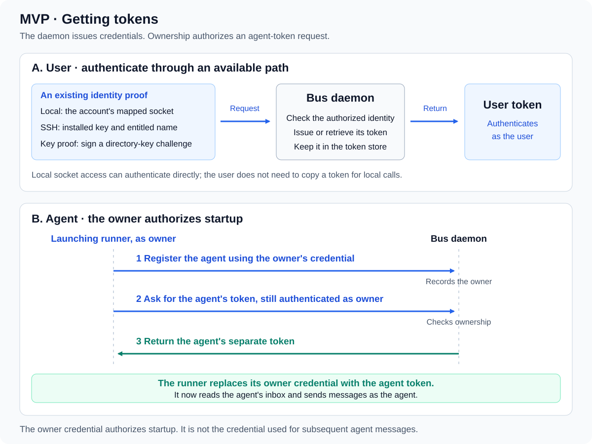
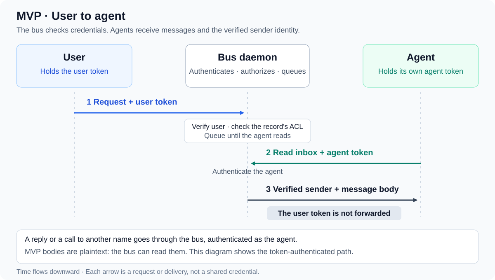

# R0.8

The MVP release.

📌 **TL;DR:** Somebody other than the author can install agent-bus and use it
safely on a shared host. MVP is complete (2026-09-23) and released on the 0.8
line; its follow-up is [constitution conformance](TODO.md#constitution-conformance).

## Purpose

Somebody other than the author can install it and use it safely on a shared host.
MVP is complete; its acceptance is in [DONE](DONE.md#done--mvp). The [0.6.0 record kinds](0.6.0-TODO.md#objective) plan closed `kind` into named kinds, six today.

The [0.7 constitution plan](0.7.0-TODO.md#objective) implements the owner's
[intended model](../../docs/constitution.md#project-constitution); it is stable at 0.7.20.

## Getting tokens

User token acquisition follows [access](../../docs/02-access.md#getting-a-token). Ownership authorizes an agent-token acquisition ([token scope](../../docs/02-access.md#what-a-call-carries)); the foreground runner obtains that credential before serving ([script agents](../../docs/08-runner-role.md#script-agents)).

## User to service

The daemon authenticates the caller and enforces the destination's access policy before delivery ([token scope](../../docs/02-access.md#what-a-call-carries), [ACL](../../docs/02-access.md#acl)). The service receives the message through its authenticated inbox read ([delivery](../../docs/04-messaging.md#push-and-pull)); replies use the [reply route](../../docs/04-messaging.md#reply-routing).

Mapped local accounts can authenticate through their [own socket](../../docs/02-access.md#local-socket). The diagram's plaintext boundary is defined in [access](../../docs/02-access.md#trust-boundary).

## Scope

[Current docs](../../docs/00-overview.md#document-ownership) own the MVP contracts. This table tracks what the release covers.

| Area | Status | Canonical contract |
|---|---|---|
| Identity, credentials and local isolation | Built | [identity](../../docs/01-identity-and-roles.md#scope), [access](../../docs/02-access.md#scope) |
| Registry, channels and private configuration | Built, including Personal classification and web grouping | [records](../../docs/03-records.md#status) |
| Messaging and restart persistence | Built, including administrative crash durability and explicit inbox selection | [messaging](../../docs/04-messaging.md#status) |
| API, CLI, MCP and web face | Built; the TypeScript web face under its own unit from 0.8.50, its installed container gates passed on 0.8.51; a real-browser rerun on an installed host is follow-up | [discovery](../../docs/05-discovery.md#status) |
| Foreground agents and adapters | Built, including launchers; live-runtime acceptance passed on the development and a fresh installed host | [runner](../../docs/08-runner-role.md#status) |
| Installation and service account | Package, setup, upgrade, reinstall and fresh-host acceptance passed | [setup](../../docs/09-setup.md#status) |
| Process isolation | Split, web authority isolation, resource limits and installed account/socket/capability acceptance built | [processes](../../docs/11-processes.md#status) |

## Boundaries

The MVP trusts the bus with bodies ([access § encrypted sessions](../../docs/02-access.md#trust-boundary)). Distributed identity, managed services and encryption are proposed in [R1](../R1.0-Release/README.md#scope). Other follow-up is indexed in [future work](FUTURE.md#follow-up).

## Evidence

[Completion log](DONE.md#done--mvp) records completed waves. [The original plan](done/TODO-before-rewrite.md#mvp-plan-before-the-documentation-rewrite) preserves task IDs and earlier acceptance detail; it is historical, not active work. Acceptance conventions live in [working rules](../../CLAUDE.md#verification).

## Web redesign

The web face was rewritten in TypeScript ([web plan](web/README.md#web-face-rewrite)) and cut over in 0.8.50. History: the earlier [web interface proposal](web-interfaces.md#proposal), the [browser and source review](done/web-review.md#scope) and [F.13](TODO.md#web-redesign).
