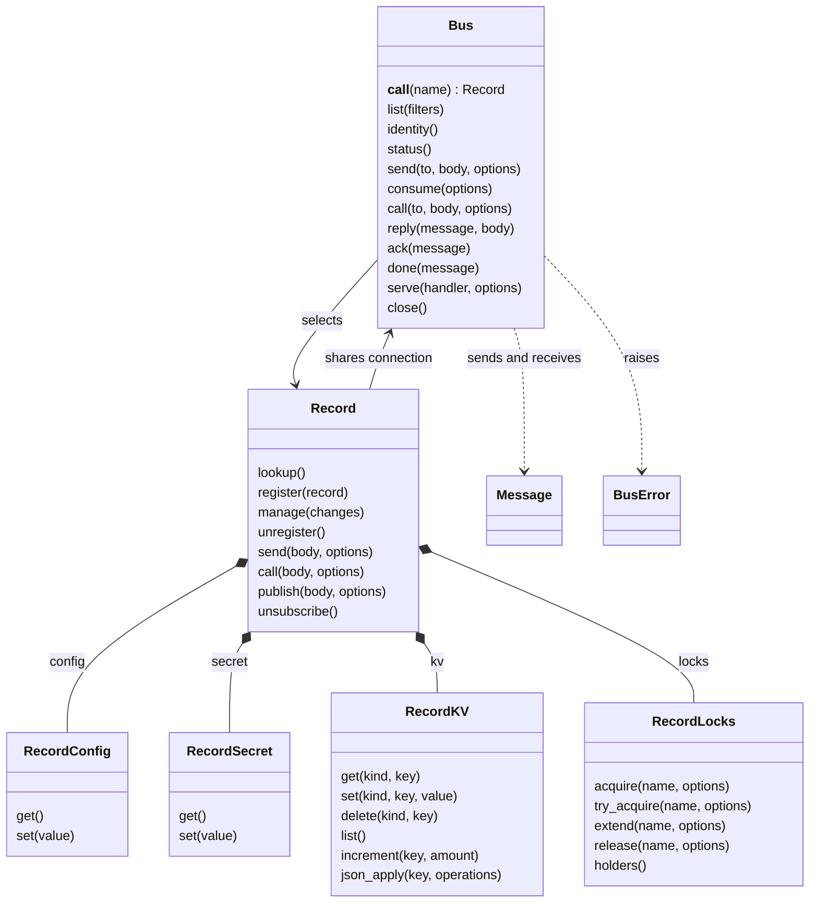

# Client libraries

## Scope

Proposal for Go, PHP, Python, Rust and TypeScript; not implemented or approved.
The same operations should have the same meaning in every language, with
idiomatic spelling. The shared protocol description remains [Q17](QUESTIONS.md#open-questions).

## Proposed methods

Names and signatures are placeholders for review. `Api.registry(name)` returns
a handle whose methods act on that named record. Its `kv` and `locks` namespaces
share that record binding; listing belongs to `Api.registry.list(filters)`.
The other methods belong to `Api`. `...` repeats the preceding lock name or
key arguments; this is not a wire format.

| Area | Methods |
|---|---|
| Connection | `connect(options)`, `close()`, `identity()`, `status()` |
| Registry | `Api.registry.list(filters)`; `Api.registry(name).lookup()`, `.register(record)`, `.manage(changes)`, `.unregister()` |
| Messaging | `send(to, body, options)`, `consume(options)`, `call(to, body, options)` |
| Responses | `reply(message, body)`, `ack(message)`, `done(message)` |
| Channels | `publish(channel, body, options)`, `unsubscribe(channel)` |
| Private values | `getConfig(name)`, `setConfig(name, value)`, `getSecret(name)`, `setSecret(name, value)` |
| Locks | `Api.registry(name).locks.acquire(lockName, options)`, `.locks.tryAcquire(...)`, `.locks.extend(...)`, `.locks.release(...)`, `.locks.holders()` |
| Key-value store | `Api.registry(name).kv.get(kind, key)`, `.kv.set(...)`, `.kv.delete(...)`, `.kv.list()`, `.kv.increment(...)`, `.kv.jsonApply(key, operations)` |
| Serving | `serve(handler, options)` |

The [daemon API](../../docs/09-daemon-api.md#how-a-call-is-made) supplies the
underlying operations. `call`, `reply`, `ack`, `done` and `publish` are helpers
over sends and consumes; they require no new daemon endpoints.

## Proposed behavior

| Operation | Behavior to review |
|---|---|
| Connection | Unix sockets and HTTP/HTTPS use the same client interface |
| `reply` | Respect `reply_to` and preserve correlation from the received message |
| `call` | Match replies by topic/tag; distinguish an answer, acknowledgment, completion and timeout |
| Concurrent calls | One inbox reader dispatches matching replies; calls do not steal one another's responses |
| Cancellation | Stop waiting; do not imply the remote work stopped |
| Retry | Do not automatically repeat an uncertain send: it may duplicate work |
| Config and secrets | Enforce the existing [private-values access rules](../../docs/constitution.md#-private-values); record visibility alone does not grant access |
| `getConfig` / `setConfig` | Read and write JSON through the dedicated configuration operations |
| `getSecret` / `setSecret` | Preserve the secret bytes; do not add a newline, parse them into environment variables, or include them in logs |
| Roles | Read-only received metadata; never a send option |
| `serve` | Consume, acknowledge before handling, then reply or send `done` on successful completion. Define failure handling explicitly |

Resource content reads need a separate adapter: the daemon holds the cards,
while the [MCP face resolves content](../../docs/03-records-resource.md#what-a-resource-is).

## Python class proposal

`Bus` names the connection; `Record` is a handle selected by `bus(name)`.
Selecting a handle makes no network request. All its namespaces share the
connection and record name. This is a naming proposal; sync/async and threading
remain for review. The diagram shows the main methods, not complete signatures.



```python
bus = Bus(...)
agent = bus("#worker@team")
agent.config.get()
agent.secret.get()
agent.kv.get("json", "jobs")
agent.locks.acquire("build", ...)
bus.serve(handler, ...)
```

## Review agenda

1. Naming and method signatures, including `serve`.
2. Synchronous and asynchronous interfaces in each language.
3. Parallel handlers and calls: concurrency limits and backpressure.
4. Threads: client sharing, inbox reader ownership and shutdown.
5. Completeness: credentials, groups, users, administration, resources,
   errors, deadlines and serving lifecycle against the daemon API.

Proposed implementation order: connection, registry and messaging first;
then locks, key-value and private values. The agenda comes before implementation.
