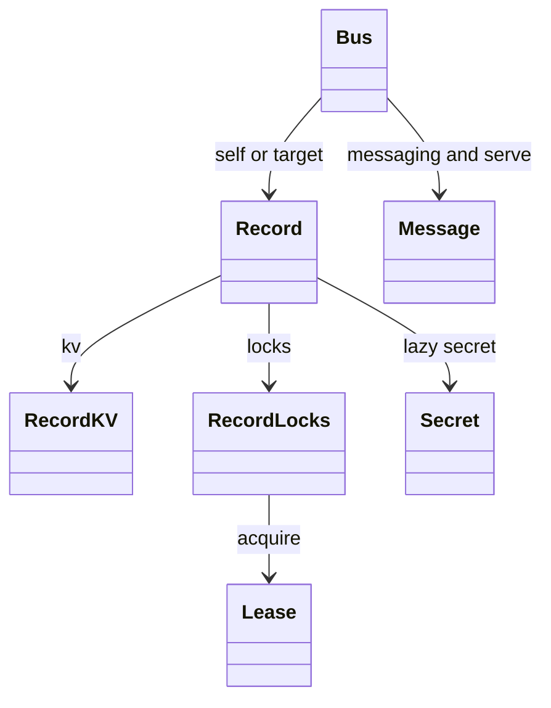

# Python client API

## Direction

Proposal, not implementation. Follow the [shared vision](../client-libraries.md#shared-vision).
Use a synchronous, thread-safe `Bus`, keyword arguments, context managers and
exceptions. Blocking private-value properties are accepted; other choices below
remain proposals. Async Python is a later mirror, not hidden event-loop work.

## Identity and handles

`Bus(name, *, addr=None, token=None, timeout=30)` means **act as that name**.
Construction does no I/O; first authenticated operation checks the actual caller
and raises `IdentityMismatch` before proceeding if it differs. A User account
socket does not automatically become an Agent credential. Credentials follow
[authentication](../../../docs/02-access.md#what-a-call-carries).

`bus.record(name)` returns a `Record` target without I/O or credential changes.
`bus.config`, `bus.secret`, `bus.kv`, `bus.locks` delegate to its own record.
Registry listing is `bus.records(...)`; creating a handle registers nothing.



```python
from agent_bus import Bus, CallReply, CallDone

with Bus("#worker@team", token=worker_token) as bus:
    config = bus.config
    jobs = bus.record("jobs@team")
    with jobs.locks.acquire("build", ttl=30, wait=10):
        jobs.kv.inc("attempts", by=1)
    result = bus.call("#builder@team", "build", timeout=10)
    if isinstance(result, CallReply):
        print(result.message.body)
    elif isinstance(result, CallDone):
        print("completed without an answer")
    bus.serve(handler, workers=4, stop=stop_event)
```

## Surface

`...` stands for keyword options, not additional wire fields. Times are seconds.

| Object | Proposed methods or properties |
|---|---|
| `Bus` | `identity()`, `status()`, `records(**filters)`, `record(name)`, `close()`; context manager |
| `Record` | `lookup()`, `register(**metadata)`, `manage(**changes)`, `unregister()` |
| `Bus` messaging | `send(to, body, **options)`, `call(to, body, *, timeout, on_receipt=None, **options)`, `consume(*, topic=None, tag=None, wait=...)` |
| `Bus` responses | `reply(message, body)`, `ack(message)`, `done(message)` |
| `Bus` channels | `publish(channel, body, **options)`, `unsubscribe(channel)` |
| `Bus` serving | `serve(handler, *, workers=1, stop=None, drain_timeout=...)` |
| `Record` private reads | `.config`, `.secret`, `refresh(*names)`; `Bus` exposes the self equivalents |
| `RecordKV` | `get(key, *, kind="string")`, `set(key, value, *, kind="string", mode="set")`, `delete(key, *, kind="string")`, `list()`, `inc(key, *, by=1)`, `json(key, *operations)` |
| `RecordLocks` | `acquire(name, *, ttl, wait=...)`, `try_acquire(name, *, ttl)`, `extend(name, *, ttl)`, `release(name)`, `force_release(name)`, `holders()` |
| `Lease` | `extend(ttl)`, `release()`; context manager, no automatic renewal |
| `Message` | Immutable received envelope; `reply(body)`, `ack()`, `done()` delegate to its originating client; roles are a tuple |
| `Secret` | Redacted `str`/`repr`; `reveal()` returns the exact bytes explicitly |

Body text stays text; do not silently parse a reply as JSON. `call` returns a
`CallReply` or `CallDone`; acknowledgments go to `on_receipt`, not the return
value. A deadline raises `BusTimeout`; cancellation does not cancel remote work.
Automatic correlation tags are unique per call, and replies honor `reply_to`.

## Private values

Accepted: `.config` and `.secret` fetch lazily, may block and cache successful
reads. One mutex per property coordinates its initial fetch; no global lock or
handler lock is held during I/O. Requests and waiting for the property are bounded
by the caller's deadline. Failed reads are not cached. Cache refresh is proposed
below; cache policy beyond initial loading is not settled.

Config returns a deep copy of cached JSON; absent config returns `None` because
that is the daemon's successful empty answer. Secret returns `Secret`; a missing
secret remains the daemon's refusal, not an inferred `None`. Neither property is
a setter. Access and supported kinds stay with the [private-values contract](../../../docs/constitution.md#-private-values).

`refresh("config", "secret")` invalidates the selected caches without fetching;
the next access reloads. An in-flight old fetch cannot repopulate an invalidated
cache. Previously returned copies remain with their callers, including after
revocation. Cache state belongs to the client, not a promise of current authority.

## Serving, calls and threads

One internal dispatcher owns the inbox; threaded calls share its pending-call
table. A raw `consume` is exclusive with serving and outstanding calls, and a
conflicting mode raises `ReaderInUse` before consuming. A handler can call another
Agent through the same Bus without creating another reader.

Reserve a worker slot before an unfiltered consume. While all slots are busy,
the dispatcher can drain exact pending-call filters, scheduling them fairly and
interrupting polls when state changes; it does not take another handler job.
The precise polling schedule is for implementation review, using existing filters.
This avoids both work prefetch and a full-pool handler-call deadlock.

`serve` acknowledges a work message before invoking `handler(message)`. A text
return replies; `None` sends done. A handler that replies explicitly suppresses
a second automatic completion. Receipt messages never cause receipt loops.
An exception reports failure locally and sends neither reply nor done; no automatic
re-delivery. Stop cancels the poll, drains handlers to the deadline and reports
unfinished work. Already consumed work is not put back implicitly.

Use a separate long-poll connection and short-request connections. Bus handles
may be shared by threads; cached data is copied and callbacks run outside locks.
CPU-bound handler parallelism is not promised by a thread pool ([Python threads](https://docs.python.org/3/library/threading.html)).
After fork, reject use of the inherited Bus and construct a new client. Async
applications must offload blocking calls; this client does not nest event loops.

## Storage, errors and scope

KV `string` returns `str` for UTF-8, otherwise `bytes`; integers are range-checked
against signed 64-bit limits. JSON storage takes an object. Set modes are `set`,
`add`, `replace`; JSON operations retain the daemon names `set`, `unset`, `inc`,
`push`, `unshift`, `shift`, `pop`, `add_to_set`, `remove_from_set`. List keeps kinds
separate; ordered operations execute atomically on the daemon.

Locks return a Lease on success; any daemon refusal, including try-acquire and
self re-acquisition, raises `Refusal`. A lease is local bookkeeping, not a fencing
token. Do not release automatically after its known expiry; the daemon has no
acquisition ID to distinguish a later lease of the same principal.

Exceptions: `BusError`, `Refusal(status, message)`, transport/timeout/cancelled,
identity mismatch, local validation and reader-mode errors. Keep original refusal
text; never classify multiple 403/409 reasons by parsing it.

First scope includes registry, messaging, channels, serving, private reads, KV
and locks. Credential minting/enrolment and user/group/account administration,
activity/debug APIs and resource content reads are outside this first proposal.
Existing credentials are accepted; close never unregisters automatically.
