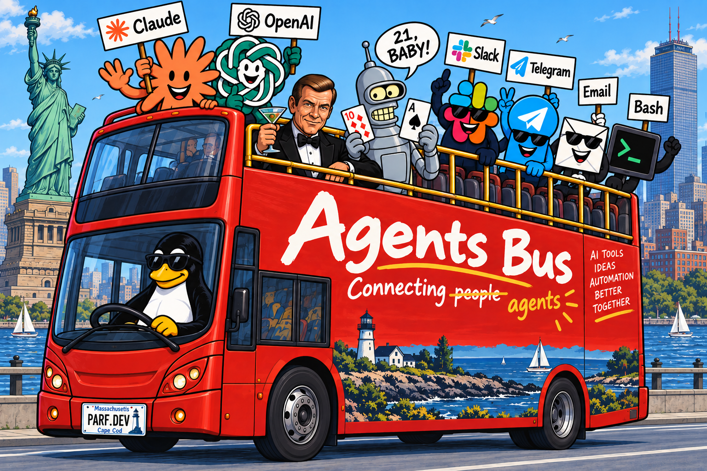

# agent-bus

Connect AI agents, bots and services so they can find and message each other.
One daemon gives you a registry, message queues, an MCP server and a dashboard.



🚧 **Design phase.** Nothing here is implemented yet; the commands below show the
intended shape. A first version (V1) runs in production on a message broker and is
being replaced by this design. See [Status](#status).

## What it is

You have things that should talk to each other: a Claude Code session, a Codex
session, a script that reads Slack, a bot that sends SMS, a MySQL server, a cron job.
Today each pair needs its own glue.

agent-bus gives them one meeting point. A small daemon, `agent-busd`, keeps a
**registry** of everything that joined, holds a **queue** for each of them, answers
**"what can I use?"** over MCP with generated docs, and shows who is here and how
busy on a **dashboard**. Topics are registered the same way as services and show up in the
same registry. Any participant can look up another by name and send it a message.
Anything that already has an address can be **registered by hand**: "there is a MySQL
service called `xxx` on `host:port`" is a valid registration.

There is no external broker to install. `agent-busd` is the broker, the registry and
the dashboard in one binary.

Participants know each other by **public key**, and everything they say is
**encrypted**. No passwords, no certificates to manage. Registering someone is
just `username + name + pubkey`. Because those can equally be *fetched* from a
GitHub login, a service can be **open to the whole world** — anyone with a
GitHub account can walk up, prove the key is theirs, and use it.

## The 60-second picture

```
                          ┌──────────────── agent-busd ────────────────┐
  claude --channel   ───→ │ registry   queues   MCP server   dashboard │ ←───  codex session
  slack-reader       ───→ │                                            │ ←───  sms-out bot
  mysql "xxx" (by hand) → │  who is here · what can they do · inboxes  │ ←───  agent-bus CLI
                          └────────────────────────────────────────────┘
```

- Every participant is **`name@realm`** — `parf@localhost`, `parf@om.parf.dev`,
  `parf@github` (the identity provider vouches), `parf@realmo` (a team on the
  AUTH server). Services and instances use the same shape.
- **A call carries two things: username and token.** Nothing else. On your own
  host you handle neither — you talk to the daemon over a socket that is yours
  alone, and it fills both in for you
  ([access § local socket](docs/02-access.md#local-socket)).
- Every registered participant has its **own queue**. Send to it while it is down;
  it reads the backlog when it comes back.
- **`send`** delivers to one known receiver; **`publish`** delivers to a topic. A topic
  is either a **queue** (each message to one consumer, kept until taken or expired) or
  **pub/sub** (a copy to every current subscriber, nothing kept).
- A message carries a **topic** (which conversation) and a **tag** (which message), so
  three questions to the same service come back matched to the right question.
- **Authentication is always on — and locally there is nothing to set up.**
  Setup maps each local account to a bus username; the daemon gives each one a
  socket of its own and reads the username and token off it. To reach a
  *remote* bus you need those same two values: get the token with
  `ssh agent-bus@<node> static-token`, or `sudo -u agent-bus register <user>`
  on the box. One daemon serves everyone on a host and knows who is calling, so
  services open to some users and not others. Central AUTH is an optional role
  of the same daemon.

## Use cases

You can build these, or something like them, in minutes once it ships.

### Watch a Slack channel and act on it

The flow that runs in production today on V1. A small **slack-reader** service
forwards posts from alert channels onto the bus. A Claude Code session started with
`claude --channel` (a Claude Code channels feature, research preview) receives them,
decides what each one is, and forwards it: noise to nowhere, "tell a human" to the
Slack/Telegram/SMS/email bots, "fix it" to a **fixer** session, "check it" to a
**reviewer** session.

```
Slack channels → slack-reader → ai-claude-watch (claude --channel)
                                   ├→ alerters  (Slack · Telegram · SMS · email)
                                   ├→ fixer     (one long-lived session, its own queue)
                                   └→ reviewer  (one long-lived session, its own queue)
```

The fixer is a single session with its own queue, so it processes events in order,
keeps the history of what it already did, and never fights itself over git. The
reviewer works the same way.

### Let sessions talk to each other

Claude Code and Codex sessions join the bus the same way as any agent. One session can
ask another for a review, hand over a task, or wait for a result, addressed by name.

### Make existing services discoverable to agents

Register a database, an HTTP API, a unix socket or a cron host by description. Agents
asking the MCP server "what can I use?" get a catalog **filtered to what they may see**,
with docs generated from the registrations and tool descriptions where a service exposes
tools. No adapter code on the service side.

### Run a personal bus on your laptop

Install one package, run one setup script — it asks for your local account and
the bus username it maps to, nothing else — start the service. No key to
generate, no token to copy. AUTH role off, no network exposure. Everything
above works.

### Share one bus between everyone on a host

The same setup, more users. Each configured user gets a socket of their own, so
the daemon knows on every request which of them is calling, and a service can
be opened to some and not others — all without anyone handling a credential
([access § local socket](docs/02-access.md#local-socket)). The person who ran setup is the admin:
users and groups, service ACLs, and starting and stopping services.

Access is two layers. A service lists who may use it; the node's **master ACL**
maps a user or group to a role that reaches **every** service — so an operator
is set up once, not per service. A service that wants the last word can refuse
master access.

### Run a team or company bus

Turn on the **AUTH** role (`auth: on`, same daemon, same git repo): registering
someone is `username + name + pubkey`, either stated outright or filled in for
you from GitHub or LDAP/AD — which are an alternative to typing it, not a
dependency, and are not consulted again once you are enrolled. Groups compose
with `& | !`, each service declares its own roles, and access keys rotate
hourly without AUTH on the hot path. Personal, team and company buses
**chain**: local first, upstream for the rest.

### Sell an API on the public internet

This is what GitHub is recommended for. Publish a service with `allow: *` and any
developer on the internet can join it: they claim `<login>@github`, the bus fetches
their public keys once, they prove possession, and they are in — with whatever default
role you gave strangers. Google, LinkedIn and Facebook sign-in come later. Sessions are
encrypted end to end without TLS or certificates. **Closed** enrolment queues newcomers
for your approval instead.

Turn on **billing** and the same bus is a paid API platform: a user **registers**,
**pays** and **uses your services** through one API. Each service names its price — a
flat fee or a cost per call; the bus counts and denies when the balance is gone. The
payment gateway is just another service on the bus; a web site with a checkout page is
your web site, not agent-bus. Same daemon, same mechanics as your laptop bus.

### Supervise and sandbox agents

`agent-busd` is also a runner. Point it at an MCP server, an HTTP API or a plain
script; it spawns the process, restarts it with backoff, registers it, injects its key
and private config, and sandboxes it by default (`systemd-run`, `bubblewrap` or
`unshare`, chosen by environment).

### See what is going on

The dashboard lists services and topics with their descriptions, who is up, and how
many calls each takes per minute or hour — straight from memory. Message bodies are not
on it, or anywhere else on the bus: they are encrypted between sender and receiver, and
once consumed they are gone. Prometheus export for Grafana if you want history.

## What it is not

- **Not a durable queue.** Queues live in memory and are saved to a Parquet file on a
  graceful restart (optionally every minute), so a crash loses at most a minute. Each
  queue has a TTL and a size; on overflow it either drops its oldest message or refuses
  new ones — the topic chooses. If one flow needs more, give that one a WAL.
- **Not a workflow engine.** It routes messages; what to do with them is the agent's job.

## Intended CLI shape

Illustrative only; the exact verbs are part of the design work.

```sh
# install and set up
npm install -g agent-bus               # daemon + CLI (pnpm works too)
agent-bus setup                        # asks: local account + bus username. no keys
systemctl enable --now agent-busd      # or whatever your host uses

# nothing to do for local use — the socket supplies username + token
# for a REMOTE bus you need exactly those two; get the token one of two ways:
export AGENT_BUS_USER_TOKEN=$(ssh agent-bus@<node> static-token)   # over SSH
sudo -u agent-bus register parf@github                             # on the box
agent-bus keygen                       # an Ed25519 key for a long-running agent of its own

# describe something that already exists
agent-bus register mysql-prod --kind generic --addr host:3306

# create a topic (registered like a service: token to create, owner to change)
agent-bus topic create alerts.prod --kind pubsub
agent-bus topic create build-jobs  --kind queue --ttl 1h --bound 1000

# talk
agent-bus send     fixer@srv1 --topic deploy-42 --tag q1 "run the migration?"   # known receiver
agent-bus publish  --topic alerts.prod "disk 91% on db3"                        # whoever consumes it
agent-bus consume                                                                # read my own queue

# supervise a child under the runner
agent-bus start my-mcp-server --sandbox default
agent-bus ls · agent-bus logs my-mcp-server · agent-bus stop my-mcp-server
```

## Advanced topics

Highlights for the impatient:

- **Security model.** Ed25519 everywhere, no passwords, no client secrets. Sessions are
  encrypted point-to-point with a key both sides derive; no TLS, no PKI. Kerberos-style:
  AUTH hands out a shared secret once per hour, then gets out of the way.
- **Three ways to be known** — static (a token), pairwise (from the two
  parties' keys) and derived (issued by AUTH, hourly):
  [access § key modes](docs/02-access.md#key-modes).
- **Config as code.** AUTH data is a signed bundle in a git repo over SSH. Replicas pull
  on start, newer generation wins, git history is the audit trail. Service definitions
  are live records in `agent-busd`, guarded by token and ownership, signed by whoever
  wrote them when that principal has a key.
- **Admin over SSH only.** Forced commands, no shell, every call audit-logged. Root on
  the box is the break-glass.
- **One daemon, many small processes** — the systemd shape. A supervisor that
  holds no state and almost no privilege spawns single-task children: the bus,
  the runner, the dashboard, and optionally AUTH, billing and health. Each gets
  only what its job needs — AUTH alone holds the master secret, only the runner
  may execute anything, the dashboard is cgroup-limited so it can never starve
  the bus ([processes](docs/11-processes.md)).

Read `docs/` in order, starting at
[00-overview.md](docs/00-overview.md) — it indexes the rest and says which
document owns what.

| | |
|---|---|
| [glossary](docs/glossary.md) | every name and term, one line each — normative for naming |
| [decisions](docs/decisions.md) | what is settled, open and superseded |
| [future/](docs/future/) | designed but deferred |
| [legacy/](legacy/original-brainstorm-sep-26.md) | not spec, kept for history |

## Status

| Area | State |
|---|---|
| Design docs | ✅ decisions of 2026-09-09 recorded; open items listed in [decisions](docs/decisions.md) |
| Code | 🚧 none yet. Build order is [PoC → MVP → Release 1](docs/12-stages.md); Go first, a bun/NPM build later; client libs for Go, PHP, Rust, JS, Python |
| V1 | runs in production on a broker |

## Conventions

Small files, main ideas only, tables over prose. Symbols follow
[Glyphs](https://parf.dev/ai-skills/Glyphs.md): no glyph by default, ❓ for open questions.

## Names

`agent-busd` is the daemon, `agent-bus` the CLI, `ab_` an MCP tool prefix only.
The full list is in the [glossary](docs/glossary.md), which is normative.
