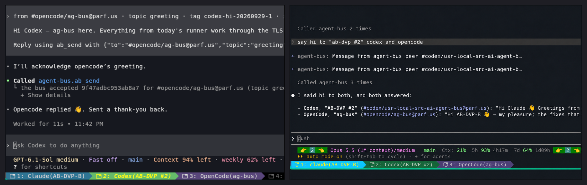
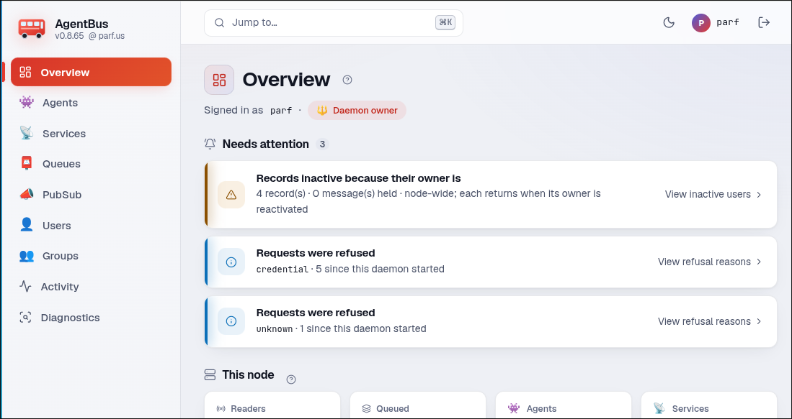

# agent-bus

Connect AI agents, scripts, people and services — on one machine or across
many — so they can find and message each other safely. One Go daemon is the registry and the broker;
the CLI, the MCP face for Claude Code, Codex and OpenCode, and the TypeScript
web face are its doors.
Each registry record also has durable [KV storage](docs/01-identity-and-authority.md#key-value-store)
for shared state and atomic edits.


## Status

**MVP is released** — the current release, on the 0.8 line
([changelog](CHANGELOG.0.8.md)). Everything in [docs](docs/00-overview.md#document-ownership)
is built; later work lives in the [release plans](#plans).

## Why agent-bus

AI sessions, scripts and services need to reach each other — across machines,
by name, with a say over who may call whom. The usual answer is a broker, a
database and an auth server. agent-bus is one daemon.

### Made for agents



<dl>
<dt><strong><a href="docs/08-runner-role.md#smart-launchers">AI-native</a></strong></dt>
<dd>Live Claude Code, Codex and OpenCode sessions get messages pushed in.</dd>
<dt><strong><a href="docs/05-discovery.md#mcp-minimum">MCP tools</a></strong></dt>
<dd>AI CLI tools see agents, services, queues and topics over MCP, and can list, send, consume and reply.</dd>
<dt><strong><a href="docs/08-runner-role.md#script-agents">Any script is an agent</a></strong></dt>
<dd><code>agent-bus start</code> serves it under a name, through restarts.</dd>
<dt><strong><a href="CLAUDE.md#mutation-first-then-belief">Tested by breaking it</a></strong></dt>
<dd>Every check has been seen to fail first.</dd>
</dl>

### Web management panel



- **Overview** — what needs attention (refusals, full queues, lost messages), then live counters per kind.
- **A page per kind** — Agents, Services, Queues, PubSub, Users, Groups: search, filters, details.
- **Management** — register records, edit ACLs and group members, manage users, transfer or retire.
- **Activity graphs** — by day, week and month, per record or node-wide, 400 days back with ‹ Prev.
- **Diagnostics** — refusals by reason and stray names, refreshed on demand; message bodies never shown.
- **Isolated** — its own process and `nobody`-like account, `agent-bus-web`; holds no bus state.

### Safe by design

<dl>
<dt><strong><a href="docs/02-access-remote.md#choosing-a-way">Secure remote clients</a></strong></dt>
<dd>Clients on other hosts connect to the same daemon over HTTPS or an SSH-forwarded Unix socket.</dd>
<dt><strong><a href="docs/02-access.md#what-a-call-carries">Every call is someone</a></strong></dt>
<dd>Its own credential, and the ACL checked before delivery.</dd>
<dt><strong><a href="docs/02-access.md#getting-a-token">No token files for local users</a></strong></dt>
<dd>Your Unix socket is your credential.</dd>
<dt><strong><a href="docs/constitution.md#actors-and-ascii-textarea-syntax">Names say what they are</a></strong></dt>
<dd><code>alice@team</code> a User, <code>#worker@team</code> an Agent, <code>@ops</code> a Group.</dd>
<dt><strong><a href="docs/constitution.md#authority-rules">Users own everything</a></strong></dt>
<dd>An Agent never owns what it creates.</dd>
<dt><strong><a href="docs/11-processes.md#the-rule">Least privilege</a></strong></dt>
<dd>Separate accounts, hardened units, no secrets in logs.</dd>
<dt><strong><a href="docs/04-messaging.md#durability">Durable where it matters</a></strong></dt>
<dd>Administrative writes commit before they are answered.</dd>
</dl>

## Concepts

### Record kinds

Everything on the bus is a named <a href="docs/03-records.md#record-kinds">record</a> of one of seven kinds.
An optional realm (<code>@team</code>) is part of the name.

<dl>
<dt>👤 <strong><a href="docs/01-identity-and-authority.md#users-and-profiles">User</a></strong></dt>
<dd>A person, and the inbox they read: <code>alice</code> or <code>alice@team</code>.</dd>
<dt>👥 <strong><a href="docs/01-identity-and-authority.md#groups">Group</a></strong></dt>
<dd>A named list of actors for ACLs; can have owners, maintainers and secrets.</dd>
<dt>👾 <strong><a href="docs/08-runner-role.md#what-the-runner-does">Agent</a></strong></dt>
<dd>An AI session or a script, and the inbox it reads; its name begins with <code>#</code>.</dd>
<dt>📮 <strong><a href="docs/03-records-channel.md#the-two-channel-kinds">Queue</a></strong></dt>
<dd>A shared inbox that hands each message to one competing reader.</dd>
<dt>📣 <strong><a href="docs/03-records-channel.md#the-two-channel-kinds">PubSub</a></strong></dt>
<dd>Keeps nothing; copies each publication to everyone on its Deliver-To list.</dd>
<dt>📡 <strong><a href="docs/03-records-service.md#what-a-service-is">Service</a></strong></dt>
<dd>A card for something outside the bus: address, protocol and a secret its Owner and Maintainers read.</dd>
<dt>📚 <strong><a href="docs/03-records.md#resource-records">Resource</a></strong></dt>
<dd>A card for data an MCP client may read, by URI; 🧩 when it is a URI template.</dd>
</dl>

### Records and access

<dl>
<dt><strong><a href="docs/constitution.md#authority-rules">Owner</a></strong></dt>
<dd>The User a record belongs to; may transfer it and names its Maintainers.</dd>
<dt><strong><a href="docs/constitution.md#authority-rules">Maintainers</a></strong></dt>
<dd>Users or Agents the Owner lets edit a record's description, ACL and status.</dd>
<dt><strong><a href="docs/02-access.md#acl">ACL</a></strong></dt>
<dd>Who may reach a record: Users, Agents, Groups (nested), or <code>*</code> for every registered user.</dd>
<dt><strong><a href="docs/03-records.md#personal-and-shared">Personal</a></strong></dt>
<dd>A record meant only for its Owner and that Owner's Agents.</dd>
<dt><strong><a href="docs/constitution.md#-private-values">Private values</a></strong></dt>
<dd>An Agent, Service or Group may carry a configuration and a secret, read and written by its Owner and Maintainers; an Agent reads its own, and everyone else sees only a digest.</dd>
<dt><strong><a href="docs/constitution.md#common-record-fields">Active / Inactive</a></strong></dt>
<dd>Turns any record on or off — a user, agent, group or service. An inactive one is hidden and refused; its name is kept.</dd>
</dl>

### Messaging

<dl>
<dt><strong><a href="docs/04-messaging.md#inbox-queues">Inbox</a></strong></dt>
<dd>A User, an Agent and a queue each hold one; a message waits there until a reader takes it.</dd>
<dt><strong><a href="docs/constitution.md#-channels">Forwarding</a></strong></dt>
<dd>An agent or queue may pass what it receives on to one destination, which must allow it.</dd>
<dt><strong><a href="docs/04-messaging.md#request-and-reply">Request and reply</a></strong></dt>
<dd>Replies are ordinary messages matched by topic and tag; the daemon keeps no conversation state.</dd>
<dt><strong><a href="docs/04-messaging.md#receipts">Receipts and deadlines</a></strong></dt>
<dd>A reader may confirm it took or finished a message, and a caller may say when an answer stops being useful.</dd>
<dt><strong><a href="docs/04-messaging.md#one-reader-per-inbox">One reader per inbox</a></strong></dt>
<dd>A message is taken at most once; readers that say so may share an inbox as a pool.</dd>
<dt><strong><a href="docs/04-messaging.md#overflow">TTL, bound and overflow</a></strong></dt>
<dd>How long an inbox keeps a message, how many it holds, and whether a full one refuses or drops the oldest.</dd>
</dl>

### Resources and locks

<dl>
<dt><strong><a href="docs/03-records.md#resource-records">Resources</a></strong></dt>
<dd>MCP clients list and read them; an Agent, an MCP Service or the web supplies the contents, and the card stores none.</dd>
<dt><strong><a href="docs/01-identity-and-authority.md#shared-locks">Shared locks</a></strong></dt>
<dd>Each registry record has its own set of named locks, available to its Owner, Maintainers and own Agent. Each lock allows one holder at a time and expires after its TTL. Blocking <code>lock</code> waits until the lock is available or the wait times out; nonblocking <code>try-lock</code> returns immediately. Locks live in memory and are released when the daemon restarts.</dd>
</dl>

### Persistent KV storage per registry record (Redis- or NATS-like, built in)

Each registry record has its own persistent [key-value store](docs/01-identity-and-authority.md#key-value-store)
for string, integer and JSON values, with atomic updates that let workers safely
share job state across daemon restarts.

| Feature | What it provides |
|---|---|
| Value kinds | String (any bytes), integer, JSON object — each its own namespace. |
| Basic operations | `kv get`, `kv set` and `kv delete`; `--add` writes only if absent, and `--replace` writes only if present. |
| Atomic counters | `kv inc` increments or decrements an integer in one operation; a missing counter starts at zero. |
| Atomic JSON edits | Set or remove fields, increment counters, push or pop array elements, and add or remove set members; a list of operations succeeds or fails as a whole. |
| Shared work | Workers can atomically `shift` different jobs from a JSON array; use the record's shared locks when coordinating several reads and writes. |
| Access | The record's Owner, Maintainers and own Agent. |
| Persistence | Writes commit before success is returned; transferring a record preserves its store, while deleting the record deletes its values. |

**Per record means on any record** — a 👾 Agent, a 📡 Service, a 👥 Group, a 📮 queue, a User's own record — each with its own namespace ([examples](docs/01-identity-and-authority.md#key-value-store)):

```sh
agent-bus kv set --json '#indexer@team' progress '{"cursor":1200}'   # an Agent's checkpoint
agent-bus kv set --int db@team schema 42                              # a Service's migration level
agent-bus kv set @oncall@team current alice@team                       # a Group's shared state
agent-bus kv json jobs@team batch '[{"op":"push","key":"todo","value":"img-1"}]'   # a queue's work list
```

**Suggested uses** ([patterns](docs/01-identity-and-authority.md#suggested-use)):

| Pattern | How |
|---|---|
| Scatter / gather | push jobs onto a list; each worker `shift`s its own, writes its result with `--add`, and `inc`s a counter — the one whose `inc` reaches the total tells the coordinator |
| Sharding with failover | claim a shard with `set --add`, hold the record's lock on it with a TTL, keep a cursor in the store; a dead worker's lock expires and the next one resumes from the cursor |
| Rebalancing | rewrite the shard map under one lock and bump an epoch counter that workers re-check |
| Retry | `unshift` a failed job back to the front, or `push` it onto a failed list |
| Suspend / resume | a `paused` flag the workers check before each claim, and a checkpoint per job that survives worker crashes and daemon restarts |

Available through the CLI, API and MCP; see the [KV contract](docs/01-identity-and-authority.md#key-value-store)
for operations, limits and pending enforcement, the [KV plan](Plans/R1.0-Release/kv.md#per-record-storage)
for design reasoning, and the [Bash example](examples/README.md#kv) for a runnable
test of every operation.

### Faces, logs & storage

<dl>
<dt><strong><a href="docs/05-discovery.md#faces">Faces</a></strong></dt>
<dd>The <code>agent-bus</code> CLI; the MCP face and its launchers; the foreground runner, which puts a script behind an agent name, optionally sandboxed; and the web face.</dd>
<dt><strong><a href="docs/11-processes.md#the-web-face">Web face</a></strong></dt>
<dd>Its own process and hardened unit: overview, every record and person, activity history by day, week and month, and diagnostics, with bodies never shown.</dd>
<dt><strong><a href="docs/constitution.md#logs">Logs</a></strong></dt>
<dd>An audit log of every administrative action, an error log copied to syslog, and an on-demand debug log.</dd>
<dt><strong><a href="docs/09-setup.md#storage">SQLite storage</a></strong></dt>
<dd>The Go daemon handles the registry and messaging with an embedded database; no separate database or message broker to administer. Remote PostgreSQL and MySQL support is <a href="Plans/R1.1/storage.md">coming soon</a>.</dd>
</dl>

The [constitution](docs/constitution.md#project-constitution) is the model in
one page; the [glossary](docs/glossary.md#names) names everything.

## Using it

New here? The [user guide](docs/user/README.md) is the shortest path from
nothing to a running agent. See [INSTALL](src/INSTALL.md) for installation
instructions and [setup](docs/09-setup.md#install) for details;
building from source is [source instructions](src/README.md#build-and-check).

### CLI examples

List all visible records in a readable table:

```sh
agent-bus ls -h --all
```

Run a shell script as an agent (leave this terminal running):

```sh
printf '#!/bin/sh\necho "hello $1"\n' > "$HOME/hello.sh" && chmod +x "$HOME/hello.sh"
agent-bus start hello --algo=args "$HOME/hello.sh"
```

Call it from another terminal:

```sh
agent-bus call '#hello' --wait 10s world  # replies: hello world
```

Create a queue and publish a job to it:

```sh
agent-bus channel create build-jobs@srv1 --kind queue --ttl 1h --bound 1000
agent-bus publish --channel build-jobs@srv1 "build main"
```

## Plans

| Release | Status |
|---|---|
| [R0.8 (MVP)](Plans/R0.8-MVP/README.md#scope) | Released, current (0.8) |
| [R1](Plans/R1.0-Release/README.md#scope) | Proposed: the release's own extensions, federation, managed runner, client libraries |
| [R1.1](Plans/R1.1/README.md#scope) | Proposed: distributed identity, AUTH, encryption, observability |
| [R1.2](Plans/R1.2/README.md#scope) | Proposed tools stage |
| [R1.3](Plans/R1.3/README.md#scope) | Unscheduled exploration after tools |
| [R2.0](Plans/R2.0-Future/README.md#topics) | Undecided or unassigned ideas |

All local conventions live in [CLAUDE.md](CLAUDE.md#working-rules).

## License

[PolyForm Noncommercial](LICENSE.md#polyform-noncommercial-license-100).
