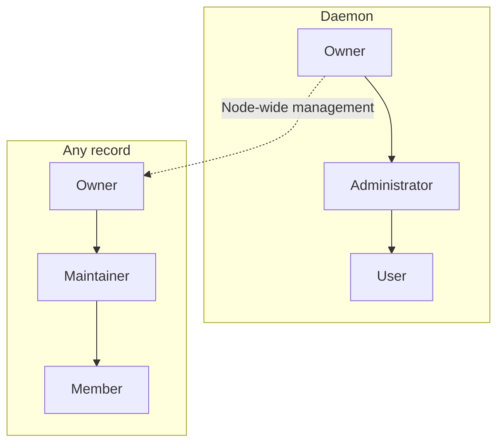

# Identity and roles

📌 **TL;DR:** The Owner controls the node, Administrators manage users and
groups, and Maintainers manage the resources assigned to them. Names,
profiles, registration, record ownership and nested groups are owned here;
credentials and checks belong to [Access](02-access.md#what-a-call-carries).

## Scope

Names, profiles, registration, resource ownership and nested groups are built.
The role model below also includes **accepted, pending changes**, marked where
relevant; [implementation work](../Plans/MVP/TODO.md#authority-model) and
[open choices](../Plans/MVP/QUESTIONS.md#open-questions) stay in the plans.

## Identities

A **User** is a registered person. A **principal** is the identity a credential
represents; it must have a user profile or a registry record to use the bus.
A record is one of [five kinds](03-records.md#five-record-kinds): 👤 `user`, 👾 `agent`, 📮 `queue`, 📣 `pubsub`, 📡 `service`.

## Names

Names look like `alice@host` or `template/instance@host`. The realm after the
last `@` identifies a namespace, not the process's physical location. Names are
lowercase; the runner completes a bare name with the local hostname.

Name syntax and examples

| Rule | Meaning |
|---|---|
| Length | At most 64 ASCII characters, including separators |
| Components | Start alphanumeric; use `a-z`, `0-9`, `.`, `_`, `-` |
| Local part | Also allows `+` and internal `@`; each `@`-separated part must be non-empty |
| Realm | Follows the last `@`; contains neither `@` nor `/` |
| Template | Optional prefix separated by one `/`; part of the identity, not a lookup |
| Normalization | Lowercase and trim the whole name and each component; internal spaces are invalid |

`mail-sender/parf@comfi.com@srv1` names template `mail-sender`, instance
`parf@comfi.com`, realm `srv1`. The bus does not treat that instance as a mailbox.
` PARF@Localhost ` and `parf@localhost` identify the same principal. Two instances
of an [agent template](03-records.md#agent-templates) have
separate names, records and configurations.

**Pending for 0.7:** an Agent's canonical name begins with `#` — `#worker`,
`#worker@srv1`, `#claude/home@srv1` — the way a group name begins with `@`, so
one name column is unique across every kind and no lookup is needed to know
what a name refers to. In a URL that `#` is percent-encoded as `%23`. The realm
becomes optional on every name and every kind. A name
without a realm is a complete name rather than a shorthand: nothing is appended
to it, and `alice` and `alice@srv1` are two distinct principals that may both
exist, each reachable only by its own spelling. The two separators are fixed
whatever else a name contains: the first `/` separates the template, and the
last `@` separates the realm. A realm-less name is therefore one carrying no
`@` at all. Every name valid today keeps its realm split; an Agent's name also
gains its `#`, so an unprefixed former Agent name now names a User. Nothing
completes a bare name with the local hostname any more; a name is taken as
written. A new User's name defaults to the
Unix account name alone, the daemon Owner's included, so the clean reinstall
bootstraps `parf` rather than `parf@host`. Agents that would otherwise collide
across machines still carry a realm: the
[launchers](08-runner-role.md#session-names) keep deriving
`#runtime/instance@host`, with the host name as the realm, because a bare
`#runner` would be the same name on every node.

## Role names and scopes

**Administrator** manages daemon users and groups. **Maintainer** manages an
explicitly assigned record. These are separate positions; a resource **Member**
has basic access and can be a user or another record.

Diagram: separate role scopes

Solid arrows show permission inheritance within each scope. The dashed override
crosses scopes and belongs only to the daemon Owner, never to Administrators.

## Daemon owner

The daemon owner has root-like authority. Setup supplies the required first
owner; the daemon then stores that position and a transfer survives restart.

* Assign and revoke Administrators; edit, activate, pause and ban them.
* Manage users and all groups.
* Edit any record, including its ACL, Maintainers and owner.
* Transfer daemon ownership to another user.

Transfer and access boundaries

Only the current active Owner may transfer the position, to a different active
registered User. The recipient becomes an Administrator; the former Owner stays
an Administrator until the new Owner changes that group. A startup owner value
seeds a legacy or first snapshot only and cannot replace a transferred Owner.
A current snapshot with a missing, invalid, inactive or unknown Owner fails
startup rather than silently restoring the seed.

Root management includes discovery, settings, ACL, Maintainers, ownership,
configuration and removal. It does not itself grant message use: the Owner
uses a resource only through its resource authority or [ACL](02-access.md#acl).
Administrators gain no node-wide resource authority from their administrative
position.

## Daemon Administrators

Administrators manage ordinary users and groups, but cannot edit the daemon
owner or peer Administrators, or grant those positions. The accepted model
allows ordinary-user unbanning; this is built, while the Owner retains authority
over every level.
Record management requires the [resource assignment](#record-authority).

## Users and profiles

Users can register records of any kind and become their owners. A user may
edit or clear only their own email; username, person name, GitHub name, state
and authority stay protected. Administrators and the Owner edit profiles below
their level. Person names come from an Administrator, the trusted local-account
adapter or the GitHub directory used for key enrolment; imports fill a blank
name and never overwrite an existing one.

Profile fields and the user directory

* Profiles contain person name, email, GitHub login, company, location and a
  Twitter/X name. GitHub may populate these ordinary editable fields. The
  daemon separately retains trusted photo/provenance data and one bounded local
  thumbnail; a blank profile is still a registered user.
* Email and GitHub login are syntax-checked, trimmed, compared in lowercase
  ASCII and unique across profiles. Provider aliases such as dots and
  plus-addresses are not merged. Person names need not be unique.
* A GitHub identity retains its own GitHub username. Proving cross-provider
  aliases is [later work](../Plans/R1.2/QUESTIONS.md#open-questions).
* A GitHub challenge retains the provider's person name with the public keys;
  successful proof imports both from that lookup. A public GitHub email fills
  only a blank Email and is skipped on a uniqueness collision. Fetching any of
  these facts remains evidence from GitHub, not authentication by itself.
* Setting or changing a GitHub login attempts to fetch the public profile, but
  provider availability does not block the login field. An explicit Company,
  Location or Twitter/X value in that edit wins; otherwise the provider value
  fills it. Explicit refresh replaces those fields and reports failure without
  mutation.
  The trusted public-profile adapter is available independently of whether an
  enrolment realm uses GitHub keys; enabling one never enables the other.
  Unrelated edits do not contact GitHub. Clearing the login clears provider
  provenance and its photo while retaining ordinary profile fields.
* GitHub imagery is fetched only by the trusted adapter, constrained to the
  provider host set, bounded before decode and re-encoded as a 96-pixel PNG.
  Photo failure keeps the prior local thumbnail or initials and never blocks an
  otherwise valid profile update. Pages never hotlink a provider image.
* `agent-bus-admin user import-local` reads the local account through the OS
  account database. Its input names an account; it accepts no free-form person
  name. Setup uses it for the first key-backed user.
* Self-email editing derives the target from the credential and carries no
  identity or protected field. Email remains normalized and unique by the same
  rule as an administrative edit.
* Administrators see the user directory; ordinary callers see their own details.
  Administrators edit below their level; the Owner may edit every level.
* The directory separates users, self-owned records and credential-only names.
  Classification comes from profiles and records, not spelling or blank fields.
  Only users have lifecycle controls; cleanup follows the
  [credential removal rule](02-access.md#ownerless-credentials).
* Viewing a directory removes nothing. Search, filters and pagination survive
  return from details; counts cover the visible entries, not the whole store.
  Entries link to relevant records; avatars do not trigger another directory
  fetch per person.
* Profiles and membership persist in snapshots. Phone and IM routes belong to
  [later contact routing](../Plans/R1.1/people.md#how-to-reach-a-person).

## User states

**Active** users may use their granted access. **Paused** and **banned** users
cannot; the records they directly own are suspended too. Suspension keeps
credentials and queued work, stops no process, and is reversible. Users are
not deleted in MVP.

**Pending for 0.7:** paused and banned become one `inactive` state, with no
second suspension level. Users remain non-deletable. An active Administrator or
the daemon Owner may reactivate an inactive ordinary User. An Administrator may
not change another Administrator; only the daemon Owner may reactivate an
inactive Administrator. The daemon Owner must remain active. Agent ownership is
also removed. An inactive User's records are inactive too, and an inactive
record is [no such entity](constitution.md#common-record-fields): hidden and
answered as unknown, readable only through the web face's read-only call, so
the ownership-chain exception below no longer exists in the 0.7 model.

**An active, authorized caller may drain an inactive identity's inbox.** The
target's inactivity alone does not block reading queued work; new deliveries
remain refused. This is existing behavior through 0.6; **pending for 0.7** it
ends, because an inactive record can be read only by that read-only call.

Suspension, reactivation and inboxes

* Tokens, browser sessions, local sockets and enrolment cannot bypass suspension;
  calls are refused as `403 suspended`. The daemon owner must remain active.
* An authorized Administrator can reactivate a paused ordinary user. Ban-lifting
  authority follows the [Administrator rule](#daemon-administrators).
* State changes cancel blocked reads that lose authority. A record's own
  credential is refused too; direct-owner suspension is checked for delivery
  and reading, and a suspended name takes no 📣 copies
  ([Deliver-To](04-messaging.md#subscribers)). Taking yourself off a Deliver-To
  list remains possible for an active caller. Already delivered work cannot be recalled.
* Suspension follows the **direct owner**, not an ownership chain. If Alice owns
  agent A and A owns B, pausing Alice suspends A, not B.
* Credentials are kept, not rotated or revoked. Lifting the state restores their
  use. Stored state survives restart; queued messages keep their existing expiry.
* Draining still requires access and obeys the stored Disabled setting. A record
  whose separate owner is suspended remains unreadable under the direct-owner
  suspension rule; permission to drain an inactive identity does not bypass it.

## Record authority

**These rules are about a record, whichever of the
[five kinds](03-records.md#five-record-kinds) it is.**

A record has one Owner, explicitly assigned Maintainers and Members with
access. Owners control their resources without requiring Administrator status.
The following model is built. **Record-defined roles** are
[R1 work](../Plans/R1/identity.md#groups-and-roles), the first R1 topic after 0.7.
Maintainers is a list of named users, groups and records. Only the
resource Owner or daemon Owner replaces it; group entries use ordinary nested
membership. Human editors use one plain term per line, as ACL editors do.

| Role | Authority |
|---|---|
| Owner | All Maintainer/Member permissions; assign/revoke Maintainers and transfer ownership |
| Maintainer | Edit settings and ACL |
| Member | Use the record |

Management boundaries and availability

* The owner, the resource's own principal and every direct or effective member
  of its Maintainers list can manage it. Only the resource Owner or daemon Owner
  may replace the list; only they may transfer ownership. Naming a group
  delegates its membership to [group administration](#groups); it does not give
  the record's owner control over who Administrators add to it.
* Disabling refuses deliveries and inbox reads, cancels blocked reads, and
  retains queued messages. A 📡 takes no Disabled setting, having no delivery
  to turn off. Enabling does not start a process. Removing access
  cancels reads relying on it; delivered work is not recalled.
* Re-registration retains the [protected settings](#registration).
* Management includes configuration, access, availability and removal, subject
  to [removal conditions](#unregistering). Only the record itself may fetch its
  [private configuration](03-records.md#configuring-a-template).
  Managed runtime start/stop remains [runner work](../Plans/R1/runner.md#what-the-runner-does).

## Channels

A channel is a 📮 `queue` or a 📣 `pubsub` record: a name **nobody acts as**.
Its creator owns it, and the [record authority rules](#record-authority) apply. The
daemon provides queue or pub/sub delivery; joining, publishing or reading grants
no ownership of the channel or another subscriber's inbox.
[Channels](07-channels.md#the-two-channel-kinds) owns what each kind does; a
message's `topic` is a [label on the envelope](04-messaging.md#envelope) and a
different thing entirely.

## Groups

For shared management, create a group and add it to each resource's Maintainers
list. A list may instead name a record directly. There is no automatic global
assignment.
**Administrators control ordinary group membership**, including groups assigned
as Maintainers. They may add themselves or another user they create, without
additional approval from the record's owner. Choosing the group accepts those
membership changes on every resource using it. This is intended, built behavior.
Retire an ordinary group by emptying it; groups are not deleted, paused or banned.
**Pending for 0.7:** a Group is a record with `status`, and an inactive Group
grants nothing and is [no such entity](constitution.md#common-record-fields)
while its name stays reserved.
Ordinary groups may contain principals and other groups. Their membership
follows the stored graph: cycles terminate, unknown group references stay inert
until populated, and any path to a principal grants effective membership.

Administrative membership and shared-group limits

* The protected `@administrators` group grants daemon administration. Only the
  daemon owner changes it; the owner always remains a member. An added
  Administrator gets a user profile; removing membership keeps that profile.
  Ordinary group membership creates no profiles. See [upgrade migration](09-setup.md#administrator-name-migration).
* Groups are daemon-local membership lists, not principals: they have no
  credential. Emptying a group preserves references to its name; adding members
  later makes those references effective again. The protected group cannot be emptied.
* Group names are available for resource-owner assignments; full membership
  lists are visible to Administrators. Owning a record grants no daemon
  user/group administration.
* Nested membership is built in 0.5.57. Stored group lists show direct entries;
  user views report effective membership. ACL and Maintainer checks use the
  same reachability rule. Record-defined roles and the proposed expression
  syntax are [R1 work](../Plans/R1/identity.md#groups-and-roles).
* `@administrators` accepts direct user identities only; the Owner remains a
  direct member. A snapshot that nests a group there is refused at startup.
  An ordinary group may name `@administrators`: its direct members then receive
  that ordinary group's access or Maintainer grant, without creating nested
  Administrator authority.
* Sharing a Maintainer group across resources does not require joint owner
  approval for membership changes. Resource owners control assignment of the
  group; Administrators control its members. The protected Administrator group
  retains its separate daemon-owner-only membership rule.

## Registration

An active, known principal can register an unheld name in an unbacked realm and
becomes its owner. Creating a name in a directory-backed realm requires
[key-possession enrolment](02-access.md#proving-possession).

Creation and re-registration

A credential-only unknown name cannot bootstrap itself by registering. A name
must first be created by an existing authorized principal or through enrolment.
An owner must have a profile or record of its own. Enrolment creates a profile
and self-owned record. Ordinary registration that states no `kind` creates a 📡
`service`, which is why it must also carry an address and a protocol; a caller
meaning one of the other four
[kinds](03-records.md#five-record-kinds) says so, and `--personal`
says `agent`.

A conditional creation refuses an existing canonical name, even for its owner;
claim and insertion happen together. Launchers use this for unique session
names. Ordinary re-registration instead permits authorized updates under the
[management rules](#record-authority).

Re-registration preserves ownership, private configuration, subscriptions,
assigned Maintainers and the disabled setting. Omitting the ACL retains its
grants; an explicit ACL replaces them. Use management to deliberately clear
grants.

## Ownership

Changing a record's owner requires its current owner's or the daemon
Owner's authority. Transfer changes who may manage the record and request its
credential; it does not revoke existing tokens.

**Pending for 0.7:** because every token also names a User, transferring an
Agent moves its tokens to the new Owner instead of leaving them naming the
former one. They keep working; who they act for changes with the record. See
[constitution § Token](constitution.md#-token).

Transfer recipients and self-owned identities

Today a recipient must be active and have a self-owned record: its name and
owner are identical. A self-owned identity itself cannot be transferred.
Ordinary user creation and enrolment create such records; Administrator
membership creates a profile without guaranteeing one. Broadening recipient
eligibility was deferred by the owner on 2026-09-17 as a rare case; these
existing conditions remain unchanged.

Existing credentials and copies already held follow the
[token lifetime policy](02-access.md#token-lifetime).

## Unregistering

`agent-bus unregister <name>` removes an idle record, its inbox, configuration
and subscriptions; it does not stop the process. Resource management authority
is required. Drain live queued work and stop all readers first.

Removal checks and what survives

* Missing names are errors. Expired messages are pruned before checking whether
  live work or any reader still blocks removal, so even a refused removal can
  prune expired messages.
* A non-user name cannot unregister while it owns other records; transfer or
  remove those first. A registered user keeps its profile and owned records
  when its own record is removed.
* A non-user loses its credential and group membership; reads it held elsewhere
  end too. Credential-store failure abandons the removal. A registered user
  keeps their credential and group standing.
* A removed non-user name is free for reuse, without priority for its former
  owner. Re-registration starts with an empty inbox and no configuration or
  subscriptions. Existing history remains history.
* Reserving a retired name is [later work](../Plans/R1.1/records.md#down-and-retired).

## Orphaned records

At startup, a non-user record whose owner has neither a profile nor a record is
deleted with its queued work. Cleanup repeats until no such records remain;
[credential cleanup](02-access.md#ownerless-credentials) follows it.

Cleanup boundaries

Deletion also removes configuration, subscriptions and group membership, releases
blocked readers and frees the name. Unlike manual removal, backlog is no reason
to keep a record nobody owns. A registered user's own record is spared.

Ownership is checked one step, not followed to a person: self-owned records and
cycles whose owners all have records survive. Failed credential revocation at
startup has a separate [unresolved failure policy](02-access.md#ownerless-credentials).

