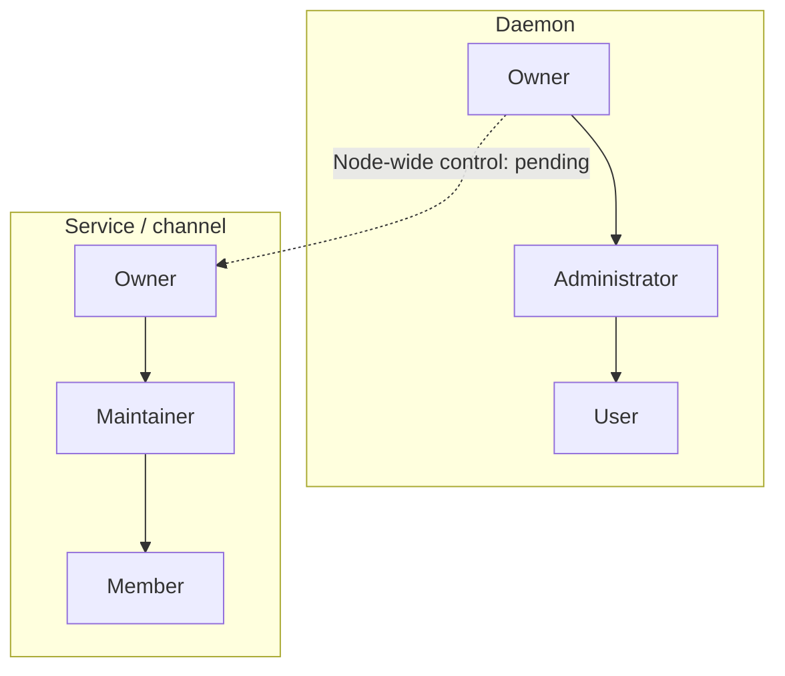

# Identity and roles

📌 **TL;DR:** Administrators manage users and groups; Maintainers manage assigned resources.

For credentials and permission checks, see [Access](02-access.md#what-a-call-carries).

## Scope

Names, profiles, registration, resource ownership and flat groups are built.
The role model below also includes **accepted, pending changes**, marked where
relevant; [implementation work](../Plans/MVP/TODO.md#authority-model) and
[open choices](../Plans/MVP/QUESTIONS.md#authority-model) stay in the plans.

## Identities

A **User** is a registered person. A **principal** is the identity a credential
represents; it must have a user profile or a registry record to use the bus.
A record describes a service or channel, whose inbox outlives the process serving it.

## Names

Names look like `alice@host` or `template/instance@host`. The realm after the
last `@` identifies a namespace, not the process's physical location. Names are
lowercase; the runner completes a bare service name with the local hostname.

Name syntax and examples

| Rule | Meaning |
|---|---|
| Length | At most 64 ASCII characters, including separators |
| Components | Start alphanumeric; use `a-z`, `0-9`, `.`, `_`, `-` |
| Local part | Also allows `+` and internal `@`; each `@`-separated part must be non-empty |
| Realm | Follows the last `@`; contains neither `@` nor `/` |
| Template | Optional prefix separated by one `/`; part of the identity, not a lookup |
| Normalization | Lowercase and trim the whole name and each component; internal spaces are invalid |

`mail-sender/parf@comfi.com@srv1` names template `mail-sender`, instance
`parf@comfi.com`, realm `srv1`. The bus does not treat that instance as a mailbox.
` PARF@Localhost ` and `parf@localhost` identify the same principal. Two instances
of a [service template](03-services-and-topics.md#service-and-template) have
separate names, inboxes and configurations.

## Role names and scopes

**Administrator** manages daemon users and groups. **Maintainer** manages an
explicitly assigned service or channel. These are separate positions; a
resource **Member** has basic access and can be a user or another service.

Diagram: separate role scopes

Solid arrows show permission inheritance within each scope. The dashed override
is pending and belongs only to the daemon Owner, never to Administrators.

## Daemon owner

Assigned via `agent-bus-setup`, the daemon owner has root-like authority in the
accepted model. **Node-wide resource override and daemon ownership transfer
are pending.**

* Assign and revoke Administrators; edit, activate, pause and ban them.
* Manage users and all groups.
* Edit any service or channel, including its ACL, Maintainers and owner.
* Transfer daemon ownership to another user.

## Daemon Administrators

Administrators manage ordinary users and groups, but cannot edit the daemon
owner or peer Administrators, or grant those positions. The accepted model
allows ordinary-user unbanning; **today only the owner can lift a ban**.
Service/channel management requires the [resource assignment](#services).

## Users and profiles

Users can register services and channels and become their owners. The accepted
profile rule allows editing email, but protects username, person name and GitHub
name; person names come from Linux passwd, GitHub or an Administrator.
**Self-editing and name-source changes are pending: today only an authorized
Administrator or Owner edits profile fields.**

Profile fields and the user directory

* Profiles contain person name, email and GitHub login. Avatars are generated
  locally from the person name; a blank profile is still a registered user.
* Email and GitHub login are syntax-checked, trimmed, compared in lowercase
  ASCII and unique across profiles. Provider aliases such as dots and
  plus-addresses are not merged. Person names need not be unique.
* A GitHub identity retains its own GitHub username. Proving cross-provider
  aliases is [later work](../Plans/R1.2/QUESTIONS.md#open-questions).
* Administrators see the user directory; ordinary callers see their own details.
  Administrators edit below their level; the Owner may edit every level.
* The directory separates users, self-owned records and credential-only names.
  Classification comes from profiles and records, not spelling or blank fields.
  Only users have lifecycle controls; cleanup follows the
  [credential removal rule](02-access.md#ownerless-credentials).
* Viewing a directory removes nothing. Search, filters and pagination survive
  return from details; counts cover the visible entries, not the whole store.
  Entries link to relevant records; avatars do not trigger another directory
  fetch per person.
* Profiles and membership persist in snapshots. Phone and IM routes belong to
  [later contact routing](../Plans/R1.1/people.md#how-to-reach-a-person).

## User states

**Active** users may use their granted access. **Paused** and **banned** users
cannot; their directly owned services are suspended too. Suspension keeps
credentials and queued work, stops no process, and is reversible. Users are
not deleted in MVP.

Suspension, reactivation and inboxes

* Tokens, browser sessions, local sockets and enrolment cannot bypass suspension;
  calls are refused as `403 suspended`. The daemon owner must remain active.
* An authorized Administrator can reactivate a paused ordinary user. Ban-lifting
  authority follows the [Administrator rule](#daemon-administrators).
* State changes cancel blocked reads that lose authority. Services' own
  credentials are refused too; direct-owner suspension is checked for delivery,
  reading and new subscriptions. Unsubscribing remains possible for an active
  caller. Already delivered work cannot be recalled.
* Suspension follows the **direct owner**, not an ownership chain. If Alice owns
  service A and A owns B, pausing Alice suspends A, not B.
* Credentials are kept, not rotated or revoked. Lifting the state restores their
  use. Stored state survives restart; queued messages keep their existing expiry.
* Whether a third party should be able to drain an inactive person's own inbox
  remains [Q63](../Plans/MVP/QUESTIONS.md#open-questions). This differs from a
  service whose separate owner is suspended.

## Services

A service has one Owner, explicitly assigned Maintainers and Members with
access. Owners control their resources without requiring Administrator status.
The following is the accepted model; **service-defined roles and the
daemon-owner override remain pending**.

| Role | Authority |
|---|---|
| Owner | All Maintainer/Member permissions; assign/revoke Maintainers and transfer ownership |
| Maintainer | Edit settings and ACL; assign/revoke service-defined roles except Maintainer |
| Member | Use the service |

Management boundaries and availability

* Today the owner, the resource's own principal and members of its assigned
  Maintainers group can manage it. Only the owner may change that group
  assignment or transfer ownership. [Group membership protection](#groups)
  is a separate, unresolved part of enforcing owner control.
* Disabling refuses deliveries and inbox reads, cancels blocked reads, and
  retains queued messages. Enabling does not start a process. Removing access
  cancels reads relying on it; delivered work is not recalled.
* Re-registration preserves ownership, private configuration, subscriptions,
  assigned Maintainers and the disabled setting.
* Management includes configuration, access, availability and removal, subject
  to [removal conditions](#unregistering). Only the service itself may fetch its
  [private configuration](03-services-and-topics.md#configuring-a-template).
  Managed runtime start/stop remains [runner work](../Plans/R1/runner.md#what-the-runner-does).
* Service-defined role labels will be stored/resolved without interpreting their
  meaning; Maintainer is the reserved management role. They must not let a
  Maintainer remove or replace another Maintainer through ACL editing.

## Channels

A channel is a service-like entity **without an actual service process**. Its
creator owns it, and the [service authority rules](#services) apply. The daemon
provides queue or pub/sub delivery; joining, publishing or reading grants no
ownership of the channel or another subscriber's inbox.
[Delivery modes](03-services-and-topics.md#topics) are defined with messaging behavior.

## Groups

For shared management, create a group and explicitly assign it as Service or
Channel Maintainer on each resource. There is no automatic global assignment.
Retire an ordinary group by emptying it; groups are not deleted, paused or banned.
**Nested groups and protection of owner-controlled maintenance membership are pending.**

Administrative membership and shared-group limits

* The protected `@administrators` group grants daemon administration. Only the
  daemon owner changes it; the owner always remains a member. An added
  Administrator gets a user profile; removing membership keeps that profile.
  Ordinary group membership creates no profiles. See [upgrade migration](09-setup.md#administrator-name-migration).
* Groups are daemon-local membership lists, not principals: they have no
  credential. Emptying a group preserves references to its name; adding members
  later makes those references effective again. The protected group cannot be emptied.
* Group names are available for resource-owner assignments; full membership
  lists are visible to Administrators. Owning a service grants no daemon
  user/group administration.
* The accepted model allows nested groups, but **current membership is flat**.
  Nested membership and service-role storage are [pending](../Plans/MVP/TODO.md#authority-model);
  proposed expression syntax remains in [R1](../Plans/R1/identity.md#groups-and-roles).
* **Owner-controlled effective Maintainer membership is not yet enforced.**
  Administrators can edit ordinary groups, including assigned Maintainer groups,
  and thereby acquire resource authority indirectly. Protection for nested and
  shared groups needs the [membership decision](../Plans/MVP/QUESTIONS.md#effective-maintainer-membership).

## Registration

An active, known principal can register an unheld name in an unbacked realm and
becomes its owner. Creating a name in a directory-backed realm requires
[key-possession enrolment](02-access.md#proving-possession).

Creation and re-registration

A credential-only unknown name cannot bootstrap itself by registering. A name
must first be created by an existing authorized principal or through enrolment.
An owner must have a profile or record of its own. Enrolment creates a profile
and self-owned record; ordinary registration creates a service record.

A conditional creation refuses an existing canonical name, even for its owner;
claim and insertion happen together. Launchers use this for unique session
names. Ordinary re-registration instead permits authorized updates under the
[management rules](#services).

## Ownership

Changing a service or channel's owner requires its current owner's authority.
The accepted daemon-owner override is still pending. Transfer changes who may
manage the record and request its credential; it does not revoke existing tokens.

Transfer recipients and self-owned identities

Today a recipient must be active and have a self-owned record: its name and
owner are identical. A self-owned identity itself cannot be transferred.
Ordinary user creation and enrolment create such records; Administrator
membership creates a profile without guaranteeing one. Whether any active user
profile should suffice is the [open recipient choice](../Plans/MVP/QUESTIONS.md#transfer-recipient).

Existing credentials and copies already held follow the
[token lifetime policy](02-access.md#token-lifetime).

## Unregistering

`agent-bus unregister <name>` removes an idle record, its inbox, configuration
and subscriptions; it does not stop the process. Resource management authority
is required. Drain live queued work and stop all readers first.

Removal checks and what survives

* Missing names are errors. Expired messages are pruned before checking whether
  live work or any reader still blocks removal, so even a refused removal can
  prune expired messages.
* A non-user name cannot unregister while it owns other records; transfer or
  remove those first. A registered user keeps its profile and owned services
  when its own record is removed.
* A non-user loses its credential and group membership; reads it held elsewhere
  end too. Credential-store failure abandons the removal. A registered user
  keeps their credential and group standing.
* A removed non-user name is free for reuse, without priority for its former
  owner. Re-registration starts with an empty inbox and no configuration or
  subscriptions. Existing history remains history.
* Reserving a retired name is [later work](../Plans/R1.1/records.md#down-and-retired).

## Orphaned records

At startup, a non-user record whose owner has neither a profile nor a record is
deleted with its queued work. Cleanup repeats until no such records remain;
[credential cleanup](02-access.md#ownerless-credentials) follows it.

Cleanup boundaries

Deletion also removes configuration, subscriptions and group membership, releases
blocked readers and frees the name. Unlike manual removal, backlog is no reason
to keep a record nobody owns. A registered user's own record is spared.

Ownership is checked one step, not followed to a person: self-owned records and
cycles whose owners all have records survive. Failed credential revocation at
startup has a separate [unresolved failure policy](02-access.md#ownerless-credentials).

