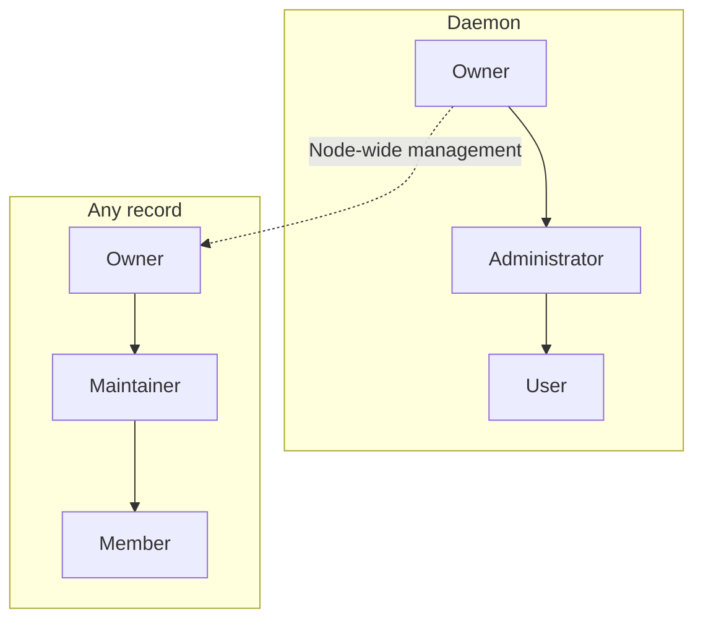

# Identity and roles

📌 **TL;DR:** The Owner controls the node, Administrators manage users and
groups, and Maintainers manage the resources assigned to them. Names,
profiles, registration, record ownership and nested groups are owned here;
credentials and checks belong to [Access](02-access.md#what-a-call-carries).

## Scope

Names, profiles, registration, resource ownership, groups and status are built
as the [constitution](constitution.md#project-constitution) states them;
[remaining work](../Plans/R0.8/TODO.md#authority-model) and
[open choices](../Plans/R0.8/QUESTIONS.md#open-questions) stay in the plans.

## Identities

A **User** is a registered person. A **principal** is the identity a credential
represents; it must have a user profile or a registry record to use the bus.
A record is one of [six kinds](03-records.md#record-kinds): 👤 `user`, 👾 `agent`, 📮 `queue`, 📣 `pubsub`, 📡 `service`.

## Names

Names look like `alice`, `alice@host` or `template/instance@host`. The realm
after the last `@` identifies a namespace, not the process's physical location,
and is optional. Names are lowercase and taken as written: nothing completes a
bare name with a hostname.

Name syntax and examples

| Rule | Meaning |
|---|---|
| Length | At most 64 ASCII characters, including separators |
| Components | Start alphanumeric; use `a-z`, `0-9`, `.`, `_`, `-` |
| Local part | Also allows `+` and internal `@`; each `@`-separated part must be non-empty |
| Realm | Optional; follows the last `@` and contains neither `@` nor `/`. A name with no `@` has no realm |
| Template | Optional prefix separated by one `/`; part of the identity, not a lookup |
| Normalization | Lowercase and trim the whole name and each component; internal spaces are invalid |

`mail-sender/parf@comfi.com@srv1` names template `mail-sender`, instance
`parf@comfi.com`, realm `srv1`. The bus does not treat that instance as a mailbox.
` PARF@Localhost ` and `parf@localhost` identify the same principal. Two instances
of an [agent template](03-records.md#agent-templates) have
separate names, records and configurations.

**Built in 0.7.4:** the realm is optional on every name and every kind. A name
without a realm is a complete name rather than a shorthand: nothing is appended
to it, and `alice` and `alice@srv1` are two distinct principals that may both
exist, each reachable only by its own spelling. The two separators are fixed
whatever else a name contains: the first `/` separates the template, and the
last `@` separates the realm, so a realm-less name is one carrying no `@` at
all. Every name valid before keeps its template and realm split. Setup's
default Owner is the installer's Unix account name alone, so the clean
reinstall bootstraps `parf` rather than `parf@host`, and the runner account's
principal is its own account name. Agents that would otherwise collide across
machines still carry a realm: the [launchers](08-runner-role.md#session-names)
keep deriving `runtime/instance@host`, with the host name as the realm.

**Built in 0.7.5:** an Agent's canonical name begins with `#` — `#worker`,
`#worker@srv1`, `#claude/home@srv1` — the way a group name begins with `@`, so
one name column is unique across every kind and no lookup is needed to know
what a name refers to. In a URL that `#` is percent-encoded as `%23`. The kind
is `agent` exactly when the name carries `#`; an unprefixed name names a User,
a channel or a service. The CLI's `--agent worker@srv1` spelling adds the `#`
and never a second one. Every record, an Agent's included, is owned by a User,
and a User cannot be created under a `#` name.

## Role names and scopes

**Administrator** manages daemon users and groups. **Maintainer** manages an
explicitly assigned record. These are separate positions; a resource **Member**
has basic access and can be a user or another record.

Diagram: separate role scopes

Solid arrows show permission inheritance within each scope. The dashed override
crosses scopes and belongs only to the daemon Owner, never to Administrators.

## Daemon owner

The daemon owner has root-like authority. Setup supplies the required first
owner; the daemon then stores that position and a transfer survives restart.
The daemon account's socket speaks for the Owner of each request, so a transfer
moves it at once ([local socket](02-access.md#local-socket)).

* Assign and revoke Administrators; edit, activate, pause and ban them.
* Manage users and all groups.
* Edit any record, including its ACL, Maintainers and owner.
* Transfer daemon ownership to another user.

Transfer and access boundaries

Only the current active Owner may transfer the position, to a different active
registered User. The recipient becomes an Administrator; the former Owner stays
an Administrator until the new Owner changes that group. A startup owner value
seeds a legacy or first snapshot only and cannot replace a transferred Owner.
A current snapshot with a missing, invalid, inactive or unknown Owner fails
startup rather than silently restoring the seed.

Root management includes discovery, settings, ACL, Maintainers, ownership,
configuration and removal. It does not itself grant message use: the Owner
uses a resource only through its resource authority or [ACL](02-access.md#acl).
Administrators gain no node-wide resource authority from their administrative
position.

## Daemon Administrators

Administrators manage ordinary users and groups, but cannot edit the daemon
owner or peer Administrators, or grant those positions. The accepted model
allows ordinary-user unbanning; this is built, while the Owner retains authority
over every level.
Record management requires the [resource assignment](#record-authority).

## Users and profiles

Users can register records of any kind and become their owners. A user may
edit or clear only their own email; username, person name, GitHub name, state
and authority stay protected. Administrators and the Owner edit profiles below
their level. Person names come from an Administrator, the trusted local-account
adapter or the GitHub directory used for key enrolment; imports fill a blank
name and never overwrite an existing one.

Profile fields and the user directory

* Profiles contain person name, email, GitHub login, company, location and a
  Twitter/X name. GitHub may populate these ordinary editable fields. The
  daemon separately retains trusted photo/provenance data and one bounded local
  thumbnail; a blank profile is still a registered user.
* Email, GitHub login and Twitter/X name are syntax-checked, trimmed and
  unique across profiles: email and GitHub login in lowercase ASCII, and the
  Twitter/X name — 1 to 15 letters, digits and `_` — without regard to case.
  Checked on add, edit, import and restore; a restore finding two Users with
  one of them ignores the later and reports it. Provider aliases such as dots
  and plus-addresses are not merged. Person names need not be unique.
* A GitHub identity retains its own GitHub username. Proving cross-provider
  aliases is [later work](../Plans/R1.2/QUESTIONS.md#open-questions).
* A GitHub challenge retains the provider's person name with the public keys;
  successful proof imports both from that lookup. A public GitHub email fills
  only a blank Email, and an imported email or Twitter/X name is skipped on a
  uniqueness collision. Fetching any of
  these facts remains evidence from GitHub, not authentication by itself.
* Setting or changing a GitHub login attempts to fetch the public profile, but
  provider availability does not block the login field. An explicit Company,
  Location or Twitter/X value in that edit wins; otherwise the provider value
  fills it. Explicit refresh replaces those fields and reports failure without
  mutation.
  The trusted public-profile adapter is available independently of whether an
  enrolment realm uses GitHub keys; enabling one never enables the other.
  Unrelated edits do not contact GitHub. Clearing the login clears provider
  provenance and its photo while retaining ordinary profile fields.
* GitHub imagery is fetched only by the trusted adapter, constrained to the
  provider host set, bounded before decode and re-encoded as a 96-pixel PNG.
  Photo failure keeps the prior local thumbnail or initials and never blocks an
  otherwise valid profile update. Pages never hotlink a provider image.
* `agent-bus-admin user import-local` reads the local account through the OS
  account database. Its input names an account; it accepts no free-form person
  name. Setup uses it for the first key-backed user.
* Self-email editing derives the target from the credential and carries no
  identity or protected field. Email remains normalized and unique by the same
  rule as an administrative edit.
* Administrators see the user directory; ordinary callers see their own details.
  Administrators edit below their level; the Owner may edit every level.
* The directory separates users, self-owned records and credential-only names.
  Classification comes from profiles and records, not spelling or blank fields.
  Only users have lifecycle controls; cleanup follows the
  [credential removal rule](02-access.md#ownerless-credentials).
* Viewing a directory removes nothing. Search, filters and pagination survive
  return from details; counts cover the visible entries, not the whole store.
  Entries link to relevant records; avatars do not trigger another directory
  fetch per person.
* Profiles and membership persist in snapshots. Phone and IM routes belong to
  [later contact routing](../Plans/R1.1/people.md#how-to-reach-a-person).

## User states

**Built in 0.7.9:** a User is **active** or **inactive**, with no second
level. An inactive User cannot act — every token, session, local socket and
enrolment is refused as `403 suspended` — and every record it owns is
inactive too, so it is [no such entity](constitution.md#common-record-fields):
hidden and answered as unknown (`404`) to every caller, readable only through
the web face's read-only view. Inactivity keeps credentials and queued work,
stops no process, and is reversible. Users are never deleted.

| Who | May change a User's status |
|---|---|
| daemon Owner | any User but itself: the daemon Owner stays active |
| an active Administrator | an ordinary User, never another Administrator |
| anyone else | no one |

Inactivity, reactivation and inboxes

* A status change releases every blocked read that loses authority, and an
  inactive record's own readers. Already delivered work cannot be recalled.
* Inactivity follows the **direct owner**; only a User owns records, so there
  is no chain to follow.
* Credentials are kept, not rotated or revoked. Reactivation restores their
  use. Stored status survives restart; queued messages keep their expiry.
* Nobody drains an inactive record's inbox, however admitted: the work waits
  for its reactivation. This replaces the earlier drain permission.
* A copy published to an inactive recipient beside live ones is that
  recipient's `dropped` and an error-log warning; see
  [Deliver-To](04-messaging.md#subscribers).

## Record authority

**These rules are about a record, whichever of the
[six kinds](03-records.md#record-kinds) it is.**

A record has one Owner, explicitly assigned Maintainers and Members with
access. Owners control their resources without requiring Administrator status.
The following model is built. **Record-defined roles** are
[R1 work](../Plans/R1/identity.md#groups-and-roles), the first R1 topic after 0.7.
Maintainers is a list of named users, groups and records. Only the
resource Owner or daemon Owner replaces it; group entries use ordinary nested
membership. Human editors use one plain term per line, as ACL editors do.

| Role | Authority |
|---|---|
| Owner | All Maintainer/Member permissions; assign/revoke Maintainers and transfer ownership |
| Maintainer | Edit settings and ACL |
| Member | Use the record |

Management boundaries and availability

* The owner, the resource's own principal and every direct or effective member
  of its Maintainers list can manage it. Only the resource Owner or daemon Owner
  may replace the list; only they may transfer ownership. Naming a group
  delegates its membership to [group administration](#groups); it does not give
  the record's owner control over who Administrators add to it.
* Built in 0.7.9: a record's `status` is `active` or `inactive`, on every
  kind but a 👤, which lives with its User. Deactivating makes it no such
  entity, releases its blocked reads and retains queued messages; its name
  stays reserved, so nothing registers over it. Only its Owner or a
  Maintainer reactivates it, by a status-only edit; every other operation
  naming it is refused as unknown. Reactivating does not start a process.
  Removing access cancels reads relying on it; delivered work is not recalled.
* Built in 0.7.11: every list — `allow` (a Group's membership), `maintainers`
  and `deliver_to` — is written whole, or changed by `add`, `add_to_set` and
  `remove` deltas that resolve against the record as the write finds it, so
  concurrent writers lose nothing. `add` refuses a term already there, and an
  occupied one-slot `deliver_to`; `add_to_set` adds what is absent and
  succeeds on what is present; `remove` is a no-op for what is absent. A list
  written whole and by a delta in one write is refused, and a delta takes the
  same authority and checks as the whole write it becomes.
* Re-registration retains the [protected settings](#registration).
* Management includes configuration, access, availability and removal, subject
  to [removal conditions](#unregistering). Only the record itself may fetch its
  [private configuration](03-records.md#configuring-a-template).
  Managed runtime start/stop remains [runner work](../Plans/R1/runner.md#what-the-runner-does).

## Channels

A channel is a 📮 `queue` or a 📣 `pubsub` record: a name **nobody acts as**.
Its creator owns it, and the [record authority rules](#record-authority) apply. The
daemon provides queue or pub/sub delivery; joining, publishing or reading grants
no ownership of the channel or another subscriber's inbox.
[Channels](07-channels.md#the-two-channel-kinds) owns what each kind does; a
message's `topic` is a [label on the envelope](04-messaging.md#envelope) and a
different thing entirely.

## Groups

**Built in 0.7.10:** a Group is an ordinary record of kind `group`, named
`@name`, or `@<owner>/<name>` for one reserved to its Owner and required of
a Personal one (built in 0.8.6, [constitution § Group](constitution.md#-group)),
whose `allow` list is its membership
([constitution § Group](constitution.md#-group)). Any User creates one, and it
belongs to that User. Its Owner, its Maintainers and the daemon's
Administrators change its membership; nobody else does. Members are actors —
Users, Agents and other Groups — never the wildcard or a runtime term.
For shared management, create a group and add it to each resource's Maintainers
list. A list may instead name a record directly. There is no automatic global
assignment. Choosing a group accepts its membership changes on every resource
using it. Retire an ordinary group by emptying it; groups are not deleted. An
inactive Group grants nothing and is
[no such entity](constitution.md#common-record-fields) while its name stays
reserved; at a publication it is skipped with an error-log warning and counts
no drop.
Ordinary groups may contain principals and other groups. Their membership
follows the stored graph: cycles terminate, unknown group references stay inert
until populated, and any path to a principal grants effective membership.

Administrative membership and shared-group limits

* The protected `@administrators` group grants daemon administration. Its
  Owner is the daemon Owner and moves with daemon ownership in the same write;
  it has no Maintainers, is never Personal, and takes no owner, Maintainer,
  membership or status change through record management. Only the daemon
  Owner changes its membership, with Users only; the Owner always remains a
  member. An added Administrator gets a user profile; removing membership
  keeps that profile. Ordinary group membership creates no profiles. A
  restored one owned by anyone else refuses the start.
* Groups are not principals: they have no credential. Every member reads a
  Group's [private values](constitution.md#-private-values). Emptying a group preserves references to its name; adding members
  later makes those references effective again. The protected group cannot be emptied.
* Group names are available for resource-owner assignments; full membership
  lists are visible to Administrators and to whom a Group's own ACL — its
  membership — and managers admit. Owning a record grants no daemon
  user/group administration.
* Nested membership is built in 0.5.57. Stored group lists show direct entries;
  user views report effective membership. ACL and Maintainer checks use the
  same reachability rule. Record-defined roles and the proposed expression
  syntax are [R1 work](../Plans/R1/identity.md#groups-and-roles).
* `@administrators` accepts direct user identities only; the Owner remains a
  direct member. A snapshot that nests a group there is refused at startup.
  An ordinary group may name `@administrators`: its direct members then receive
  that ordinary group's access or Maintainer grant, without creating nested
  Administrator authority.
* Sharing a Maintainer group across resources does not require joint owner
  approval for membership changes. Resource owners control assignment of the
  group; Administrators control its members. The protected Administrator group
  retains its separate daemon-owner-only membership rule.

## Registration

An active, known principal can register an unheld name in an unbacked realm and
becomes its owner. Creating a name in a directory-backed realm requires
[key-possession enrolment](02-access.md#proving-possession).

Creation and re-registration

A credential-only unknown name cannot bootstrap itself by registering. A name
must first be created by an existing authorized principal or through enrolment.
An owner must have a profile or record of its own. Enrolment creates a profile
and self-owned record. Ordinary registration that states no `kind` creates a 📡
`service`, which is why it must also carry an address and a protocol; a caller
meaning one of the other four
[kinds](03-records.md#record-kinds) says so, and `--personal`
says `agent`.

A conditional creation refuses an existing canonical name, even for its owner;
claim and insertion happen together. Launchers use this for unique session
names. Ordinary re-registration instead permits authorized updates under the
[management rules](#record-authority).

Re-registration preserves ownership, private configuration, subscriptions,
assigned Maintainers and the status. Omitting the ACL retains its
grants; an explicit ACL replaces them. Use management to deliberately clear
grants.

## Ownership

Changing a record's owner requires its current owner's or the daemon
Owner's authority, and the new owner is a User. Transfer changes who may
manage the record and request its credential; it does not revoke existing
tokens. Built in 0.7.6: transferring an Agent rebinds its tokens to the new
Owner in the transfer's own commit, so they keep working and act for the new
Owner; a transfer whose commit fails moves neither the record nor its tokens.
See [constitution § Token](constitution.md#-token).

Transfer recipients and user records

A recipient must be an active User. A User's own 👤 record cannot be
transferred. User creation, enrolment and Administrator membership each
create the User's record with it.

Existing credentials and copies already held follow the
[token lifetime policy](02-access.md#token-lifetime).

## Unregistering

`agent-bus unregister <name>` removes an idle record, its inbox, configuration
and subscriptions; it does not stop the process. Resource management authority
is required. Drain live queued work and stop all readers first.

Removal checks and what survives

* Missing names are errors. Expired messages are pruned before checking whether
  live work or any reader still blocks removal, so even a refused removal can
  prune expired messages.
* A User's own 👤 record is never removed, and only a User owns records, so
  a removed name owns nothing.
* The removal's one commit deletes the name's credentials and every reference
  to it: ACL, Maintainer, Group member and Deliver-To entries. Reads it held
  elsewhere end too. A commit that fails removes nothing.
* A removed name is free for reuse, without priority for its former owner.
  Re-registration starts with an empty inbox, no configuration, no references
  and a new internal ID, so nothing the former holder kept answers for it.
  Existing history remains history.
* Reserving a retired name is [later work](../Plans/R1.1/records.md#down-and-retired).

## Orphaned records

**Built in 0.7.5:** every owner is a User, so a record whose owner is not a
User is one no running daemon wrote. At startup it is
[ignored and reported](constitution.md#persistence-and-loading), not deleted:
it is not loaded, its name is free on the running bus, and the database keeps
it for an operator. A User without its own 👤 record is ignored the same way,
and so, on the same start, is every record it owned.
[Credential cleanup](02-access.md#ownerless-credentials) follows it.

Loading boundaries

An ignored record's stored queue is ignored and reported with it. A record
later registered under the freed name starts with no stored queue, so the old
messages never reach the new owner. Each start reads the database afresh, so
an ignored record is reported again until an operator repairs or removes it, or
the name is registered again: the new record replaces the stored row.
Ownership is checked one step: an Agent never owns a record, so there are no
ownership chains to follow.

