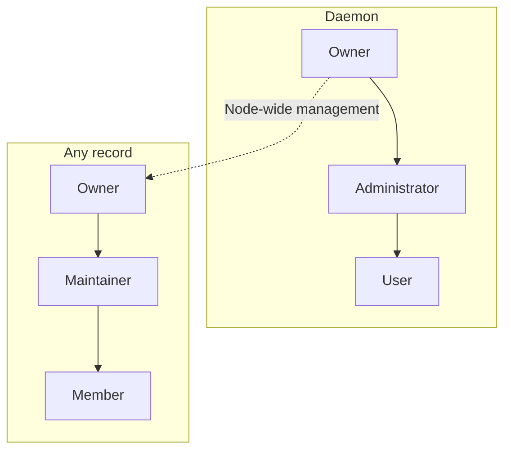

# Identity and roles

📌 **TL;DR:** The Owner controls the node, Administrators manage users and
groups, and Maintainers manage the resources assigned to them. Names,
profiles, registration, record ownership and nested groups are owned here;
credentials and checks belong to [Access](02-access.md#what-a-call-carries).

## Scope

Names, profiles, registration, resource ownership, groups and status are built
as the [constitution](constitution.md#project-constitution) states them;
[open choices](../Plans/R0.8-MVP/QUESTIONS.md#open-questions) stay in the plan.

## Identities

A **User** is a registered person. A **principal** is the identity a credential
represents; it must have a user profile or a registry record to use the bus.
A record is one of [seven kinds](03-records.md#record-kinds): 👤 `user`, 👾 `agent`, 📮 `queue`, 📣 `pubsub`, 📡 `service`, 👥 `group`, 📚 `resource`.

## Names

Names look like `alice`, `alice@host` or `template/instance@host`. The realm
after the last `@` identifies a namespace, not the process's physical location,
and is optional. Names are lowercase and taken as written: nothing completes a
bare name with a hostname.

<details>
<summary>Name syntax and examples</summary>

| Rule | Meaning |
|---|---|
| Length | At most 64 ASCII characters, including separators |
| Components | Start alphanumeric; use `a-z`, `0-9`, `.`, `_`, `-` |
| Local part | Also allows `+` and internal `@`; each `@`-separated part must be non-empty |
| Realm | Optional; follows the last `@` and contains neither `@` nor `/`. A name with no `@` has no realm |
| Template | Optional prefix separated by one `/`; part of the identity, not a lookup |
| Normalization | Lowercase and trim the whole name and each component; internal spaces are invalid |

`mail-sender/parf@comfi.com@srv1` names template `mail-sender`, instance
`parf@comfi.com`, realm `srv1`. The bus does not treat that instance as a mailbox.
` PARF@Localhost ` and `parf@localhost` identify the same principal. Two instances
of an [agent template](03-records.md#agent-templates) have
separate names, records and configurations.

</details>

**Built in 0.7.4:** the realm is optional on every name and every kind. A name
without a realm is a complete name rather than a shorthand: nothing is appended
to it, and `alice` and `alice@srv1` are two distinct principals that may both
exist, each reachable only by its own spelling. The two separators are fixed
whatever else a name contains: the first `/` separates the template, and the
last `@` separates the realm, so a realm-less name is one carrying no `@` at
all. Every name valid before keeps its template and realm split. Setup's
default Owner is the installer's Unix account name alone, so the clean
reinstall bootstraps `parf` rather than `parf@host`, and the runner account's
principal is its own account name. Agents that would otherwise collide across
machines still carry a realm: the [launchers](08-runner-role.md#session-names)
keep deriving `runtime/instance@host`, with the host name as the realm.

**Built in 0.7.5:** an Agent's canonical name begins with `#` — `#worker`,
`#worker@srv1`, `#claude/home@srv1` — the way a group name begins with `@`, so
one name column is unique across every kind and no lookup is needed to know
what a name refers to. In a URL that `#` is percent-encoded as `%23`. The kind
is `agent` exactly when the name carries `#`; an unprefixed name names a User,
a channel or a service. The CLI's `--agent worker@srv1` spelling adds the `#`
and never a second one. Every record, an Agent's included, is owned by a User,
and a User cannot be created under a `#` name.

## Role names and scopes

**Administrator** manages daemon users and groups. **Maintainer** manages an
explicitly assigned record. These are separate positions; a resource **Member**
has basic access and can be a user or another record.

<details>
<summary>Diagram: separate role scopes</summary>


```mermaid
flowchart TB
    subgraph Node[Daemon]
        DO[Owner] --> DA[Administrator] --> DU[User]
    end
    subgraph Resource[Any record]
        RO[Owner] --> RM[Maintainer] --> Member[Member]
    end
    DO -. "Node-wide management" .-> RO
```

Solid arrows show permission inheritance within each scope. The dashed override
crosses scopes and belongs only to the daemon Owner, never to Administrators.

</details>

## Daemon owner

The daemon owner has root-like authority. Setup supplies the required first
owner; the daemon then stores that position and a transfer survives restart.
The daemon account's socket speaks for the Owner of each request, so a transfer
moves it at once ([local socket](02-access.md#local-socket)).

* Assign and revoke Administrators; edit, activate and deactivate them.
* Manage users and all groups.
* Edit any record, including its ACL, Maintainers and owner.
* Transfer daemon ownership to another user.

<details>
<summary>Transfer and access boundaries</summary>

Only the current active Owner may transfer the position, to a different active
registered User. The recipient becomes an Administrator; the former Owner stays
an Administrator until the new Owner changes that group. A startup owner value
seeds a legacy or first store only and cannot replace a transferred Owner.
Stored state with a missing, invalid, inactive or unknown Owner fails
startup rather than silently restoring the seed.

Root management includes discovery, settings, ACL, Maintainers, ownership,
configuration and removal. It does not itself grant message use: the Owner
uses a resource only through its resource authority or [ACL](02-access.md#acl).
Administrators gain no node-wide resource authority from their administrative
position.

</details>

## Daemon Administrators

Administrators manage ordinary users and groups, but cannot edit the daemon
owner or peer Administrators, or grant those positions. They may
reactivate an ordinary user, while the Owner retains authority over every
level.
Record management requires the [resource assignment](#record-authority).

## Users and profiles

Users can register records of any kind and become their owners. A user may
edit or clear only their own email; username, person name, GitHub name, state
and authority stay protected. Administrators and the Owner edit profiles below
their level. Person names come from an Administrator, the trusted local-account
adapter or the GitHub directory used for key enrolment; imports fill a blank
name and never overwrite an existing one.

<details>
<summary>Profile fields and the user directory</summary>

* Profiles contain person name, email, GitHub login, company, location and a
  Twitter/X name. GitHub may populate these ordinary editable fields. The
  daemon separately retains trusted photo/provenance data and one bounded local
  thumbnail; a blank profile is still a registered user.
* Email, GitHub login and Twitter/X name are syntax-checked, trimmed and
  unique across profiles: email and GitHub login in lowercase ASCII, and the
  Twitter/X name — 1 to 15 letters, digits and `_` — without regard to case.
  Checked on add, edit, import and restore; a restore finding two Users with
  one of them ignores the later and reports it. Provider aliases such as dots
  and plus-addresses are not merged. Person names need not be unique.
* A GitHub identity retains its own GitHub username. Proving cross-provider
  aliases is [later work](../Plans/R1.3/QUESTIONS.md#open-questions).
* A GitHub challenge retains the provider's person name with the public keys;
  successful proof imports both from that lookup. A public GitHub email fills
  only a blank Email, and an imported email or Twitter/X name is skipped on a
  uniqueness collision. Fetching any of
  these facts remains evidence from GitHub, not authentication by itself.
* Setting or changing a GitHub login attempts to fetch the public profile, but
  provider availability does not block the login field. An explicit Company,
  Location or Twitter/X value in that edit wins; otherwise the provider value
  fills it. Explicit refresh replaces those fields and reports failure without
  mutation.
  The trusted public-profile adapter is available independently of whether an
  enrolment realm uses GitHub keys; enabling one never enables the other.
  Unrelated edits do not contact GitHub. Clearing the login clears provider
  provenance and its photo while retaining ordinary profile fields.
* GitHub imagery is fetched only by the trusted adapter, constrained to the
  provider host set, bounded before decode and re-encoded as a 96-pixel PNG.
  Photo failure keeps the prior local thumbnail or initials and never blocks an
  otherwise valid profile update. Pages never hotlink a provider image.
* `agent-bus-admin user import-local` reads the local account through the OS
  account database. Its input names an account; it accepts no free-form person
  name. Setup uses it for the first key-backed user.
* Self-email editing derives the target from the credential and carries no
  identity or protected field. Email remains normalized and unique by the same
  rule as an administrative edit.
* Administrators see the user directory; ordinary callers see their own details.
  Administrators edit below their level; the Owner may edit every level.
* The directory separates users, self-owned records and credential-only names.
  Classification comes from profiles and records, not spelling or blank fields.
  Only users have lifecycle controls; cleanup follows the
  [credential removal rule](02-access.md#ownerless-credentials).
* Viewing a directory removes nothing. Search, filters and pagination survive
  return from details; counts cover the visible entries, not the whole store.
  Entries link to relevant records; avatars do not trigger another directory
  fetch per person.
* Profiles and membership persist in the database. Phone and IM routes belong to
  [later contact routing](../Plans/R1.2/people.md#how-to-reach-a-person).

</details>

## User states

**Built in 0.7.9:** a User is **active** or **inactive**, with no second
level. An inactive User cannot act — every token, session, local socket and
enrolment is refused as `403 suspended` — and every record it owns is
inactive too, so it is [no such entity](constitution.md#common-record-fields):
hidden and answered as unknown (`404`) to every caller, readable only through
the web face's read-only view. Inactivity keeps credentials and queued work,
stops no process, and is reversible. Users are never deleted.

| Who | May change a User's status |
|---|---|
| daemon Owner | any User but itself: the daemon Owner stays active |
| an active Administrator | an ordinary User, never another Administrator |
| anyone else | no one |

<details>
<summary>Inactivity, reactivation and inboxes</summary>

* A status change releases every blocked read that loses authority, and an
  inactive record's own readers. Already delivered work cannot be recalled.
* Inactivity follows the **direct owner**; only a User owns records, so there
  is no chain to follow.
* Credentials are kept, not rotated or revoked. Reactivation restores their
  use. Stored status survives restart; queued messages keep their expiry.
* Nobody drains an inactive record's inbox, however admitted: the work waits
  for its reactivation. This replaces the earlier drain permission.
* A copy published to an inactive recipient beside live ones is that
  recipient's `dropped` and an error-log warning; see
  [Deliver-To](04-messaging.md#subscribers).

</details>

## Record authority

**These rules are about a record, whichever of the
[seven kinds](03-records.md#record-kinds) it is.**

A record has one Owner, explicitly assigned Maintainers and Members with
access. Owners control their resources without requiring Administrator status.
The following model is built. **Record-defined roles** are
[R1 work](../Plans/R1.0-Release/roles.md#record-defined-roles).
Maintainers is a list of named users, groups and records. Only the
resource Owner or daemon Owner replaces it; group entries use ordinary nested
membership. Human editors use one plain term per line, as ACL editors do.

| Role | Authority |
|---|---|
| Owner | All Maintainer/Member permissions; assign/revoke Maintainers and transfer ownership |
| Maintainer | Edit settings and ACL |
| Member | Use the record |

<details>
<summary>Management boundaries and availability</summary>

* The owner, the resource's own principal and every direct or effective member
  of its Maintainers list can manage it. Only the resource Owner or daemon Owner
  may replace the list; only they may transfer ownership. A transfer leaves
  the record's credentials as they are: an Agent's token keeps working, so a
  former Owner who still holds its bytes can use it until someone rotates it
  (Q129). Naming a group
  delegates its membership to [group administration](#groups); it does not give
  the record's owner control over who Administrators add to it.
* Built in 0.7.9: a record's `status` is `active` or `inactive`, on every
  kind but a 👤, which lives with its User. Deactivating makes it no such
  entity, releases its blocked reads and retains queued messages; its name
  stays reserved, so nothing registers over it. Only its Owner or a
  Maintainer reactivates it, by a status-only edit; every other operation
  naming it is refused as unknown. Reactivating does not start a process.
  Removing access cancels reads relying on it; delivered work is not recalled.
* Built in 0.7.11: every list — `allow` (a Group's membership), `maintainers`
  and `deliver_to` — is written whole, or changed by `add`, `add_to_set` and
  `remove` deltas that resolve against the record as the write finds it, so
  concurrent writers lose nothing. `add` refuses a term already there, and an
  occupied one-slot `deliver_to`; `add_to_set` adds what is absent and
  succeeds on what is present; `remove` is a no-op for what is absent. A list
  written whole and by a delta in one write is refused, and a delta takes the
  same authority and checks as the whole write it becomes.
* Re-registration retains the [protected settings](#registration).
* Management includes configuration, access, availability and removal, subject
  to [removal conditions](#unregistering). Only the record itself may fetch its
  [private configuration](03-records.md#configuring-a-template).
  Managed runtime start/stop remains [runner work](../Plans/R1.0-Release/runner.md#what-the-runner-does).

</details>

## Channels

A channel is a 📮 `queue` or a 📣 `pubsub` record: a name **nobody acts as**.
Its creator owns it, and the [record authority rules](#record-authority) apply. The
daemon provides queue or pub/sub delivery; joining, publishing or reading grants
no ownership of the channel or another subscriber's inbox.
[Channels](07-channels.md#the-two-channel-kinds) owns what each kind does; a
message's `topic` is a [label on the envelope](04-messaging.md#envelope) and a
different thing entirely.

## Shared locks

**Built in 0.8.66, tied to records from 0.8.74:** the daemon hands out named
locks, each on a record; one holder has one at a time. The record is the
lock's namespace, and its **Owner, its Maintainers** (nested groups and the
`@owner` and `@agent` terms included) **and its own Agent** may use its locks —
the record's [management authority](#record-authority), checked before every
acquisition attempt, including after waiting. Its allow list grants use of the
record, not of its locks. Every lock has a ttl, so a crashed holder cannot wedge the rest; the table is memory
only, and a restart releases every lock.

| Verb | |
|---|---|
| `lock <record> <name> --ttl` | take it; waits until granted or the caller's `--wait` runs out (default 30s). Re-taking your own lock is refused at once — use extend |
| `try-lock <record> <name> --ttl` | the same, granted or refused now; a refusal names the holder |
| `extend <record> <name> --ttl` | the holder sets a fresh ttl from now; anyone else is refused, and a lock nobody holds is not extended |
| `release <record> <name>` | the holder gives it back before the ttl; anyone else is refused |
| `release <record> <name> --force` | releases a lock somebody else holds; any of those who may use the record's locks may, and it is audited |
| `holders <record>` | who holds which of the record's locks and the time left; the API answers each as `{holder, expires}` |

The API names the record `record`, in a body or a query. An inactive record
has no locks: taking one is refused as no such entity, and any deactivation
ends its locks and refuses pending takes at once
([common record fields](constitution.md#common-record-fields)).
The web face shows a record's locks on its page to those who may use them, and every such lock on its Locks page. `GET /holders` with no record answers that listing: each lock with its record, the record's kind, holder and expiry.

## Key-value store

**Built in 0.8.77:** every record keeps a store of named values in the
daemon's database, with atomic edits on them. The same authority as its
[shared locks](#shared-locks) uses it — its **Owner, Maintainers and own
Agent** — and its allow list grants use of the record, not of its store.
There are three kinds of value, each its own namespace: a **string** (any
bytes, the default), an **int** (signed 63-bit) and a **json** object.

**Per record** means every registered name carries a store of its own — the
same name on two records is two values — and it lives and dies with that
record:

| Attach it to | For example | Who uses it |
|---|---|---|
| 👾 an Agent | a worker's checkpoint: `kv set --json '#indexer@team' progress '{"cursor":1200}'` | its Owner, its Maintainers, and the Agent itself |
| 📮 a queue or 📣 a PubSub | the batch behind the work sent there: `kv json jobs@team batch '[{"op":"push","key":"todo","value":"img-1"}]'` | its Owner and Maintainers |
| 📡 a Service | facts about the thing outside: `kv set --int db@team schema 42`, the migration it is on | its Owner and Maintainers |
| 👥 a Group | the team's shared state: `kv set @oncall@team current alice@team` | its Owner and Maintainers — not its members, whom the Group grants elsewhere |
| 👤 a User's own record | a person's own notes and settings: `kv set alice@team theme dark` | that User |

| Verb | String | Int | JSON |
|---|---|---|---|
| read one name | `kv get` | `kv get --int` | `kv get --json` |
| write one; `--add` only if absent, `--replace` only if present, and a refused one says so | `kv set` | `kv set --int` | `kv set --json` |
| remove one; the answer says whether it was there | `kv delete` | `kv delete --int` | `kv delete --json` |
| edit in one step | | `kv inc <record> <name> [n]`, an absent name counting from 0 | `kv json <record> <name> <ops>` |

| Rule | |
|---|---|
| Durable | a write is committed before it is answered, never left to the queue checkpoint |
| Atomic | every edit — a mode, an increment, a list of JSON operations — is one transaction on the value it replaces |
| Integer range | −2^62 through 2^62−1, inclusive; integer values, increment operands and results, and JSON `inc` use this range; overflow refuses the complete edit |
| The record's life | an inactive record's store is [no such entity](constitution.md#common-record-fields) and comes back with it; removing the record deletes its store in the same transaction, and a name registered again starts empty. Values are keyed by the record's internal ID, so a transfer keeps them |
| Limits | a name is 1 to 256 bytes of UTF-8; a value at most 128 KiB; a record holds at most 10,000 names of one kind; a JSON list at most 100 operations |
| At start | a stored value whose record is not stored is ignored and reported, never reattached |
| Faces | the API's `GET /kv` and `POST /kv/set`, `/kv/delete`, `/kv/inc`, `/kv/json` take `record`, `kind` and `name`; a string travels as a JSON string, or `value_base64` when its bytes are not UTF-8, an int as a number and a JSON value as the object. `GET /kv/list` answers a record's names with sizes and previews, or with no record every store the caller may use. The MCP face has `ab_kv_get`, `ab_kv_set`, `ab_kv_delete`, `ab_kv_inc` and `ab_kv_json`; the web face shows a record's store on its page, and on the **KV** page and its own pages ([web face](../src/web/web-face/records.md#key-value-stores)) |

The value cap leaves room for JSON escaping inside the API's request-body
limit. **Pending enforcement:** the implementation still accepts values up to
its former cap; reduce it to the limit above for both string and JSON writes.
The narrowed integer range also awaits enforcement; the implementation still
uses signed 64-bit bounds. MCP must preserve integers exactly across its
JavaScript boundary: narrowing to 63 bits alone does not prevent rounding.

### JSON operations

A JSON value is an object, and each operation names one of its top-level keys.
A list of them is applied whole or not at all; an absent name starts as `{}`.

| Op | Does |
|---|---|
| `set key value` | writes the key |
| `unset key` | removes the key |
| `inc key n` | adds the integer `n` to an integer |
| `push key value` | appends one value to an array |
| `unshift key value` | prepends one value to an array |
| `shift key` | removes and answers an array's first element |
| `pop key` | removes and answers an array's last element |
| `add_to_set key value` | appends `value` unless an equal one is present |
| `remove_from_set key value` | removes every element equal to `value`; answers nothing |

A key holding the wrong type, or an unknown or malformed operation, refuses
the whole list and names it. `inc`, `push`, `unshift` and `add_to_set` create
a missing key, as `0` or a one-element array; `shift`, `pop`,
`remove_from_set` and `unset` on one change nothing and say so, as does an
empty array's `shift` or `pop`. Each operation answers `{op, key, changed}`,
with `value` for what `shift` or `pop` took and the number `inc` left.
Equality compares JSON values, so key order and number spelling do not
matter; a value is stored compact with its keys sorted.

```sh
agent-bus kv json jobs@team batch '[{"op":"push","key":"todo","value":"a"},{"op":"push","key":"todo","value":"b"}]'
agent-bus kv json jobs@team batch '[{"op":"shift","key":"todo"}]'   # each worker gets its own job
```

Why it is shaped this way is the [plan's reasoning](../Plans/R1.0-Release/kv.md#per-record-storage).

### Suggested use

The store coordinates a pool without a database beside the bus. Put it on the
record the work belongs to — a 📮 queue or the pool's 👾 Agent — so the
workers reach it as that Agent, or as its Maintainers. Three rules make every
pattern below safe: **claim with an atomic op** (`shift`, `pop`,
`set --add`), **make results idempotent** (`--add` on a result name, so a
retried item writes once), and **pair a store with a [lock](#shared-locks)
when liveness matters** — the lock's ttl says who is alive, the store says how
far they got, and survives them.

Below, `batch.todo` is the key `todo` of the JSON value `batch`, edited with
`kv json`; `batch/total` is a name of its own.

| Pattern | Coordinator | Each worker | Why it holds |
|---|---|---|---|
| **Scatter** | `push` every item onto `batch.todo`, then `set --int batch/total N` | `shift batch.todo` until it answers nothing | no two workers get one item; an empty `shift` is the end, not an error |
| **Gather** | waits for one message, not a poll | writes `set --add result/<id> …`, then `inc batch/done`; the worker whose `inc` answers `N` sends the coordinator "gathered" | `--add` makes a retry write nothing twice; exactly one `inc` sees the total |
| **Retry** | — | a failed item goes back with `unshift batch.todo`, or to `push batch.failed` after its third try, counted in the item | the queue keeps it through any crash but the worker's own |
| **Sharding** | `set --int shards N`; items go to shard `hash(key) mod N` | claims a shard with `set --add shard/<n> <me>`, holds `lock <record> shard/<n> --ttl 30s` and `extend`s it while working, keeps `set --int cursor/<n> <offset>` | the claim is exclusive; a dead worker's lock expires, and whoever takes shard `n` next — `delete shard/<n>`, then `--add` — resumes from its cursor |
| **Rebalancing** | takes `lock <record> rebalance`, rewrites the `shards` map, bumps `inc epoch` | reads `epoch` before each item and re-claims when it moved | one rebalance at a time; a worker never mixes two maps |
| **Suspend** | `set --int paused 1` | reads `paused` before each claim, stops taking new items, and checkpoints `set --json job/<id>` with its cursor and state | a pool pauses without stopping a process; nothing in flight is lost |
| **Resume** | `set --int paused 0` | picks up from each `job/<id>` it held, or any whose worker is gone, by the same claim | the checkpoint is stored and committed before its answer, so a daemon restart resumes too |

<details>
<summary>Scatter and gather from the CLI</summary>

```sh
# coordinator
agent-bus kv json jobs@team batch '[{"op":"push","key":"todo","value":"img-1"},{"op":"push","key":"todo","value":"img-2"}]'
agent-bus kv set --int jobs@team batch/total 2

# each worker, in a loop
job=$(agent-bus kv json jobs@team batch '[{"op":"shift","key":"todo"}]')   # "changed":false, no value, when empty
agent-bus kv set --add jobs@team result/img-1 "done:42"                   # a retry is refused, not doubled
[ "$(agent-bus kv inc jobs@team batch/done)" = 2 ] && agent-bus send coordinator@team gathered
```

</details>

What the store is not: a message queue — nothing wakes a waiting worker, so a
worker that finds `todo` empty waits for a message, not a tight loop — and not
a database: no queries, only names and top-level keys. A value is at most
512 KiB, so large results go elsewhere and the store keeps where.

## Groups

**Built in 0.7.10:** a Group is an ordinary record of kind `group`, named
`@name`, or `@<owner>/<name>` for one reserved to its Owner and required of
a Personal one (built in 0.8.6, [constitution § Group](constitution.md#-group)),
whose `allow` list is its membership
([constitution § Group](constitution.md#-group)). Any User creates one, and it
belongs to that User. Its Owner, its Maintainers and the daemon's
Administrators change its membership; nobody else does. Members are actors —
Users, Agents and other Groups — never the wildcard or a runtime term.
For shared management, create a group and add it to each resource's Maintainers
list. A list may instead name a record directly. There is no automatic global
assignment. Choosing a group accepts its membership changes on every resource
using it. Retire an ordinary group by emptying it; groups are not deleted. An
inactive Group grants nothing and is
[no such entity](constitution.md#common-record-fields) while its name stays
reserved; at a publication it is skipped with an error-log warning and counts
no drop.
Ordinary groups may contain principals and other groups. Their membership
follows the stored graph: cycles terminate, unknown group references stay inert
until populated, and any path to a principal grants effective membership.

<details>
<summary>Administrative membership and shared-group limits</summary>

* The protected `@administrators` group grants daemon administration. Its
  Owner is the daemon Owner and moves with daemon ownership in the same write;
  it has no Maintainers, is never Personal, and takes no owner, Maintainer,
  membership or status change through record management. Only the daemon
  Owner changes its membership, with Users only; the Owner always remains a
  member. An added Administrator gets a user profile; removing membership
  keeps that profile. Ordinary group membership creates no profiles. A
  restored one owned by anyone else refuses the start.
* Groups are not principals: they have no credential. A Group's
  [private values](constitution.md#-private-values) are its Owner's and
  Maintainers', as on every record; membership does not read them. Emptying a group preserves references to its name; adding members
  later makes those references effective again. The protected group cannot be emptied.
* Group names are available for resource-owner assignments; full membership
  lists are visible to Administrators and to whom a Group's own ACL — its
  membership — and managers admit. Owning a record grants no daemon
  user/group administration.
* Nested membership is built in 0.5.57. Stored group lists show direct entries;
  user views report effective membership. ACL and Maintainer checks use the
  same reachability rule. Record-defined roles and the proposed expression
  syntax are [R1 work](../Plans/R1.0-Release/roles.md#record-defined-roles).
* `@administrators` accepts direct user identities only; the Owner remains a
  direct member. Stored state that nests a group there is refused at startup.
  An ordinary group may name `@administrators`: its direct members then receive
  that ordinary group's access or Maintainer grant, without creating nested
  Administrator authority.
* Sharing a Maintainer group across resources does not require joint owner
  approval for membership changes. Resource owners control assignment of the
  group; Administrators control its members. The protected Administrator group
  retains its separate daemon-owner-only membership rule.

</details>

## Registration

An active, known principal can register an unheld name in an unbacked realm and
becomes its owner. Creating a name in a directory-backed realm requires
[key-possession enrolment](02-access.md#proving-possession).

<details>
<summary>Creation and re-registration</summary>

A credential-only unknown name cannot bootstrap itself by registering. A name
must first be created by an existing authorized principal or through enrolment.
An owner must have a profile or record of its own. Enrolment creates a profile
and self-owned record. Ordinary registration that states no `kind` creates a 📡
`service`, which is why it must also carry an address and a protocol; a caller
meaning one of the other four
[kinds](03-records.md#record-kinds) says so, and `--personal`
says `agent`.

A conditional creation refuses an existing canonical name, even for its owner;
claim and insertion happen together. Launchers use this for unique session
names. Ordinary re-registration instead permits authorized updates under the
[management rules](#record-authority).

The User Owner or daemon Owner may set initial Maintainers when creating a
record. The complete grant is validated before the record is stored; an Agent
creating a record for its Owner cannot assign Maintainers. Re-registration
keeps the existing grant; changing it uses management.

Re-registration preserves ownership, private configuration, subscriptions,
assigned Maintainers and the status. Omitting the ACL retains its
grants; an explicit ACL replaces them. Use management to deliberately clear
grants.

</details>

## Ownership

Changing a record's owner requires its current owner's or the daemon
Owner's authority, and the new owner is a User. Transfer changes who may
manage the record and request its credential; it does not revoke existing
tokens. Built in 0.7.6: transferring an Agent rebinds its tokens to the new
Owner in the transfer's own commit, so they keep working and act for the new
Owner; a transfer whose commit fails moves neither the record nor its tokens.
See [constitution § Token](constitution.md#-token).

<details>
<summary>Transfer recipients and user records</summary>

A recipient must be an active User. A User's own 👤 record cannot be
transferred. User creation, enrolment and Administrator membership each
create the User's record with it.

Existing credentials and copies already held follow the
[token lifetime policy](02-access.md#token-lifetime).

</details>

## Unregistering

`agent-bus unregister <name>` removes an idle record, its inbox, configuration
and subscriptions, and ends its [locks and pending takes](#shared-locks); it does
not stop the process. Resource management authority is required. Drain live queued work and stop all readers first.

<details>
<summary>Removal checks and what survives</summary>

* Missing names are errors. Expired messages are pruned before checking whether
  live work or any reader still blocks removal, so even a refused removal can
  prune expired messages.
* A User's own 👤 record is never removed, and only a User owns records, so
  a removed name owns nothing.
* The removal's one commit deletes the name's credentials and every reference
  to it: ACL, Maintainer, Group member and Deliver-To entries. Reads it held
  elsewhere end too. A commit that fails removes nothing.
* A removed name is free for reuse, without priority for its former owner.
  Re-registration starts with an empty inbox, no configuration, no references
  and a new internal ID, so nothing the former holder kept answers for it.
  Existing history remains history.
* Reserving a retired name is [later work](../Plans/R1.2/records.md#down-and-retired).

</details>

## Orphaned records

**Built in 0.7.5:** every owner is a User, so a record whose owner is not a
User is one no running daemon wrote. At startup it is
[ignored and reported](constitution.md#persistence-and-loading), not deleted:
it is not loaded, its name is free on the running bus, and the database keeps
it for an operator. A User without its own 👤 record is ignored the same way,
and so, on the same start, is every record it owned.
[Credential cleanup](02-access.md#ownerless-credentials) follows it.

<details>
<summary>Loading boundaries</summary>

An ignored record's stored queue is ignored and reported with it. A record
later registered under the freed name starts with no stored queue, so the old
messages never reach the new owner. Each start reads the database afresh, so
an ignored record is reported again until an operator repairs or removes it, or
the name is registered again: the new record replaces the stored row.
Ownership is checked one step: an Agent never owns a record, so there are no
ownership chains to follow.

</details>
