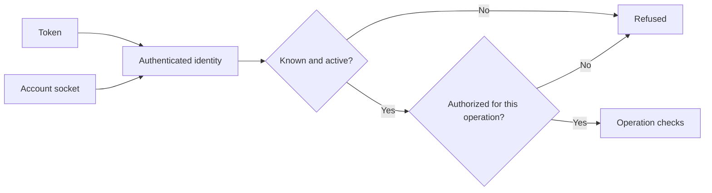
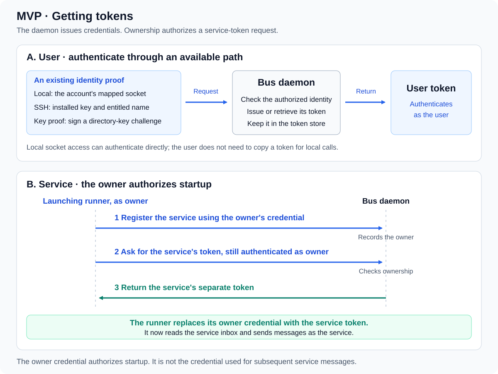
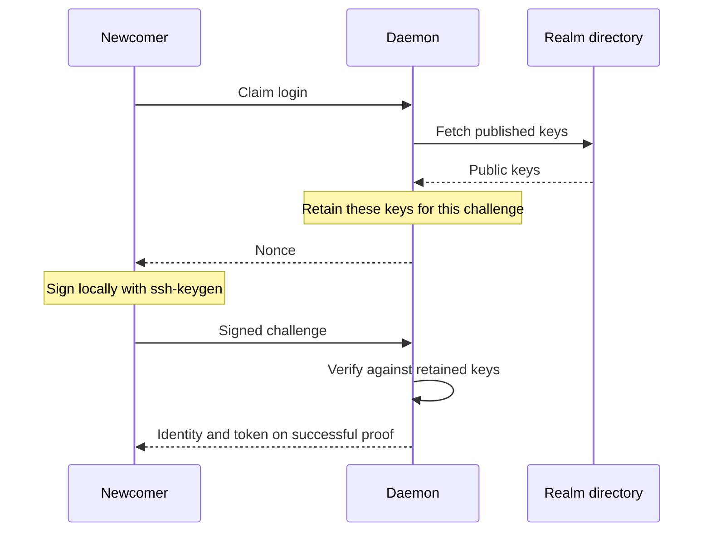

# Access

📌 **TL;DR:** Credentials identify; permissions authorize. A call carries a
token or an account socket, and the daemon checks that the caller is known,
active and allowed; a name sent beside a credential cannot change who is
calling. ACLs and nested groups decide what that caller may reach.

For ownership and management, see [Identity and roles](01-identity-and-roles.md#role-names-and-scopes).

## Scope

Tokens, key-possession enrolment, account sockets, rotation, browser sessions,
ACLs and nested groups are built. Record-defined roles and group expressions are
[R1 work](../Plans/R1/identity.md#groups-and-roles). Startup revocation remains
[best effort](#ownerless-credentials); further hardening is deferred. Future encryption is separate.
The [Owner-and-Maintainers empty ACL rule](#acl) applies to new and restored records.

## What a call carries

A token identifies one principal; an account socket can supply that identity
locally. The daemon checks that the caller is known, active and authorized.
Sending a name alongside a credential cannot change who is calling.

**Built in 0.7.6:** a token always names a User and an agent credential names
its Agent as well, the User being that Agent's Owner, both by internal ID. The
Agent remains the acting principal and the User is who it acts for, so an
inactive User refuses the agent's token too. Every call checks that pair
against the registry as it is now; a credential whose pair disagrees answers
for nothing. Only a User and an Agent are issued one: a queue, a topic and a
service are reached, never speak. See [constitution § Token](constitution.md#-token).

Protected requests follow this path; authority is rechecked when the operation acts.
Public exceptions are listed below.

Authentication boundaries and public exceptions

| Door | What authenticates |
|---|---|
| Token | The credential on the API request |
| Local account socket | The principal mapped to that listener |
| SSH token/admin command | The key's forced-command entitlement |

* A principal needs a profile or registry record. A bad token or unknown identity
  receives `401`; suspension receives `403 suspended`.
* Authority is rechecked when an operation acts, not trusted from an earlier
  gate or page. Token issuance and record removal also check authority together
  with their credential-store writes.
* Tokens authenticate to the daemon, not one target name. Routed messages
  carry the verified sender identity, never the sender's token. Whatever reads
  the receiving queue uses its own credential.
* `AGENT_BUS_NAME` tells a process and its children what they serve; it does not
  authenticate to the daemon. `status` reports the authenticated caller.
* [Public node identity](05-discovery.md#what-a-node-says-about-itself) and
  [key enrolment](#proving-possession) do not require an existing token.
  Neither grants unrelated registry access.
* SSH exposes the [installed command grammar](09-setup.md#ssh-admin), not an
  arbitrary remote-command proxy. Remote clients can tunnel to the loopback
  listener; the daemon refuses public-interface binds.

## Getting a token

Use `agent-bus-token`, locally, over SSH or with a published key. The daemon
owner may request any known identity's credential; other callers may request
their own or a record they own. Unknown names must be created or enrolled first.

Commands and entitlement

| Path | Command |
|---|---|
| SSH | `export AGENT_BUS_TOKEN=$(ssh agent-busd@<node> token)` |
| Local account | `agent-bus-token <user@realm>` |
| Published key, no sshd needed | `agent-bus-token <user@realm> --key <ed25519>` |

The first two paths require access to the node's host. Over SSH, the
`authorized_keys` forced command fixes the permitted identity; a caller cannot
replace it by supplying another name. An ordinary user's key reaches the token
helper; an operator's reaches the [administration program](09-setup.md#ssh-admin).

The key path uses [the enrolment proof](#proving-possession), including for a
previously enrolled identity retrieving its credential again. No path issues a
token for an unknown identity without first establishing that identity.

## Proving possession

A directory-backed realm admits a name only after proof of its published key.
The newcomer signs a daemon challenge; successful enrolment creates a profile,
a self-owned record and a credential. Fetching somebody's public key is not proof.

Challenge exchange and provider outages

The proof needs no prior token; the signature establishes entitlement. Unanswered
challenges expire, and successful ones are spent. Registration cannot create a
new name in a directory-backed realm; realms without directories use the
[registration rule](01-identity-and-roles.md#registration).

GitHub enrolment retains public keys and the provider's person name under the
[profile import rules](01-identity-and-roles.md#users-and-profiles). Existing
tokens keep working during provider outages; a new challenge requires both
provider answers. Private keys stay with the signing tool.

## ACL

**Pending for 0.7:** Forwarding uses the constitution's
[hop-specific ACL checks](constitution.md#-channels), including channel-name
references for Queue sources.

**ACL governs other principals' access to a record**, whichever of the five
[kinds](03-records.md#five-record-kinds) it is. A record does not
need to list itself in its own ACL: it may read its own inbox independently.
Caller standing, owner suspension and the record's Disabled setting still apply.
On a 📡 the list governs who may **read** the record — its address, protocol,
description and [secret](06-services.md#secrets) — because a
service has no delivery to govern. On a 📣 it governs who may **publish**;
who receives a copy is the separate
[Deliver-To list](04-messaging.md#subscribers).

**For other principals, an empty ACL means access only for the record's Owner
and assigned Maintainers.** This default
applies to Personal and non-Personal records alike.
Being a user alone grants no access: Owner and Maintainer are the relevant
resource roles, not additional entries that must be placed in the ACL.

To allow **any registered user**, explicitly add **`*`** to the ACL. This does
not admit anonymous, unknown or suspended callers. A
[Personal agent](03-records.md#personal-and-shared) cannot use
this grant because it admits every registered user. **Pending for 0.7:** `*`
also admits every active Agent, which acts for its User.

**`@owner` is a runtime ACL term for the record's direct Owner and every 👾
`agent` directly owned by that Owner.** No other
[kind](03-records.md#five-record-kinds) joins the cohort: a 📮, a
📣 and a 👤 are destinations or people rather than callers acting for an owner,
and a 📡 calls nothing here at all. Ownership is one step: an agent owned by
another agent does not inherit the human owner's cohort. The term follows current registry
ownership, grants access rather than management, and is not a stored group: it
cannot be created, nested in a group or assigned as a Maintainer.

**Built in 0.7.5:** an ACL or Maintainer line naming an 👾 `agent` carries a
leading `#` and is stored with it, so a bare `alice@team` names a User; the
[typed actor terms](constitution.md#-registry-record) own that rule.
`@agent` joins `@owner` as a runtime term, aliasing the record's
own agent principal on an 👾 `agent` record, and both terms become valid in
Maintainers as well as the ACL. Neither becomes a stored group: they still
cannot be created or nested in one, and they resolve against current registry
ownership at each check. Both names are reserved, so no group may be named
`@owner` or `@agent`, and `@agent` on a record that is not an 👾 is refused. A
[Personal agent](03-records.md#personal-and-shared) may use both; the wildcard
stays invalid there because it admits every registered user.

Faces cannot widen these permissions. Enter ACLs in the project's
[plain-text syntax](05-discovery.md#acl-editing), not display glyphs.

Grants and upgrade behavior

Version 0.5.44 replaces the former open-empty default, including on restored
records. See the [upgrade note](09-setup.md#empty-acl-upgrade).

| Rule | Effect for an active, known caller |
|---|---|
| Resource management authority | Owner, resource's own principal and assigned Maintainers have access |
| Empty allow list | No additional access beyond resource management authority |
| Matching name, ordinary group or `*` | Grants access |
| `@owner` | Grants access to the direct Owner and the agents that Owner directly owns |

Version 0.5.74 removes the former master layer, including its flag and record
field. The daemon Owner keeps
[node-wide management](01-identity-and-roles.md#daemon-owner), which permits
discovery and editing without opening a resource's message interface. See the
[release note](09-setup.md#owner-acl-and-master-removal).

Allow lists are registry settings, never values taken from private
[registry configuration](03-records.md#configuring-a-template). Queries, sends, consumes and writes still obey their applicable
state and authority checks.

ACLs can name any registered record, ordinary groups and `@owner`. Ordinary
group resolution follows
[nested membership](01-identity-and-roles.md#groups), including cycle-safe and
later-populated group references. Entity glyphs are
[display labels](05-discovery.md#identity-labels-in-web-and-cli), not ACL input.

## Token lifetime

Principal tokens never expire or rotate because of time, inactivity or restart.
Explicit rotation keeps the current and previous token valid. Removing an
agent deletes its credentials in the removal's own commit, and
[ownerless cleanup](#ownerless-credentials) collects credentials that answer
for nobody; pausing or banning a user retains theirs.

Persistence, rotation and sessions

* Asking again retrieves the current token. `agent-bus-token <name> --rotate`
  issues another; the token preceding the previous one stops authenticating.
* Token bytes, issuance time and the User/Agent pair persist. Last use is
  written in one batch on the queue flush's cadence, never once per call, so
  a crash may lose the uses since the last flush.
* At start, a stored credential whose pair disagrees with ownership, or that a
  kind holding none carries, can only come from a failed write: it is ignored,
  authenticates nothing and is reported as an alert naming the User, the
  Agent and the current Owner, never the credential. It is not repaired. A
  credential issued before its principal was bound is bound on first check.
* Credential listings show only identities the caller holds, using keyed
  fingerprints rather than token bytes.
* A person's credential lasts while their user profile exists; MVP does not
  delete users. Removing a person's registry record does not remove their
  profile or credential. See [record removal](01-identity-and-roles.md#unregistering).
* Browser sessions have a [separate lifetime](05-discovery.md#signing-in) and
  are not persisted; they are not principal-token rotation.
* The no-automatic-expiry rule also protects future encrypted backlog recovery:
  replacing key material does not make old ciphertext decryptable. The
  [future key lifecycle](../Plans/R1/access.md#key-modes) must account for it.

## Ownerless credentials

A credential with neither a user profile nor a registry record is collected at
startup, after [orphaned records](01-identity-and-roles.md#orphaned-records).
The Owner or an Administrator can also remove it explicitly; viewing a list
never performs cleanup.

Eligibility and failed revocation

* Eligibility is checked again at removal. A newly created profile or record
  prevents cleanup; age, inactivity and ownership of other records are not
  alternative eligibility tests.
* Registered users retain credentials even while paused or banned. The daemon
  owner has a profile and survives by the same rule. Credential-only entries
  can remain visible until cleanup; directory counts cover visible entries.
* **Startup revocation is best effort today.** If saving a revocation fails, the
  daemon logs it and continues. Old bytes can then authenticate a later holder
  of the same name; re-registration also prevents later ownerless sweeps from
  retrying. Further hardening was deferred by the owner on 2026-09-17;
  no change to this behavior is scheduled.
* Explicit [unregistration](01-identity-and-roles.md#unregistering) instead
  abandons removal if its required credential-store write fails.

## Local socket

On the node's host, an account socket authenticates its mapped principal without
a token. The shared socket requires a token. Both obey the same permissions as
other authenticated requests.

Socket paths, discovery and permissions

| Socket or directory | Access |
|---|---|
| `/run/agent-bus/user-<account>.sock` | Owned by that account, mode `600` |
| `/run/agent-bus/bus.sock` | Shared, mode `666`; does not supply an identity |
| `/run/agent-bus/` | Mode `711`: traversable, not listable by other users |

The CLI chooses global `--addr`, then `AGENT_BUS_ADDR`, then discovery. Discovery
checks the login runtime directory before the installed directory; without a
token it chooses the account socket, with one the shared socket. An explicit
address failure never falls back to another bus. The token helper uses discovery
when its address is unset; daemon bind defaults are separate from discovery.

The daemon creates its runtime directory and maps identity by the listener used;
`status` reports that identity. Its own account gets a socket too. A launcher
obtains a session token over its account socket, then uses the shared listener.
Socket ownership needs [supervisor-only CAP_CHOWN](11-processes.md#why-the-supervisor-holds-cap_chown),
not a root-running bus child.

Setup flags seed the editable account map once. The stored map is then
authoritative and Owner/Administrators change it through the existing
[administration path](09-setup.md#administering-the-account-map); a full daemon
restart replaces the listeners. The daemon account's implicit socket stays
outside that map.

## Trust boundary

MVP assumes a trusted host: message bodies and stored configuration are readable
by the daemon. No peer handshake or message encryption is built. Hiding bodies
from the dashboard is a disclosure boundary, not encryption; the future design
lives in [R1](../Plans/R1/access.md#encrypted-sessions).
