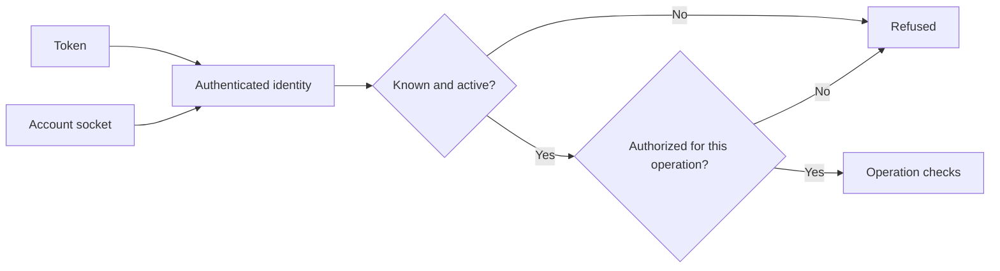
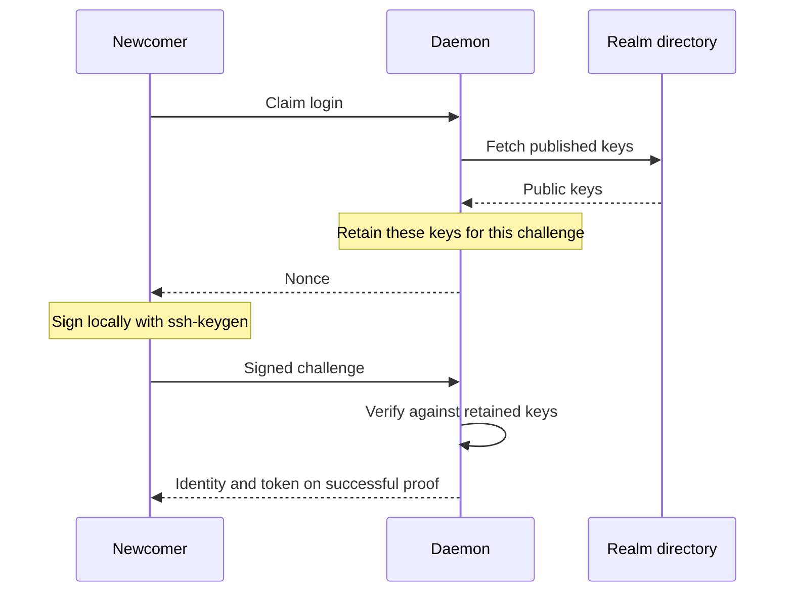

# Access

📌 **TL;DR:** Credentials identify; permissions authorize.

For ownership and management, see [Identity and roles](01-identity-and-roles.md#role-names-and-scopes).

## Scope

Tokens, key-possession enrolment, account sockets, rotation, browser sessions
and flat ACLs are built. Nested groups and service-role expressions remain
[pending](../Plans/MVP/TODO.md#authority-model); startup revocation failure policy
is [unresolved](../Plans/MVP/QUESTIONS.md#open-questions). Future encryption is separate.
The [owner-only empty ACL rule](#acl) is accepted and awaits implementation.

## What a call carries

A token identifies one principal; an account socket can supply that identity
locally. The daemon checks that the caller is known, active and authorized.
Sending a name alongside a credential cannot change who is calling.

Protected requests follow this path; authority is rechecked when the operation acts.
Public exceptions are listed below.

Authentication boundaries and public exceptions

| Door | What authenticates |
|---|---|
| Token | The credential on the API request |
| Local account socket | The principal mapped to that listener |
| SSH token/admin command | The key's forced-command entitlement |

* A principal needs a profile or registry record. A bad token or unknown identity
  receives `401`; suspension receives `403 suspended`.
* Authority is rechecked when an operation acts, not trusted from an earlier
  gate or page. Token issuance and record removal also check authority together
  with their credential-store writes.
* Tokens authenticate to the daemon, not one target service. Routed messages
  carry the verified sender identity, never the sender's token. The receiving
  service uses its own credential.
* `AGENT_BUS_NAME` tells a process and its children what they serve; it does not
  authenticate to the daemon. `status` reports the authenticated caller.
* [Public node identity](05-discovery.md#what-a-node-says-about-itself) and
  [key enrolment](#proving-possession) do not require an existing token.
  Neither grants unrelated registry access.
* SSH exposes the [installed command grammar](09-setup.md#ssh-admin), not an
  arbitrary remote-command proxy. Remote clients can tunnel to the loopback
  listener; the daemon refuses public-interface binds.

## Getting a token

Use `agent-bus-token`, locally, over SSH or with a published key. The daemon
owner may request any known identity's credential; other callers may request
their own or a record they own. Unknown names must be created or enrolled first.

Commands and entitlement

| Path | Command |
|---|---|
| SSH | `export AGENT_BUS_TOKEN=$(ssh agent-busd@<node> token)` |
| Local account | `agent-bus-token <user@realm>` |
| Published key, no sshd needed | `agent-bus-token <user@realm> --key <ed25519>` |

The first two paths require access to the node's host. Over SSH, the
`authorized_keys` forced command fixes the permitted identity; a caller cannot
replace it by supplying another name. An ordinary user's key reaches the token
helper; an operator's reaches the [administration program](09-setup.md#ssh-admin).

The key path uses [the enrolment proof](#proving-possession), including for a
previously enrolled identity retrieving its credential again. No path issues a
token for an unknown identity without first establishing that identity.

## Proving possession

A directory-backed realm admits a name only after proof of its published key.
The newcomer signs a daemon challenge; successful enrolment creates a profile,
a self-owned record and a credential. Fetching somebody's public key is not proof.

Challenge exchange and provider outages

The proof needs no prior token; the signature establishes entitlement. Unanswered
challenges expire, and successful ones are spent. Registration cannot create a
new name in a directory-backed realm; realms without directories use the
[registration rule](01-identity-and-roles.md#registration).

GitHub enrolment fetches public keys, not profile details. Existing tokens keep
working during provider outages. Private keys stay with the signing tool.

## ACL

A record's ACL controls who may see and use it. **An empty ACL means access
only for the record's owner. Accepted; implementation pending.** This default
applies to Personal and non-Personal services alike.
Faces cannot widen these permissions. Enter ACLs in the project's
[plain-text syntax](05-discovery.md#acl-editing), not display glyphs.

Current implementation and the pending access change

Today the daemon still treats an empty allow list as open. The table below
describes that existing behavior, not the accepted owner-only default.

| Rule | Effect for an active, known caller |
|---|---|
| Resource management authority | Owner, resource's own principal and assigned Maintainers have access |
| Empty allow list | Open to authenticated principals |
| Matching name, group or `*` | Grants access |
| Master | Grants access unless the record refuses master |

The daemon owner holds master; additional masters are configured at startup.
Master grants access, not ownership or management. The accepted node-wide
[Owner override](01-identity-and-roles.md#daemon-owner) remains pending.
Allow lists and master refusal are registry settings, never values taken from
private service configuration. Queries, sends, consumes and writes still obey
their applicable state and authority checks.

ACLs can name users, services and groups. Group resolution is currently flat;
[nesting and effective maintenance membership](01-identity-and-roles.md#groups)
are separate pending work. User/Agent/Service glyphs are
[display labels](05-discovery.md#identity-labels-in-web-and-cli), not ACL input.

## Token lifetime

Principal tokens never expire or rotate because of time, inactivity or restart.
Explicit rotation keeps the current and previous token valid. Record removal
and [ownerless cleanup](#ownerless-credentials) can revoke non-user credentials;
pausing or banning a user retains theirs.

Persistence, rotation and sessions

* Asking again retrieves the current token. `agent-bus-token <name> --rotate`
  issues another; the token preceding the previous one stops authenticating.
* Token bytes and issuance time persist. Last-use tracking is in memory for
  this run, without a disk write per call.
* Credential listings show only identities the caller holds, using keyed
  fingerprints rather than token bytes.
* A person's credential lasts while their user profile exists; MVP does not
  delete users. Removing a person's registry record does not remove their
  profile or credential. See [record removal](01-identity-and-roles.md#unregistering).
* Browser sessions have a [separate lifetime](05-discovery.md#signing-in) and
  are not persisted; they are not principal-token rotation.
* The no-automatic-expiry rule also protects future encrypted backlog recovery:
  replacing key material does not make old ciphertext decryptable. The
  [future key lifecycle](../Plans/R1/access.md#key-modes) must account for it.

## Ownerless credentials

A credential with neither a user profile nor a registry record is collected at
startup, after [orphaned records](01-identity-and-roles.md#orphaned-records).
The Owner or an Administrator can also remove it explicitly; viewing a list
never performs cleanup.

Eligibility and failed revocation

* Eligibility is checked again at removal. A newly created profile or record
  prevents cleanup; age, inactivity and ownership of other records are not
  alternative eligibility tests.
* Registered users retain credentials even while paused or banned. The daemon
  owner has a profile and survives by the same rule. Credential-only entries
  can remain visible until cleanup; directory counts cover visible entries.
* **Startup revocation is best effort today.** If saving a revocation fails, the
  daemon logs it and continues. Old bytes can then authenticate a later holder
  of the same name; re-registration also prevents later ownerless sweeps from
  retrying. The failure policy remains [Q69](../Plans/MVP/QUESTIONS.md#open-questions).
* Explicit [unregistration](01-identity-and-roles.md#unregistering) instead
  abandons removal if its required credential-store write fails.

## Local socket

On the node's host, an account socket authenticates its mapped principal without
a token. The shared socket requires a token. Both obey the same permissions as
other authenticated requests.

Socket paths, discovery and permissions

| Socket or directory | Access |
|---|---|
| `/run/agent-bus/user-<account>.sock` | Owned by that account, mode `600` |
| `/run/agent-bus/bus.sock` | Shared, mode `666`; does not supply an identity |
| `/run/agent-bus/` | Mode `711`: traversable, not listable by other users |

The CLI chooses global `--addr`, then `AGENT_BUS_ADDR`, then discovery. Discovery
checks the login runtime directory before the installed directory; without a
token it chooses the account socket, with one the shared socket. An explicit
address failure never falls back to another bus. The token helper uses discovery
when its address is unset; daemon bind defaults are separate from discovery.

The daemon creates its runtime directory and maps identity by the listener used;
`status` reports that identity. Its own account gets a socket too. A launcher
obtains a session token over its account socket, then uses the shared listener.
Socket ownership needs [supervisor-only CAP_CHOWN](11-processes.md#why-the-supervisor-holds-cap_chown),
not a root-running bus child.

## Trust boundary

MVP assumes a trusted host: message bodies and stored configuration are readable
by the daemon. No peer handshake or message encryption is built. Hiding bodies
from the dashboard is a disclosure boundary, not encryption; the future design
lives in [R1](../Plans/R1/access.md#encrypted-sessions).
