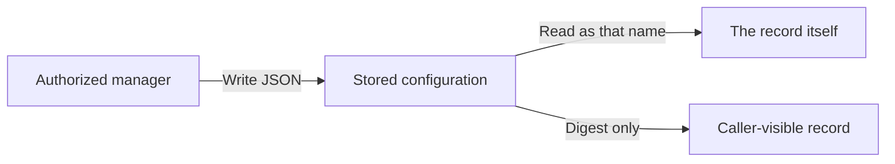

# Agents

📌 **TL;DR:** A 👾 Agent is the bus's working entity: a name beginning with
`#`, owned by a User, that acts under its own credential and reads its own
inbox. It is how a script, a service or an AI session takes part — sending,
answering and coordinating — and every other kind exists to route to one,
describe something outside, or group actors.


## What an Agent is

| | |
|---|---|
| Name | begins with `#` — `#worker@team`, `#claude/session@host` — so the name alone says it is an Agent; every face requires the `#`, and the CLI also takes `--agent worker@team` ([names](01-identity-and-authority.md#names)) |
| Owner | always a User, never another Agent; an Agent acting for its Owner gains no authority over what it creates ([ownership](01-identity-and-authority.md#ownership)) |
| Credential | its own token, issued by its Owner, which acts as the Agent: it is the sending, reading principal ([what a call carries](02-access.md#what-a-call-carries), [getting a token](02-access.md#getting-a-token)) |
| Inbox | the queue it reads; who may send to it is its allow list, and it may answer a User that list admits ([inbox queues](04-messaging.md#inbox-queues), [ACL](02-access.md#acl)) |
| Readers | one reader at a time unless each says it shares; a pool of workers is one name ([one reader per inbox](04-messaging.md#one-reader-per-inbox)) |
| Its own rights | an Agent reads its own [configuration and secret](constitution.md#-private-values), uses its own record's [locks](01-identity-and-authority.md#shared-locks) and [key-value store](01-identity-and-authority.md#key-value-store), and edits what a Maintainer may on its own record |
| Personal | session agents the [`ab-*` launchers](08-runner-role.md#session-names) start are Personal, with `@owner` in their allow list ([Personal and shared](03-records.md#personal-and-shared)) |
| Roles | R1: an Agent is told the roles its caller holds on every message ([roles are for Agents](../Plans/R1.0-Release/roles.md#roles-are-for-agents)) |

## What it carries

The common fields every record has ([common record fields](constitution.md#common-record-fields)),
and these of its own:

| Field | |
|---|---|
| `ttl`, `bound`, `overflow` | its inbox's message lifetime, capacity and what a full inbox does ([overflow](04-messaging.md#overflow)) |
| `deliver_to` | one slot: forward what arrives to another 👾, 📮 or 📣 ([subscribers](04-messaging.md#subscribers)) |
| `config`, `secret` | private values: a JSON configuration and an env-file secret, its Owner's and Maintainers' to write ([configuring a template](#configuring-a-template)) |
| `script` | what `agent-bus start` serves it with, written by the runner and informational ([script agents](08-runner-role.md#script-agents)) |

An Agent has no address and no protocol: it is reached by sending to its name,
never at an address ([how to call it](03-records.md#how-to-call-it)).

## How one is started

| Started by | |
|---|---|
| `agent-bus start` | the foreground runner: registers the Agent, reads its inbox and runs a script per message or keeps a child ([script agents](08-runner-role.md#script-agents)) |
| an `ab-*` launcher | Claude Code, Codex or OpenCode with the MCP face, under a session agent name ([smart launchers](08-runner-role.md#smart-launchers)) |
| itself | any program holding its credential registers on start and reads its inbox through the CLI, the API or MCP |

## Agent Templates

`name@realm` stands alone; `template/instance@realm` says which **agent
template** that instance was configured from. The prefix is naming, not a group
and not an instruction to fan out: the parser accepts it for a name of any
[kind](03-records.md#record-kinds) and reads no meaning out of it. Each complete name is
a record of its own, with its own configuration and — for the four kinds that
have one — its own queue. Nothing parses configuration out of an instance's
name.

**A record's method information is its description, and nothing else.** The
record's one free-text field is what `ls` and the MCP catalog show, so anything
whose callers need to know its verbs writes them into that sentence. The release has
no method list, no per-method destructive hint and nothing generated from one; a
better representation is proposed in
[R1 method metadata](../Plans/R1.0-Release/method-metadata.md#method-metadata).

## Configuring a template

Configuring an agent template **is** what produces a configured name. One verb
does it, and reads it back:

| | |
|---|---|
| `cat cfg.json \| agent-bus agent-template <template/instance@realm> -` | configure it, JSON on stdin |
| `agent-bus agent-template <template/instance@realm> '{"k":"v"}'` | the same, inline |
| `agent-bus agent-template <template/instance@realm>` | print that configuration |

The direction is decided by whether a configuration was handed to it, and
setting one answers with its digest rather than with what was set. The verb
is **one hyphenated word** so that it stays a single verb in every face,
including as an MCP tool name
([glossary § names that are enforced](glossary.md#names)).

The record is created if it does not exist, with the defaults a bare
registration gets — configuring is not a second way to describe a record, only
the way to give it a configuration. What it creates is an 👾 `agent`: a 📡
`service` could not be created here, having no address to be registered with
([record kinds](03-records.md#record-kinds)). A standalone `name@realm` takes a
configuration the same way; the template prefix is not what makes one
configurable.

| | |
|---|---|
| the configuration | **arbitrary JSON, stored opaque** and compacted before storage and hashing. The only check is that it *is* JSON — a syntax check, not interpretation. Nothing looks for a server, a user, a mailbox or a credential. A stored configuration that is not compact JSON is [ignored and reported](constitution.md#persistence-and-loading) at load |
| who may write it | the record's **Owner and Maintainers** ([private values](constitution.md#-private-values)). Unlike a registration, a configuration is not something any caller may overwrite — and registering does not overwrite one either, so an agent restarting keeps what it was configured with. A registration carries **neither half**: not the bytes, and not the digest, which is derived from them and would otherwise let anyone claim any setup |
| who may read it | the record's **Owner and Maintainers**, and an 👾 agent its own. The allow list and a 👥's membership grant use, not the configuration. A caller who sees the record and may not read it is told it is private; one who may not see it learns only that there is no such name |
| what a query gets | **`config_sha`**, a SHA-256 of the stored bytes, on every answer that carries a record — the whole listing, a query for one name (`agent-bus ls <name>`), and the answer to setting one ([why a digest at all](#why-a-digest-at-all)) |
| where the bytes are **not** | anywhere else. No listing carries them, and the one read is the record's own |
| nothing to store | refused: no configuration at all, something that is not JSON, and `null` — which would read back exactly like never having been configured |
| an empty *value* | kept. `{}`, `[]`, `""`, `0` and `false` are configurations; the bus does not judge what is inside |

### Why a digest at all

<details>
<summary>Diagram: configuration goes in; only the named record reads it back</summary>



The digest lets a caller compare configurations without reading their contents.
This is an access boundary, not encryption from the daemon.

</details>

**So that anything watching can tell whether a record's setup has been
changed by someone, without ever being shown it.** A configuration cannot be
read back — not even by its owner — so the only other way to answer "is this
still what I set?" would be to hand out the secrets to compare. The digest
answers it without them:

| Asking | How |
|---|---|
| is this name configured? | a `config_sha` is there, or it is not |
| did my write land? | setting one answers with its digest; compare it to the next query |
| has someone changed it since? | the digest moved |
| do these two records hold the same setup? | the digests match |
| is this host's copy the one I shipped? | compare digests across hosts |

A
monitor, a peer, a deploy check or the owner can all hold the digest they
expect and notice the day it differs.

The bus stores **one spelling**: the bytes are compacted, so reformatting a
configuration file is not a change and does not move the digest. That also
means `sha256sum cfg.json` matches only if the file is already compact.

A digest of a short, guessable configuration can be recovered by trying
candidates. The current configuration is plaintext in daemon state, including
the database. The caller restrictions are real; secrecy from the daemon
is not claimed.

**A record fetches its own configuration; nothing injects it** — and it is
the only one that can, so this runs as that name, not as its owner. This is
the *registry's* configuration, not the runner's environment, which is the
other thing that word names ([glossary § terms](glossary.md#terms)):

```sh
cfg=$(agent-bus agent-template "$AGENT_BUS_NAME")
```

