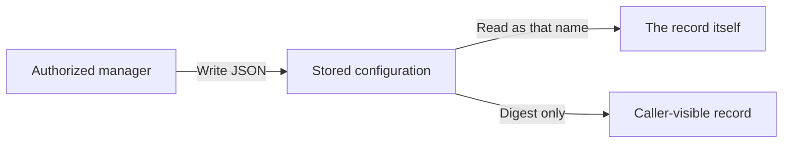

# Records

📌 **TL;DR:** Every registered name is one of five kinds; four have a queue here and the fifth says where something external is.

## Status

| MVP | Scope |
|---|---|
| Built | [Five record kinds](#five-record-kinds) closing `kind`, registry records, [agent templates](#agent-templates), private registry configuration and [Personal classification and web grouping](#personal-and-shared). A record's method information is its [description](#agent-templates). |
| Pending | Nothing here. The 📮 and 📣 kinds are owned by [channels](07-channels.md#status), and the 📡 kind by [services](06-services.md#status). |

## Five record kinds

`kind` is a closed set. The daemon answers what a record is, rather than a page
inferring it from which fields happen to be filled in.

| | Kind | What it is | Registered by | Someone acts as this name |
|---|---|---|---|---|
| 👤 | `user` | the queue a person reads | the daemon, when the person is registered | the person |
| 👾 | `agent` | the queue an agent reads | its launcher, or the agent itself at startup | the agent |
| 📮 | `queue` | a [topic](07-channels.md#the-two-channel-kinds) created to be shared, named for its own sake rather than for a principal | a user or an agent | nobody |
| 📣 | `pubsub` | a [pub/sub topic](07-channels.md#the-two-channel-kinds): it keeps nothing and copies each publication to everyone on its [Deliver-To list](04-messaging.md#subscribers) | a user or an agent | nobody |
| 📡 | `service` | a description of something [**external**](06-services.md#what-a-service-is), not on this bus | a user or an agent | nobody here |

Registering with no kind stores `service`, because describing something outside
is the case a bare `register` is usually for. `--personal` names an `agent`.

**The bus carries work between people and agents.** Those two act: they hold a
[credential](02-access.md#what-a-call-carries), send under their own name and
answer. The two channel kinds are **passive** — they hold or they copy,
and a person or an agent does the work at each end. A service does not even do
that: it is a card saying where something outside is and how to reach it.

The last column says what a name is *for*, not what the daemon refuses: a
credential can be minted for any registered name its owner asks for, and no
check consults the kind.

**The kind does not change who may read a record.** One allow list still governs
a record in both directions ([ACL](02-access.md#acl)), so a kind naming a single
principal describes what the record is *for*, not a reader the daemon enforces.
Splitting that list into a write side and a delivery side is a separate,
undecided question ([directional access](../Plans/Future/acl-direction.md#where-direction-is-needed)).

**A service is the external case, and everything about it lives on its own
page.** It has no queue here, so nothing is sent to it, nothing subscribes it
and nothing consumes from it; it carries an address and a protocol instead, and
the daemon reaches neither. See [services](06-services.md#what-a-service-is).

Before 1.1 there is no compatibility obligation, so no migration is written:
existing records are registered again under the kind they should carry.

### Restoring a record

Restore asks the same shape question registration does, and **refuses** a record
this version could not have registered: an unknown kind, a
[service](06-services.md#it-has-no-queue-here) without an address or a protocol,
a service carrying queue settings or a queue, a
[secret](06-services.md#secrets) on anything but a service, or
[Personal](#personal-and-shared) on anything but an agent. The daemon names the
record and the reason rather than converting it or coming up pretending.

## How to call it

The kind says how a name is reached, and there are only two answers.

| Kind | How a caller reaches it |
|---|---|
| 👤 👾 📮 📣 | **send to the name.** The daemon puts the message in the [queue](04-messaging.md#inbox-queues) belonging to it, and whoever reads that queue takes it |
| 📡 | **call it directly**, at its own address — [services § how to call it](06-services.md#how-to-call-it) owns that half |

## Agent Templates

`name@realm` stands alone; `template/instance@realm` says which **agent
template** that instance was configured from. The prefix is naming, not a group
and not an instruction to fan out: the parser accepts it for a name of any
[kind](#five-record-kinds) and reads no meaning out of it. Each complete name is
a record of its own, with its own configuration and — for the four kinds that
have one — its own queue. Nothing parses configuration out of an instance's
name.

**A record's method information is its description, and nothing else.** The
record's one free-text field is what `ls` and the MCP catalog show, so anything
whose callers need to know its verbs writes them into that sentence. The MVP has
no method list, no per-method destructive hint and nothing generated from one; a
better representation is proposed in
[R1 method metadata](../Plans/R1/discovery.md#method-metadata).

## Configuring a template

Configuring an agent template **is** what produces a configured name. One verb
does it, and reads it back:

| | |
|---|---|
| `cat cfg.json \| agent-bus agent-template <template/instance@realm> -` | configure it, JSON on stdin |
| `agent-bus agent-template <template/instance@realm> '{"k":"v"}'` | the same, inline |
| `agent-bus agent-template <template/instance@realm>` | print that configuration |

The direction is decided by whether a configuration was handed to it, and
setting one answers with its digest rather than with what was set. The verb
is **one hyphenated word** so that it stays a single verb in every face,
including as an MCP tool name
([glossary § names that are enforced](glossary.md#names)).

The record is created if it does not exist, with the defaults a bare
registration gets — configuring is not a second way to describe a record, only
the way to give it a configuration. What it creates is an 👾 `agent`: a 📡
`service` could not be created here, having no address to be registered with
([five record kinds](#five-record-kinds)). A standalone `name@realm` takes a
configuration the same way; the template prefix is not what makes one
configurable.

| | |
|---|---|
| the configuration | **arbitrary JSON, stored opaque.** The only check is that it *is* JSON — a syntax check, not interpretation. Nothing looks for a server, a user, a mailbox or a credential |
| who may write it | the principals with [record management authority](01-identity-and-roles.md#groups). Unlike a registration, a configuration is not something any caller may overwrite — and registering does not overwrite one either, so an agent restarting keeps what it was configured with. A registration carries **neither half**: not the bytes, and not the digest, which is derived from them and would otherwise let anyone claim any setup |
| who may read it | **the named record itself, and nobody else — its owner included.** Setup data goes in and is used; it does not come back out to be looked at |
| what a query gets | **`config_sha`**, a SHA-256 of the stored bytes, on every answer that carries a record — the whole listing, a query for one name (`agent-bus ls <name>`), and the answer to setting one ([why a digest at all](#why-a-digest-at-all)) |
| where the bytes are **not** | anywhere else. No listing carries them, and the one read is the record's own |
| nothing to store | refused: no configuration at all, something that is not JSON, and `null` — which would read back exactly like never having been configured |
| an empty *value* | kept. `{}`, `[]`, `""`, `0` and `false` are configurations; the bus does not judge what is inside |

### Why a digest at all

<details>
<summary>Diagram: configuration goes in; only the named record reads it back</summary>



The digest lets a caller compare configurations without reading their contents.
This is an access boundary, not encryption from the daemon.

</details>

**So that anything watching can tell whether a record's setup has been
changed by someone, without ever being shown it.** A configuration cannot be
read back — not even by its owner — so the only other way to answer "is this
still what I set?" would be to hand out the secrets to compare. The digest
answers it without them:

| Asking | How |
|---|---|
| is this name configured? | a `config_sha` is there, or it is not |
| did my write land? | setting one answers with its digest; compare it to the next query |
| has someone changed it since? | the digest moved |
| do these two records hold the same setup? | the digests match |
| is this host's copy the one I shipped? | compare digests across hosts |

A
monitor, a peer, a deploy check or the owner can all hold the digest they
expect and notice the day it differs.

The bus stores **one spelling**: the bytes are compacted, so reformatting a
configuration file is not a change and does not move the digest. That also
means `sha256sum cfg.json` matches only if the file is already compact.

A digest of a short, guessable configuration can be recovered by trying
candidates. The current configuration is plaintext in daemon state, including
the restart snapshot. The caller restrictions are real; secrecy from the daemon
is not claimed.

**A record fetches its own configuration; nothing injects it** — and it is
the only one that can, so this runs as that name, not as its owner. This is
the *registry's* configuration, not the runner's environment, which is the
other thing that word names ([glossary § terms](glossary.md#terms)):

```sh
cfg=$(agent-bus agent-template "$AGENT_BUS_NAME")
```

## Personal and shared

An owner may tag their agent **Personal**. Without that tag, it is
**non-Personal**. The tag hides personal agents from the main web pages to
reduce clutter; access works exactly as for any other record.
The stored classification, assignment limits and web grouping are built.

| Rule | Requirement |
|---|---|
| Carried by | an 👾 `agent` and nothing else; the tag is not a kind ([five record kinds](#five-record-kinds)) |
| ACL entries | Only other agents; a user's own queue does not turn that user into one |
| Groups | Not valid ACL entries, even when every member is an agent |
| Runtime `@owner` | Not valid; a Personal agent lists the agents it admits directly |
| Sharing with users | Requires making the agent non-Personal; a user entry cannot coexist with the Personal tag |
| Maintainers | Cannot be assigned while the agent is Personal; shared maintenance requires making it non-Personal |
| Broad access | The [wildcard grant](02-access.md#acl) is not valid for a Personal agent |
| Main web pages | Exclude Personal agents; find them in the dedicated tab instead |
| User's web view | A **Personal** tab shows that user's Personal agents |
| Daemon owner's web view | Personal agents can be filtered per owner across the node-wide inventory visible through Owner management |

The tag introduces no separate access policy and no sixth kind. Apart from
these assignment restrictions and web grouping, ordinary
[access rules](02-access.md#acl), ownership and delivery are unchanged. Hiding
an agent from the main web pages does not revoke authorized access or remove it
from the registry.

Users, channels and services cannot carry Personal. Extending the
classification to another kind needs an explicit owner decision.

<details>
<summary>How the stored classification changes</summary>

Only the owner changes Personal. A new registration may state it; an agent
refreshing its metadata preserves the owner's stored choice. A request that
changes Personal and its assignments is checked as one final record, so an
owner can remove sharing while enabling Personal, or disable Personal while
adding sharing, in one operation.

Assignment validity is checked when a record is written. If an allowed agent is
later removed, the name remains stored but grants nobody; the next write must
remove it or restore that agent before the Personal record can be saved again.

</details>
