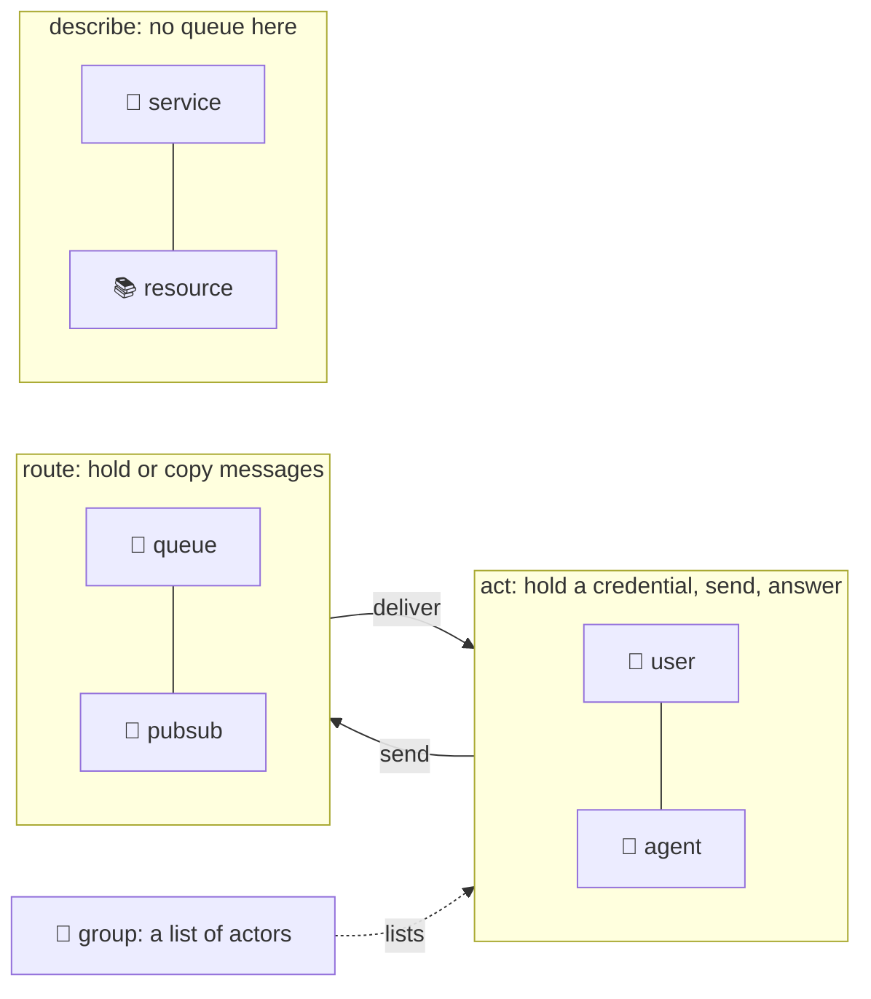

# Records

📌 **TL;DR:** Every registered name is one of seven kinds: 👤 `user`, 👾 `agent`,
📮 `queue`, 📣 `pubsub`, 📡 `service`, 👥 `group` and 📚 `resource`. Four have a
queue here, a service says where something external is, a group is a named
list of actors, and a resource is a card for data an MCP client may read. `kind` is a closed set the daemon answers for, never inferred from
which fields are filled in.

## What a record is

Every name on the bus is a **record** in one registry, one of seven kinds. Each
also carries its own [locks](01-identity-and-authority.md#shared-locks) and
[key-value store](01-identity-and-authority.md#key-value-store), for its Owner,
Maintainers and own Agent.


```mermaid
flowchart LR
    subgraph Act[act: hold a credential, send, answer]
        U[👤 user] --- A[👾 agent]
    end
    subgraph Route[route: hold or copy messages]
        Q[📮 queue] --- P[📣 pubsub]
    end
    subgraph Describe[describe: no queue here]
        S[📡 service] --- R[📚 resource]
    end
    G[👥 group: a list of actors]
    Act -->|send| Route
    Route -->|deliver| Act
    G -. lists .-> Act
```

## Record kinds

`kind` is a closed set the daemon answers for, never guessed from which fields
are filled in.

| | Kind | What it is |
|---|---|---|
| 👤 | `user` | the inbox a person reads |
| 👾 | `agent` | the inbox an [agent](03-records-agent.md#what-an-agent-is) reads; the bus's working entity |
| 📮 | `queue` | a [channel](03-records-channel.md#the-two-channel-kinds) made to be shared: messages wait for whoever reads it |
| 📣 | `pubsub` | a [channel](03-records-channel.md#the-two-channel-kinds) that keeps nothing and copies each publication to its [Deliver-To list](04-messaging.md#subscribers) |
| 📡 | `service` | a card for something [external](03-records-service.md#what-a-service-is): its address and protocol |
| 👥 | `group` | a named list of actors: its `allow` is its [membership](01-identity-and-authority.md#groups) |
| 📚 | `resource` | a [card](#resource-records) for data an MCP client may read; 🧩 when it is a template |

Only 👤 and 👾 names are acted as — by the person and by the agent; nobody
acts as the other five.

- **People and agents act;** they hold a [credential](02-access.md#what-a-call-carries),
  send under their own name and answer. Channels are passive — they hold or
  copy — and services and resources only describe.
- **Acting is what a name is for,** not a check: a credential can be minted for
  any registered name its owner asks for, and no check consults the kind.
- **The kind does not change who may read a record:** one allow list governs it
  in both directions ([ACL](02-access.md#acl)); splitting it is
  [undecided](../Plans/R2.0-Future/acl-direction.md#where-direction-is-needed).

<details>
<summary>Who registers each kind</summary>

| Kind | Registered by |
|---|---|
| 👤 `user` | the daemon, when the person is registered |
| 👾 `agent` | its launcher, the runner, or the agent itself at start |
| 📮 📣 📡 👥 📚 | a User, or an Agent acting for its Owner |

Registering with no kind stores `service`, the case a bare `register` is
usually for; `--personal` with no kind names an `agent`.

</details>

## Fields

The normative rules for each field are the
[constitution's](constitution.md#common-record-fields); this is what each one
means.

### Common fields

Every record carries these.

| Field | Meaning |
|---|---|
| `name` | the identity, globally unique: `name`, `name@realm` or `template/instance@realm`. `#` begins an Agent's and `@` a Group's, so the name says the kind ([names](01-identity-and-authority.md#names)) |
| `kind` | one of the seven; fixed for the record's life |
| `owner` | the owning User, never an Agent, kept by name and by `user_id` ([ownership](01-identity-and-authority.md#ownership)) |
| `descr` | one free-text line `ls`, MCP and the web show; a record's method information goes here ([agent templates](03-records-agent.md#agent-templates)) |
| `status` | `active` or `inactive`. An inactive record is no such entity to anyone but those who may bring it back; it changes by a settings edit, never by registering |
| `personal` | the audience tag that keeps the web pages readable, not a permission; always true on a 👤 ([Personal and shared](#personal-and-shared)) |
| `allow` | who may use it — send to it, read it, see it; on a 👥, its membership ([ACL](02-access.md#acl)). Unused on a 👤 |
| `maintainers` | who may manage it beside the Owner. Unused on a 👤 |
| `created_at`, `at` | when it was made and last changed; the daemon's, never a caller's |

### Kind-specific fields

A field a kind does not carry is refused, never stored and ignored.

| Field | Meaning | Kinds |
|---|---|---|
| `ttl`, `bound`, `overflow` | its inbox's message lifetime, capacity and what a full inbox does ([overflow](04-messaging.md#overflow)) | 👤 👾 📮 |
| `subs` (`deliver_to`) | one forwarding slot, or a 📣's list of recipients ([subscribers](04-messaging.md#subscribers)) | 👾 📮 one, 📣 a list |
| `config`, `secret` | private values: a JSON configuration and an env-file secret, read by the Owner, Maintainers and an Agent its own ([private values](constitution.md#-private-values)) | 👾 📡 👥 |
| `addr`, `protocol` | where something outside is reached and how ([services](03-records-service.md#what-a-service-is)) | 📡 |
| `script` | what `agent-bus start` serves it with; informational ([script agents](08-runner-role.md#script-agents)) | 👾 |
| `resource` | the MCP card: URI, template flag, source and descriptor ([Resource records](#resource-records)) | 📚 |

What a listing adds — `reading`, `readers`, `queued`, `in`, `out`, `dropped`,
`expired`, `oldest`, `last_used`, `can_manage`, `route_allowed` — is observed
live and answered, never stored, and a registration stating any of it is
refused ([discovery](05-discovery.md#what-a-listing-answers)).

## How to call it

| Kind | How a caller reaches it |
|---|---|
| 👤 👾 📮 📣 | **send to the name**: the daemon puts the message in its [queue](04-messaging.md#inbox-queues), and whoever reads it takes it |
| 📡 | **call it directly** at its own address ([services § how to call it](03-records-service.md#how-to-call-it)) |
| 👥 📚 | neither: a Group is named in lists, and a resource is read through MCP |

### Restoring a record

Restore asks registration's question: a record this version could not have
registered is [ignored and reported](constitution.md#persistence-and-loading),
never converted, and the rest of the node starts. Among them:

- an unknown kind, or one that disagrees with the name's `#` or `@`;
- a [service](03-records-service.md#it-has-no-queue-here) without an address or
  protocol, or with queue settings;
- a [secret](03-records-service.md#secrets) or configuration on a kind that
  holds none;
- an owner that is not a User, or not the User that owned it;
- a [Personal](#personal-and-shared) record whose lists reach outside its cohort.

## Resource records

**Built in 0.8.70.** A 📚 Resource is information, not a service and not an
Agent: a card for data some source has, which the MCP face passes to MCP one to
one under the [latest specification](constitution.md#external-protocols). The
card carries no content; listing it promises that a read of its URI is answered.

| | |
|---|---|
| The card | the common fields as on every record, and a `resource` descriptor: `uri` (an RFC 6570 template when `template` is set, 🧩), the MCP `name` (the record's name when empty), and the optional `title`, `mimeType`, `size` (not on a template), `icons` and `annotations`. `description` is the record's own |
| Source | who answers a read: a 👾 Agent, or a 📡 Service of protocol `mcp`. Only a plain `https://` card may name none. Nothing is queued on the card, so queue settings, an address and private values are refused |
| Listing | `resources/list` and `resources/templates/list` answer the cards the caller's [ACL](02-access.md#acl) admits |
| Reading | `resources/read` finds the card (an exact URI first, then the first listed matching template — not the most specific, so overlapping templates are the registrant's to avoid) and asks its source. An Agent gets a message whose body is the URI, on topic `resources/read`, and its answer is the contents: plain text, or JSON `{contents, ttlMs, cacheScope}`. A Service is forwarded the read over MCP, with `MCP_AUTHORIZATION=…` from its [secret](03-records-service.md#secrets) as the Authorization header; the secret is its Owner's and Maintainers' to read, so a reader who may not read it is refused rather than sent on without it, and a Service with no secret is reached as it is. An `https://` card is fetched by the face, up to 10 MiB |
| Rules | a read changes nothing; `cacheScope` is `public` only when the card admits `*`; an unknown URI, a card the caller may not see, or a source that does not answer is `-32602`, never an empty `contents`; `ab_ls` returns a `resource_link` for each concrete card, so a model reaches them through a tool |

The daemon serves no content: the reading and forwarding happen in the face,
which runs as the caller. An Agent source is reached under its own ACL, so it
must admit whoever its cards admit.

<details>
<summary>Trust: a card's source is fetched from the reader's host</summary>

The face follows an `https://` card wherever it points, loopback and private
addresses included (Q141, [decision](decisions.md#settled)). That is a
server-side request made from the reader's machine on the card author's word.
It is accepted on a trusted bus: the answer goes only to the reader, who could
fetch it anyway, and plain `http://` is refused without a source. When users
other than the Owner register cards, the face should refuse loopback, private
and link-local addresses — checked after name resolution and after every
redirect, with an allowlist for intranet sources. No choice here stops what a
card's content says to a model that reads it; content from any source is
untrusted.

</details>

```sh
agent-bus register notes@team --uri 'md://notes/{+path}' --template \
  --source '#notes-reader@team' --mime text/markdown --allow '@team' --descr "team notes"
```

## Agents

👾 Agents — what they are, their fields, templates and configuration, and how
one is started — have their own page: [agents](03-records-agent.md#what-an-agent-is).

## Personal and shared

A record is **Personal** or **shared**. Personal states an intended audience —
the Owner and the agents that Owner owns — and keeps the web interface
readable: a few company-wide shared agents stay on the main pages while the
hundreds of per-user agents sit apart. Built in 0.7.5.

| Rule | Requirement |
|---|---|
| Carried by | every kind; the tag is not a kind ([record kinds](#record-kinds)) |
| 👤 user record | always Personal and cannot be made shared |
| `allow` and `maintainers` | only the Owner, the Owner's own agents by name, and the runtime [`@owner` and `@agent` terms](02-access.md#acl) |
| Refused | another user's agent, an ordinary group, a user entry other than the Owner, and the [wildcard grant](02-access.md#acl) — each an error on every save, at creation and after it |
| Everything else | unaffected: delivery, `deliver_to` and forwarding behave as on a shared record |
| Main web pages | exclude Personal records; each kind's list shows them under its `?personal=1` filter |
| Launchers | the [`ab-*` launchers](08-runner-role.md#session-names) register their session agents Personal, with `@owner` in the ACL |

Hiding a record from the main web pages does not revoke authorized access or
remove it from the registry.

<details>
<summary>How the stored classification changes</summary>

Only the owner changes Personal. A new registration may state it; an agent
refreshing its metadata preserves the owner's stored choice. A stored record
whose lists reach outside its cohort is
[ignored and reported](constitution.md#persistence-and-loading) at load. A request that
changes Personal and its assignments is checked as one final record, so an
owner can remove sharing while enabling Personal, or disable Personal while
adding sharing, in one operation.

Assignment validity is checked when a record is written, and kept true after
it: removing an allowed agent takes every reference to it in the removal's
commit ([unregistering](01-identity-and-authority.md#unregistering)), and
transferring one to another User takes it off its old Owner's Personal
records in the transfer's commit, since it has left that cohort.

</details>
