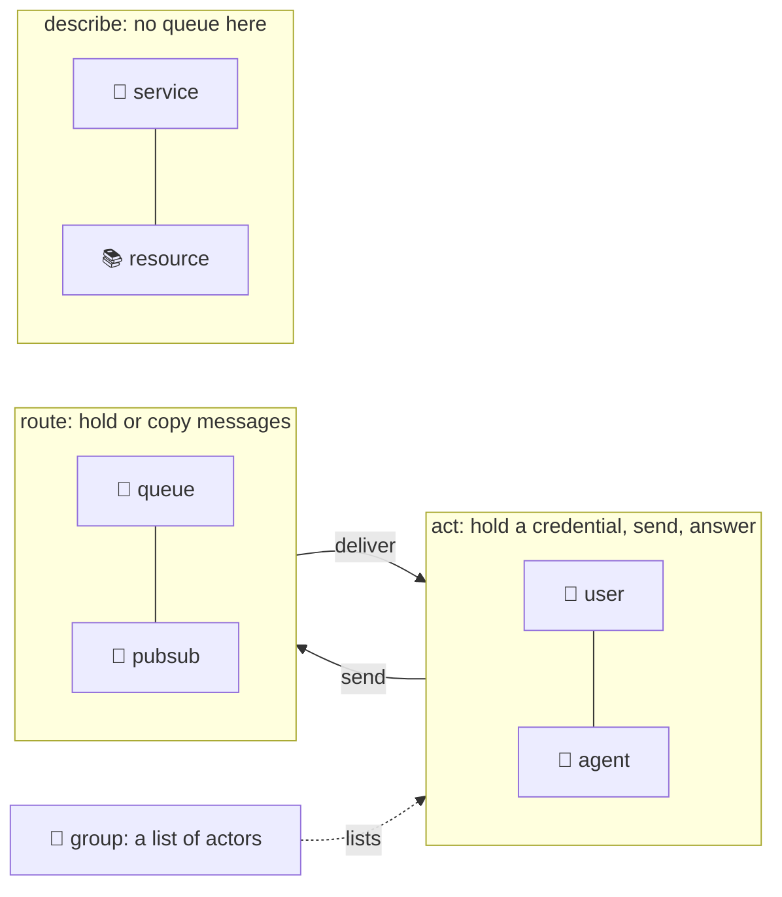

# Records

📌 **TL;DR:** Every registered name is one of seven kinds: 👤 `user`, 👥 `group`,
👾 `agent`, 📮 `queue`, 📣 `pubsub`, 📡 `service` and 📚 `resource`. Four have a
queue here, a group is a named list of actors, a service says where something
external is, and a resource is a card for data an MCP client may read. `kind` is a closed set the daemon answers for, never inferred from
which fields are filled in.

## What a record is

**A record is a name with a job.** Someone to talk to, somewhere to send,
something outside to reach, a card to read, or a list of who — every one of
them is a record, in one registry, and every record answers the same four
questions:

| Question | Field |
|---|---|
| what is it? | `kind` |
| whose is it? | `owner` |
| who may use it? | `allow` |
| who may manage it? | `maintainers` |

And every record comes with its own [locks](01-identity-and-authority.md#shared-locks)
and a durable [key-value store](01-identity-and-authority.md#key-value-store)
for whoever manages it.

```mermaid
flowchart LR
    subgraph Act[act: hold a credential, send, answer]
        U[👤 user] --- A[👾 agent]
    end
    subgraph Route[route: hold or copy messages]
        Q[📮 queue] --- P[📣 pubsub]
    end
    subgraph Describe[describe: no queue here]
        S[📡 service] --- R[📚 resource]
    end
    G[👥 group: a list of actors]
    Act -->|send| Route
    Route -->|deliver| Act
    G -. lists .-> Act
```

## Record kinds

`kind` is a closed set the daemon answers for, never guessed from which fields
are filled in.

| | Kind | What it is |
|---|---|---|
| 👤 | `user` | the inbox a person reads |
| 👥 | `group` | a named list of actors: its `allow` is its [membership](01-identity-and-authority.md#groups) |
| 👾 | `agent` | the inbox an [agent](03-records-agent.md#what-an-agent-is) reads; the bus's working entity |
| 📮 | `queue` | a [channel](03-records-channel.md#the-two-channel-kinds) made to be shared: messages wait for whoever reads it |
| 📣 | `pubsub` | a [channel](03-records-channel.md#the-two-channel-kinds) that keeps nothing and copies each publication to its [Deliver-To list](04-messaging.md#subscribers) |
| 📡 | `service` | a card for something [external](03-records-service.md#what-a-service-is): its address and protocol |
| 📚 | `resource` | a [card](03-records-resource.md#what-a-resource-is) for data an MCP client may read; 🧩 when it is a template |

Only 👤 and 👾 names are acted as — by the person and by the agent; nobody
acts as the other five.

- **People and agents act;** they hold a [credential](02-access.md#what-a-call-carries),
  send under their own name and answer. Channels are passive — they hold or
  copy — and services and resources only describe.
- **Acting is what a name is for,** not a check: a credential can be minted for
  any registered name its owner asks for, and no check consults the kind.
- **The kind does not change who may read a record:** one allow list governs it
  in both directions ([ACL](02-access.md#acl)); splitting it is
  [undecided](../Plans/R2.0-Future/acl-direction.md#where-direction-is-needed).

Who registers each kind

| Kind | Registered by |
|---|---|
| 👤 `user` | the daemon, when the person is registered |
| 👾 `agent` | its launcher, the runner, or the agent itself at start |
| 👥 📮 📣 📡 📚 | a User, or an Agent acting for its Owner |

Registering with no kind stores `service`, the case a bare `register` is
usually for; `--personal` with no kind names an `agent`.

## Fields

The normative rules for each field are the
[constitution's](constitution.md#common-record-fields); this is what each one
means.

### Common fields

Every record carries these.

| Field | Meaning |
|---|---|
| `name` | the identity, globally unique: `name`, `name@realm` or `template/instance@realm`. `#` begins an Agent's and `@` a Group's, so the name says the kind ([names](01-identity-and-authority.md#names)) |
| `kind` | one of the seven; fixed for the record's life |
| `owner` | the owning User, never an Agent, kept by name and by `user_id` ([ownership](01-identity-and-authority.md#ownership)) |
| `descr` | one free-text line `ls`, MCP and the web show; a record's method information goes here ([agent templates](03-records-agent.md#agent-templates)) |
| `status` | `active` or `inactive`. An inactive record is no such entity to anyone but those who may bring it back; it changes by a settings edit, never by registering |
| `personal` | the audience tag that keeps the web pages readable, not a permission; always true on a 👤 ([Personal and shared](#personal-and-shared)) |
| `allow` | who may use it — send to it, read it, see it; on a 👥, its membership ([ACL](02-access.md#acl)). Unused on a 👤 |
| `maintainers` | who may manage it beside the Owner. Unused on a 👤 |
| `created_at`, `at` | when it was made and last changed; the daemon's, never a caller's |

### Kind-specific fields

A field a kind does not carry is refused, never stored and ignored.

| Field | Meaning | Kinds |
|---|---|---|
| `ttl`, `bound`, `overflow` | its inbox's message lifetime, capacity and what a full inbox does ([overflow](04-messaging.md#overflow)) | 👤 👾 📮 |
| `subs` (`deliver_to`) | one forwarding slot, or a 📣's list of recipients ([subscribers](04-messaging.md#subscribers)) | 👾 📮 one, 📣 a list |
| `config`, `secret` | private values: a JSON configuration and an env-file secret, read by the Owner, Maintainers and an Agent its own ([private values](constitution.md#-private-values)) | 👾 📡 👥 |
| `addr`, `protocol` | where something outside is reached and how ([services](03-records-service.md#what-a-service-is)) | 📡 |
| `script` | what `agent-bus start` serves it with; informational ([script agents](08-runner-role.md#script-agents)) | 👾 |
| `roles` | the roles it understands; informational ([roles](03-records-agent.md#roles)) | 👾 |
| `resource` | the MCP card: URI, template flag, source and descriptor ([resources](03-records-resource.md#what-a-resource-is)) | 📚 |

What a listing adds — `reading`, `readers`, `queued`, `in`, `out`, `dropped`,
`expired`, `oldest`, `last_used`, `can_manage`, `route_allowed` — is observed
live and answered, never stored, and a registration stating any of it is
refused ([discovery](05-discovery.md#what-a-listing-answers)).

## How to call it

**Send to the name** for 👤 👾 📮 📣; **call it at its address** for 📡; a 👥 is
named in lists and a 📚 is read through MCP.

How each kind is reached

| Kind | How a caller reaches it |
|---|---|
| 👤 👾 📮 📣 | **send to the name**: the daemon puts the message in its [queue](04-messaging.md#inbox-queues), and whoever reads it takes it |
| 📡 | **call it directly** at its own address ([services § how to call it](03-records-service.md#how-to-call-it)) |
| 👥 📚 | neither: a Group is named in lists, and a resource is read through MCP |

## Pages for each kind

| Kind | Page |
|---|---|
| 👤 user · 👥 group | [identity and authority](01-identity-and-authority.md#identities) |
| 👾 agent | [agents](03-records-agent.md#what-an-agent-is): name, credential, inbox, templates, configuration, how one is started |
| 📮 queue · 📣 pubsub | [channels](03-records-channel.md#the-two-channel-kinds): delivery and what publish stamps |
| 📡 service | [services](03-records-service.md#what-a-service-is): address, protocol, secrets |
| 📚 resource | [resources](03-records-resource.md#what-a-resource-is): the card, its source, listing and reading |

## Personal and shared

**Personal marks a record as its Owner's own** — for the Owner and the Owner's
agents — and keeps it off the main web pages, under each list's Personal
filter. It narrows who its lists may name; it is not a permission and hides
nothing from those already allowed.

The rules

| Rule | Requirement |
|---|---|
| Carried by | every kind; the tag is not a kind ([record kinds](#record-kinds)) |
| 👤 user record | always Personal and cannot be made shared |
| `allow` and `maintainers` | only the Owner, the Owner's own agents by name, and the runtime [`@owner` and `@agent` terms](02-access.md#acl) |
| Refused | another user's agent, an ordinary group, a user entry other than the Owner, and the [wildcard grant](02-access.md#acl) — each an error on every save, at creation and after it |
| Everything else | unaffected: delivery, `deliver_to` and forwarding behave as on a shared record |
| Main web pages | exclude Personal records; each kind's list shows them under its `?personal=1` filter |
| Launchers | the [`ab-*` launchers](08-runner-role.md#session-names) register their session agents Personal, with `@owner` in the ACL |

How the stored classification changes

Only the owner changes Personal. A new registration may state it; an agent
refreshing its metadata preserves the owner's stored choice. A stored record
whose lists reach outside its cohort is
[ignored and reported](constitution.md#persistence-and-loading) at load. A request that
changes Personal and its assignments is checked as one final record, so an
owner can remove sharing while enabling Personal, or disable Personal while
adding sharing, in one operation.

Assignment validity is checked when a record is written, and kept true after
it: removing an allowed agent takes every reference to it in the removal's
commit ([unregistering](01-identity-and-authority.md#unregistering)), and
transferring one to another User takes it off its old Owner's Personal
records in the transfer's commit, since it has left that cohort.

