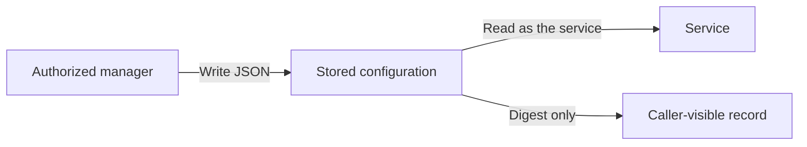
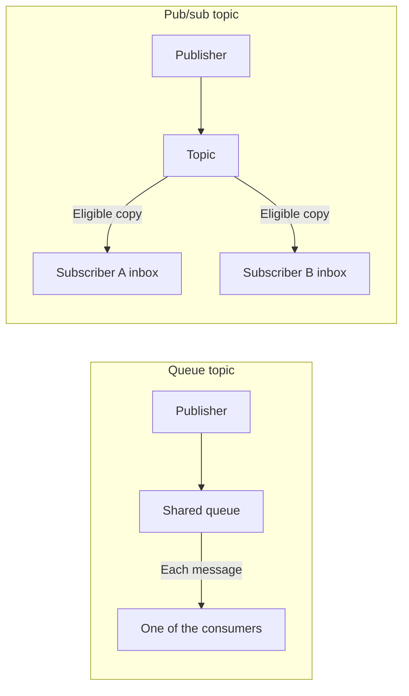

# Services and topics

📌 **TL;DR:** Register services; route messages to inboxes or call external protocols directly.

## Status

| MVP | Scope |
|---|---|
| Built | Registry records, protocol hints, private registry configuration and queue/pubsub topics. A service's method information is its [description](#service-and-template). |
| Pending | [Personal services](#personal-and-shared): owner tagging, restricted ACL entries and dedicated web views. |

## Service kinds

The registry stores agents, generic descriptions and topics. A description may
point to something that knows nothing about the bus. A script service is
registered by its launcher and served by the foreground runner.

Publishing and consuming are operations a principal performs; they do not
require a separate service kind or capability-expression engine.

## How to call it

A registration says **where** something is (`addr`); it also says **how** to
talk to it, and the interesting case is that almost nothing needs to.

| `protocol` | Means |
|---|---|
| **unset** | an ordinary agent-bus service: send to its name and the daemon delivers to its inbox ([messaging § inbox queues](04-messaging.md#inbox-queues)). This is the default because it is the common case |
| anything else | **the caller speaks it directly**, at `addr`. `mysql`, `https`, `amqp` — the bus passes the word along and does nothing with it |

**`/etc/services` is the suggested vocabulary, and only a suggestion.** Use
the name from it where there is one, so two people registering the same kind
of thing write the same word. It is not a checked set and cannot become one:
the file is outdated and incomplete — half of what anyone registers here
(`mcp`, `grpc`, an in-house protocol) is not in it, and refusing those would
make the field useless to the people who need it most.

The value is **stored raw and never interpreted**. The daemon does not implement a
second protocol, does not proxy, and does not refuse a send to a record that
names one: a runner or gateway may well be reading that inbox on the thing's
behalf ([runner § adapters](08-runner-role.md#adapters)). It is a fact in the
registry for whoever is choosing what to call
([discovery § what a listing answers](05-discovery.md#what-a-listing-answers)).

## Personal and shared

An owner may tag their service **Personal**. Without that tag, it is
**non-Personal**. A Personal service's ACL may contain other services only,
never users. **Accepted; implementation pending.**

| Rule | Requirement |
|---|---|
| ACL entries | Only other service identities; a user's backing inbox does not turn that user into a service |
| Sharing with users | Requires making the service non-Personal; a user entry cannot coexist with the Personal tag |
| Broad access | The [wildcard grant](02-access.md#acl) is not valid for a Personal service |
| User's web view | A **Personal Services** tab shows that user's Personal services |
| Daemon owner's web view | **Personal Services** can be viewed per user |

The tag is a classification, not a different service kind. Interaction with
[implicit access](../Plans/MVP/QUESTIONS.md#personal-service-access) still needs
settling before enforcement; this requirement does not yet promise private access.

## Service and template

A service is a configured, addressable name. `service@realm` stands alone;
`template/instance@realm` names a configured instance. The prefix is naming,
not a group or an instruction to fan out. Each complete name has its own
record, inbox and optional configuration. Nothing parses configuration out of
an instance's name.

**A service's method information is its description, and nothing else.** The
record's one free-text field is what `ls` and the MCP catalog show, so a service
whose callers need to know its verbs writes them into that sentence. The MVP has
no method list, no per-method destructive hint and nothing generated from one; a
better representation is proposed in
[R1 method metadata](../Plans/R1/discovery.md#method-metadata).

## Configuring a template

Configuring a service template **is** what produces a configured service. One
verb does it, and reads it back:

| | |
|---|---|
| `cat cfg.json \| agent-bus service-template <template/instance@realm> -` | configure it, JSON on stdin |
| `agent-bus service-template <template/instance@realm> '{"k":"v"}'` | the same, inline |
| `agent-bus service-template <template/instance@realm>` | print that configuration |

The direction is decided by whether a configuration was handed to it, and
setting one answers with its digest rather than with what was set. The verb
is **one hyphenated word** so that it stays a single verb in every face,
including as an MCP tool name
([glossary § names that are enforced](glossary.md#names)).

The service is created if it does not exist, with the defaults a bare
registration gets — configuring is not a second way to describe a service,
only the way to give it one. A standalone `service@realm` takes a configuration
the same way; the template prefix is not what makes one configurable.

| | |
|---|---|
| the configuration | **arbitrary JSON, stored opaque.** The only check is that it *is* JSON — a syntax check, not interpretation. Nothing looks for a server, a user, a mailbox or a credential |
| who may write it | the principals with [record management authority](01-identity-and-roles.md#groups). Unlike a registration, a configuration is not something any caller may overwrite — and registering does not overwrite one either, so a service restarting keeps what it was configured with. A registration carries **neither half**: not the bytes, and not the digest, which is derived from them and would otherwise let anyone claim any setup |
| who may read it | **the service, and nobody else — its owner included.** Setup data goes in and is used; it does not come back out to be looked at |
| what a query gets | **`config_sha`**, a SHA-256 of the stored bytes, on every answer that carries a record — the whole listing, a query for one service (`agent-bus ls <name>`), and the answer to setting one ([why a digest at all](#why-a-digest-at-all)) |
| where the bytes are **not** | anywhere else. No listing carries them, and the one read is the service's own |
| nothing to store | refused: no configuration at all, something that is not JSON, and `null` — which would read back exactly like never having been configured |
| an empty *value* | kept. `{}`, `[]`, `""`, `0` and `false` are configurations; the bus does not judge what is inside |

### Why a digest at all

<details>
<summary>Diagram: configuration goes in; only the service reads it back</summary>



The digest lets a caller compare configurations without reading their contents.
This is an access boundary, not encryption from the daemon.

</details>

**So that anything watching can tell whether a service's setup has been
changed by someone, without ever being shown it.** A configuration cannot be
read back — not even by its owner — so the only other way to answer "is this
still what I set?" would be to hand out the secrets to compare. The digest
answers it without them:

| Asking | How |
|---|---|
| is this service configured? | a `config_sha` is there, or it is not |
| did my write land? | setting one answers with its digest; compare it to the next query |
| has someone changed it since? | the digest moved |
| do these two services hold the same setup? | the digests match |
| is this host's copy the one I shipped? | compare digests across hosts |

A
monitor, a peer, a deploy check or the owner can all hold the digest they
expect and notice the day it differs.

The bus stores **one spelling**: the bytes are compacted, so reformatting a
configuration file is not a change and does not move the digest. That also
means `sha256sum cfg.json` matches only if the file is already compact.

A digest of a short, guessable configuration can be recovered by trying
candidates. The current configuration is plaintext in daemon state, including
the restart snapshot. The caller restrictions are real; secrecy from the daemon
is not claimed.

**A service fetches its own configuration; nothing injects it** — and it is
the only one that can, so this runs as the service, not as its owner. This is
the *registry's* configuration, not the runner's environment, which is the
other thing that word names ([glossary § terms](glossary.md#terms)):

```sh
cfg=$(agent-bus service-template "$AGENT_BUS_NAME")
```

## Topics

A topic is registered like a service and is **first-class** in the same
registry. Two kinds — the Redis model:

| Kind | Delivery | Retention | No subscribers at publish time | Redis analogue |
|---|---|---|---|---|
| **queue** | each message to **one** consumer (competing consumers take turns) | until consumed or **TTL**; bounded; overflow per mode | fine — it waits for its TTL | list + `BRPOP` + `EXPIRE` |
| **pub/sub** | a **copy** to every subscriber, into that subscriber's own inbox ([messaging § subscribers](04-messaging.md#subscribers)) | none of its own — each copy is kept by the inbox it is in | dropped, a no-op | `PUBLISH` / `SUBSCRIBE` |

<details>
<summary>Diagram: one consumer versus subscriber copies</summary>



Each subscriber is checked again at publication. A copy that its inbox refuses
is dropped; other subscribers still receive theirs. With no eligible
subscribers, the pub/sub topic retains nothing.

</details>

A topic **declares its kind, TTL, bound and overflow mode at creation**:

| Aspect | MVP behavior |
|---|---|
| Create and change | [Ownership](01-identity-and-roles.md#ownership) applies |
| Visibility and use | [Audience](05-discovery.md#audience) and the record ACL apply; publication rechecks each subscriber |
| Storage | [Restart persistence](04-messaging.md#durability), with messages in memory |
| Observations | [Listing state](05-discovery.md#what-a-listing-answers) |

Inboxes belong to registered names ([messaging § inbox queues](04-messaging.md#inbox-queues)). Signed records and upstream namespaces are proposed in [R1 registry](../Plans/R1/registry.md#registry-sync) and [federation](../Plans/R1/federation.md#chaining).
