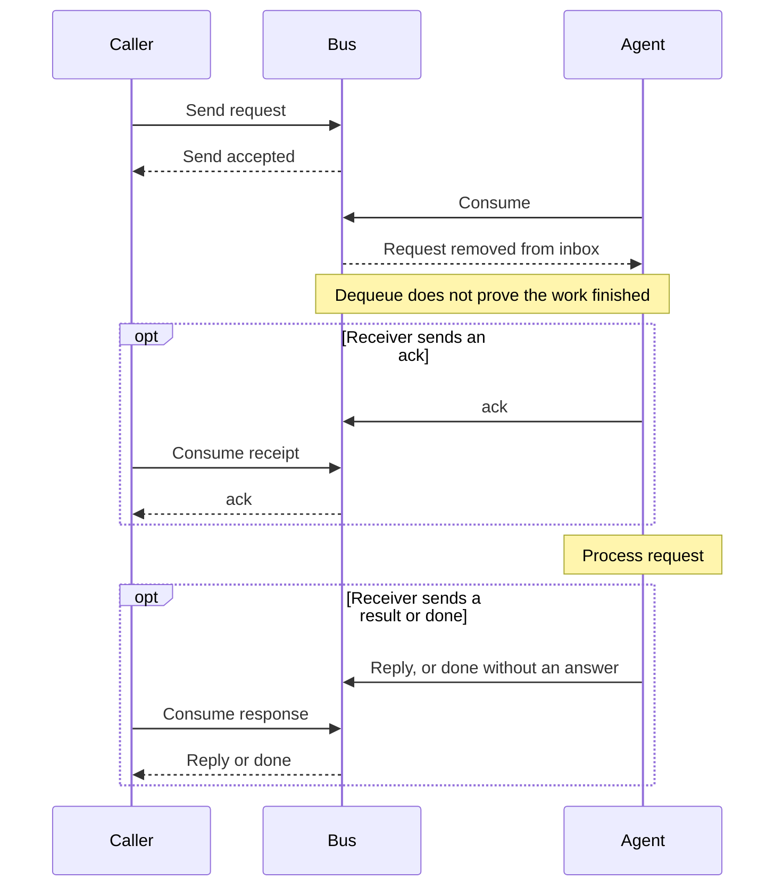

# Messaging

📌 **TL;DR:** Messages wait in bounded inboxes, and dequeue is not completion:
a reader takes a message, does the work, and answers it. The verbs, request
and reply, inbox selection, one reader per inbox, message fields and TTL,
receipts and reply routing are owned here.

<svg viewBox="0 0 760 300" role="img" aria-label="Request and reply circle between a caller and an agent, through their inboxes" style="max-width:760px;width:100%;height:auto;font-family:sans-serif">
  <defs>
    <marker id="arr" viewBox="0 0 10 10" refX="9" refY="5" markerWidth="7" markerHeight="7" orient="auto-start-reverse">
      <path d="M0,0 L10,5 L0,10 z" fill="#475569"/>
    </marker>
  </defs>
  <!-- caller -->
  <rect x="30" y="128" width="110" height="44" rx="6" fill="#ffffff" stroke="#172b3a" stroke-width="1.5"/>
  <text x="85" y="155" text-anchor="middle" font-size="15" font-weight="600" fill="#1a1a17">Caller</text>
  <!-- agent -->
  <rect x="620" y="128" width="110" height="44" rx="6" fill="#ffffff" stroke="#172b3a" stroke-width="1.5"/>
  <text x="675" y="155" text-anchor="middle" font-size="15" font-weight="600" fill="#1a1a17">Agent</text>
  <!-- agent inbox (cylinder) -->
  <path d="M330,44 L330,71 A50,9 0 0 0 430,71 L430,44" fill="#f2f2ee" stroke="#87847b" stroke-width="1.5"/>
  <ellipse cx="380" cy="44" rx="50" ry="9" fill="#f2f2ee" stroke="#87847b" stroke-width="1.5"/>
  <text x="380" y="62" text-anchor="middle" font-size="13" fill="#1a1a17">Agent inbox</text>
  <!-- caller inbox (cylinder) -->
  <path d="M330,234 L330,261 A50,9 0 0 0 430,261 L430,234" fill="#f2f2ee" stroke="#87847b" stroke-width="1.5"/>
  <ellipse cx="380" cy="234" rx="50" ry="9" fill="#f2f2ee" stroke="#87847b" stroke-width="1.5"/>
  <text x="380" y="252" text-anchor="middle" font-size="13" fill="#1a1a17">Caller inbox</text>
  <!-- request: caller -> agent inbox -->
  <path d="M142,126 C205,102 262,64 326,48" fill="none" stroke="#475569" stroke-width="1.5" marker-end="url(#arr)"/>
  <text x="212" y="70" text-anchor="middle" font-size="13" fill="#475569">send request</text>
  <!-- consume: agent inbox -> agent -->
  <path d="M434,48 C498,64 555,102 618,126" fill="none" stroke="#475569" stroke-width="1.5" marker-end="url(#arr)"/>
  <text x="548" y="70" text-anchor="middle" font-size="13" fill="#475569">consume</text>
  <!-- reply: agent -> caller inbox -->
  <path d="M618,174 C555,198 498,236 434,250" fill="none" stroke="#475569" stroke-width="1.5" marker-end="url(#arr)"/>
  <text x="548" y="234" text-anchor="middle" font-size="13" fill="#475569">send reply</text>
  <!-- consume reply: caller inbox -> caller -->
  <path d="M326,250 C262,236 205,198 142,174" fill="none" stroke="#475569" stroke-width="1.5" marker-end="url(#arr)"/>
  <text x="212" y="234" text-anchor="middle" font-size="13" fill="#475569">consume reply</text>
</svg>

A successful request and reply, using the caller's own return address.
Each inbox belongs to a registered name; replies use the same topic and tag.
Taking a message does not prove the work finished—see [receipts](#receipts).

## Status

| MVP | Scope |
|---|---|
| Built | Inbox delivery, [explicit inbox selection](#inbox-selection-and-filters), shared readers, filtered waits, receipts, deadlines, TTL, subscriptions, overflow, the [SQLite store](#durability) and [durable administrative changes](#administrative-crash-recovery). |


How principals on the bus talk. The bus delivers securely and says who sent it;
everything else is the receiver's business.

## Inbox queues

**Every registered agent has its own queue** — an implicit 📮 named
after it, in memory in `agent-busd`, bounded, with a TTL.

**An inbox belongs to a registered name.** Consuming as a name the registry
does not know is refused rather than answered with an empty wait: nothing
could ever arrive in it — `send` refuses an unknown receiver — and creating
one on demand would let any caller name leave an inbox behind for good.

**The address outlives the process**: anyone may `send` to a registered agent
that is down — or one that has never run yet — and the message waits until
something with that name reads it, unless the TTL expires or the queue fills
first. Choose both sensibly. A queue belongs to a **name**, never to a
connection or a session, so nothing is lost because a reader died: that is
the whole difference from an ephemeral channel.

## Verbs

| Verb | Target | Lands in | Allowed if |
|---|---|---|---|
| **`send`** | a known receiver with a queue here, `name@realm` | exactly that queue | you may talk to that principal. A 📡 is refused: it is [external](03-records.md#record-kinds) and has no queue |
| **`publish`** | a channel | **as the channel's kind says** — a 📮 to one consumer and kept until taken; a 📣 to every name on its [Deliver-To list](#subscribers), kept for none ([channels](07-channels.md#the-two-channel-kinds)) | the channel's [access policy](02-access.md#acl) permits the caller — on a 📣 that list is who may publish, and not who receives; delivery-state checks still apply |

**A message is addressed to a name, and a name that is registered nowhere is
refused at `send`** — there is no label to send to and nothing accepts on
behalf of an address that does not exist. Accepting something undeliverable
and reporting the truth later is the failure mode this rules out: what comes
back from `send` is the whole delivery story, and whether anyone *acted* is
the receiver's own `ack` or reply, never the transport's
([receipts](#receipts)).

`consume` defaults to your own queue; see [inbox selection](#inbox-selection-and-filters). Delivery does not report who
received a publish, but the API answers "are there subscribers on this channel,
and who?" to anyone whose access allows the lookup.

## Request and reply

**Built in 0.7.5:** a 👤 User takes a direct send from an Agent exactly when
that Agent's ACL admits the User — whoever may reach an Agent may be answered
by it — and never from another User. The daemon does not recognize replies:
matching stays the sender's topic + tag. A User is not a topic recipient, no forwarding route
may name one, and a User carries no `deliver_to` field of its own
([constitution § Channels](constitution.md#-channels)). This intentionally
ends person-to-person sends: a person reaches another person through an agent.

Calling a name is not a third verb. It is a **`send` whose reply comes back on
the same topic + tag**, and the caller waits for it:

| Side | Does |
|---|---|
| caller | **states its own record** if it has none — an answer needs an address to arrive at ([identity § registration](01-identity-and-roles.md#registration)) — then `send` and wait on its own queue for a message with that topic + tag. A plain `send` does **not** require this: a sender's name is checked for shape, not for registration, so fire-and-forget works from anyone and an answer to an unregistered sender is refused as *no such name*. Wanting a reply is what makes the record necessary |
| receiver | `consume` its inbox, optionally `ack` (got it), do the work, `reply` — and `done` if the sender asked for it |
| deadline | the caller's, and it **travels with the request** so the receiver can give up early — see below. The message's TTL is a different bound, and is what stops a late answer arriving |

The bus adds nothing here — matching is the topic + tag it already carries, the
wait is an ordinary `consume`, and a caller that does not want to wait simply
does not. A receiver may answer twice (`ack` now, result later) or hand the
answer to a third party with `reply-to`.

**The caller's deadline travels.** A request states how long its caller will
wait, and the bus turns that into a moment on the envelope the receiver
consumes. A receiver that sees the moment already past **does not do the
work**: nobody is waiting for it. Without the field the two parties time out
independently and the work is done for a caller who has gone.

It is a second pair beside the TTL, not a spelling of it, and the difference
is what each one belongs to:

| | Belongs to | Bounded by the queue | The bus acts on it |
|---|---|---|---|
| **TTL** ([message ttl](#message-ttl)) | the message | yes — the receiver owns its retention | yes: it stops delivering |
| **deadline** | the caller | no — it is not the receiver's to shorten | no: it only carries it |

So a message whose caller has gone is **still delivered**. Only the receiver
knows whether the work is worth doing for somebody else — a third party on
`reply-to`, a cache, an audit — and the bus does not guess. What the bus does
guarantee is that the moment is its own: the caller states a **duration** and
never an instant, so the receiver is not reading the caller's clock.

## Inbox selection and filters

**Built in 0.5.52.** `--inbox` selects where to read;
`--topic` and `--tag` select messages there, each on its own field: `--topic`
alone takes any tag. Without `--inbox`, read your own
inbox. Filters never select a different inbox, regardless of their spelling
or whether a matching channel exists. Selecting an inbox does not change the
caller's identity or bypass its access checks.

```sh
agent-bus consume --inbox jobs@host
agent-bus consume --topic MyTopic
agent-bus consume --topic MyTopic --tag result
agent-bus consume --inbox jobs@host --topic MyTopic --tag result
```

<details>
<summary>Options and migration</summary>

| Option | Meaning |
|---|---|
| `--inbox NAME` | Explicit inbox; omitted means the caller's own |
| `--topic TOPIC` | Message-topic filter, never an inbox address |
| `--tag TAG` | Message-tag filter; does not change the selected inbox |

Each option requires a value when present. Reading without filters takes the
next message from the selected inbox. “Own inbox” refers to the caller's
identity, not the record's Personal classification.

Before 0.5.52, a `topic` without a tag could implicitly select a registered
channel's inbox. Such callers must now select it explicitly. An address-shaped
topic is an ordinary filter value: if it matches nothing, the wait ends empty.

</details>

## One reader per inbox

A typical agent must read its whole inbox, without a topic/tag filter.
Filtered waits serve specific exchanges; they do not replace that agent's
general reader. The web's [Readers count](05-discovery.md#readers) shows all
outstanding reads together.

**An inbox has exactly one reader.** A session runs a push adapter, an MCP
face and possibly a CLI, and all three would otherwise `consume` the same
queue and take each other's messages — a waiting `call` losing its reply to
the notifier, or the reverse.

| Rule | Why |
|---|---|
| **one outstanding unfiltered read** at a time — a second is **refused**, not queued behind the first, unless both asked to share ([several readers](#several-readers-may-wait-when-they-say-so)) | a silent second reader looks exactly like message loss |
| by convention, one *designated* process does that reading for a principal | the bus enforces the outstanding read, not process ownership; claiming otherwise would need a lease nothing here wants |
| a waiter passes a **topic + tag filter** to `consume`, and the daemon hands it a match ahead of the unfiltered reader | the match happens where the message already is: no dispatcher in a client, and no local protocol between a Go CLI and a TypeScript session process |

**Reading a channel's inbox is not filtering.** A 📮 channel is a named inbox;
[inbox selection and filters](#inbox-selection-and-filters) define which queue
is read and which messages are selected.

The filter is how a wait coexists with a live session's reader — it is an
ordinary `consume`, so every client language gets it for free, and the daemon
hands it its match first. It is a **priority, not a lease**: it wins only
while the wait is outstanding, and a wait ends at one message. A receipt is a
message, so between the `ack` and the wait that follows it the unfiltered
reader can take the reply.

### Several readers may wait when they say so

The rule above exists for an *accidental* second reader, and a worker pool is
not one — so **the pool says so**. A reader that asks to **share** the inbox
is one of several, and any number of those may block on one empty inbox at
once; the first message wakes one of them.

| | |
|---|---|
| how the daemon tells the two apart | it is asked. A pool passes one word; an accident cannot pass it by accident |
| a reader that does not ask | keeps the whole old guarantee, **in both directions**: it is refused beside a pool, and a pool member is refused beside it. Wanting the inbox to yourself is still something you get |
| what this does not change | competing consumers, which already worked — while there is a backlog, N readers take turns and no message goes to two of them ([channels](07-channels.md#the-two-channel-kinds)). What sharing adds is the **empty** inbox, which is a pool's steady state |
| what it deliberately is not | a lease, a group or a registration. Nothing is remembered between reads, so a worker that dies leaves nothing behind to clean up |

So the guarantee is stated precisely: **filtered and unfiltered readers on
one inbox are allowed, and a synchronous `call` on such an inbox is not
guaranteed its own answer.** A caller that needs the answer — a CLI beside a
pushing session, say — uses **a name of its own**, which costs one record and
no machinery. Making the wait exclusive for the length of an exchange would
mean a reservation in the daemon, and the daemon keeps no exchange state
([reply routing](#reply-routing)).

**`consume` is at-most-once**: the message is handed over and gone. A reader
that dies between taking a message and acting on it loses that message, and
that is the accepted cost — it keeps `ack` an optional business receipt rather
than a dequeue contract, and keeps the daemon from tracking in-flight state
for every reader.

## Message fields

Every message carries:

| Field | Meaning |
|---|---|
| **`message_id`** | unique within its channel, assigned by `agent-busd`; what dedup, "did you get it?" and the dashboard refer to |
| **`topic`** | the conversation id, e.g. one A→B exchange |
| **`tag`** | the sender's label for this message |

A asks B three questions with three tags; B's answers carry the same tags, so A
matches them. **A tag is unique to its exchange** — that is what makes the
match sound, and why `call` generates one rather than reusing a label.

## Receipts

Transport delivery and the receiver's report are separate steps.

<details>
<summary>Diagram: delivery, receipt and completion</summary>



Example with successful delivery and no `reply-to` override. Receipts are
ordinary messages from the receiver; their absence leaves the outcome unknown.

</details>

Optional, and **both emitted by the receiver**, not the bus:

| Receipt | Means |
|---|---|
| **`ack`** | the receiver **got** the message |
| **`done`** | the receiver **finished processing** it |

Together they are what a sender actually wants to know — **`ack`: received.
`done`: the work finished** — and both can only come from the receiver,
because nothing else knows. That is why the bus keeps no delivery journal of
its own: an observation made anywhere but the receiver is about the
transport, and a correlated message from the receiver is both simpler and
worth more.

Read them for exactly what they say. `ack` means the message reached the
receiver, **not** that the work started: a script service acks before it runs
the script ([runner § script agents](08-runner-role.md#script-agents)).
And **no receipt means unknown** — the request, the work or the receipt may
be late or lost — never proof of loss. Receipts remove a layer of guessing,
not the uncertainty itself.

**`done` ends a caller's wait.** A receiver that replies has plainly finished,
so it sends no `done`; therefore a `done` that does arrive says *finished, and
no answer is coming*. A caller blocked on the answer stops there rather than
sitting out its deadline for something that will never be sent — and says
which of the two happened, because "finished with nothing to return" and "no
answer in time" are different outcomes. `ack` ends nothing: it says the message
arrived, not that the work stopped.

Both are ordinary messages to the sender's queue (or its `reply-to`), carrying
the original `message_id`, topic and tag. The field is a **closed set** — one
of those two words — because a caller tells an answer from a receipt by
reading it, and a third value would read as an answer. Neither is required; a sender that
wants them asks. A **reply carries the answer** and says nothing by itself
about either.

## Message TTL

Optional, and shorter than the channel's — asking for longer is not an error,
it simply is not kept that long, because the receiver owns its retention the
same way it owns its [overflow](#overflow). When it expires undelivered the
message is dropped from the queue and **counted apart from overflow**, never
handed to a consumer. A question nobody should answer late sets one.

Two counters, because they are two problems: a queue too small for its
traffic, and a message nobody wanted by the time it arrived. One number
cannot tell an operator which they have.

## Reply routing

To the sender's queue with the same topic + tag — unless the request sets
`reply-to: {name, topic, tag}`.

**A request that expects a reply needs a reply address that exists.** The
route is the requester's own name plus the exchange's topic and tag, or an
explicit `reply-to` naming another; either way the destination is a
**registered name**, checked when the request is accepted rather than
discovered when the answer bounces. Registered is not the same as *live* —
the name owns a queue and its reader may be offline, which is the point of
name-owned queues ([inbox queues](#inbox-queues)). A plain `send` or
`publish` stays open to unregistered senders: fire-and-forget asks for
nothing back.

**The daemon keeps no reply state.** A reply is an ordinary `send` carrying
the routing fields, and `reply <message-id>` is sugar: the client that
consumed the message still has its envelope, so it fills in receiver, topic and
tag itself. The daemon stays simple — nothing to bound, expire or reconcile —
and the rule that a consumed message is gone stays true.

The consequence: **you can only `reply` from a client that
holds the routing context of what was consumed** — the receiver, topic and
tag. Whether that is one process is up to the client: the MCP face keeps it in
memory, and the CLI writes it where its next invocation finds it, so `consume`
and `reply` work as two commands. Since an inbox has exactly one reader, the
context has one owner either way.

## Push and pull

**Consumers pull** through the consume API. The current daemon does not push
to a registered callback address. Agent sessions receive pushes from their
client-side adapters — see
[runner § adapters](08-runner-role.md#adapters).

### Subscribers

The rules below describe built delivery, including
[PubSub routing](constitution.md#pubsub-routing): routing counters, partial-delivery
warnings and the refusal of a publication no recipient takes (0.7.12).

**A 📣 topic carries two lists, and they answer different questions.** Its
[ACL](02-access.md#acl) says who may **publish** to it. Its **Deliver-To list**
says who **receives a copy** — and the copy lands in that name's own inbox, so
a publication is one copy per recipient and the topic itself keeps nothing.

Neither list stands in for the other. A name on Deliver-To receives whether or
not it may publish, and a name the ACL admits receives nothing until whoever
manages the channel puts it on Deliver-To. Both live on the record, so both
survive a restart with the rest of the registry ([durability](#durability)),
and a recipient that is down keeps its backlog exactly like any other name
([inbox queues](#inbox-queues)). That is the whole reason to put the copy in
an inbox rather than hand it to whoever is connected.

| | |
|---|---|
| who writes Deliver-To | whoever **manages** the channel — its owner or a Maintainer ([record authority](01-identity-and-roles.md#record-authority)) — at registration and afterwards. Delivery is granted, never taken |
| who may be on it | 👾 **agents**, `@group` terms, 📮 **queues** — the copy lands in the queue's inbox — and 📣 **topics**, a further publication one forwarding step on, at most ten; two topics listing each other end with that error. A 👤 user and a 📡 service are refused for their kind, and a name with no record as unknown. Built in 0.7.11 ([constitution § Channels](constitution.md#-channels)) |
| an 👾 or 📮's own `deliver_to` | **one slot**: an agent, a queue or a pubsub, never a group. Built in 0.7.12: a message sent to the source **moves** there, keeping its sender and gaining `original_to` and a forward counter, and the source keeps no copy and counts nothing. The destination's ACL must list the source record itself, when the route is stored and again at delivery — neither the sender's nor the source Owner's access stands in — and its bound, TTL and overflow decide, a refusal answering the sender with nothing stored. A revoked grant refuses delivery and keeps the route; a listing's `route_allowed` says which ([constitution § Channels](constitution.md#-channels)) |
| the topic's own counters | routing, not depth: `in` once per publication at least one recipient took, `out` once per accepted copy and never again when it is read. A publication to an empty list is refused and counted nowhere ([PubSub routing](constitution.md#pubsub-routing)) |
| `@group` | allowed, and **expanded at publication**, nested groups included, each name once. Membership therefore decides delivery when the publish happens, not when the list was written |
| taking **yourself** off | always allowed, because it is your inbox that fills. Putting yourself back on is the manager's call |
| checked again at **every publish** | that the recipient still exists, is on the bus and is **active**. Built in 0.7.9: an inactive recipient — itself or through its User — is a failed recipient: its copy is discarded, counted as its `dropped` and written to the error log naming topic and recipient, while the publication succeeds for the others ([constitution](constitution.md#common-record-fields)). A copy its bound refuses is a failed recipient the same way |
| **no** recipient takes it | the publication is refused before anything is stored or counted, with an error-log warning; the caller is told why the first recipient failed. A topic whose list is empty refuses a publication the same way |
| whose bound, TTL and overflow apply | the **recipient's**, because the copy is in the recipient's inbox |
| a recipient that will not read | loses its own copies and **stops nothing**: the publish still succeeds for everyone else, and the copy that would not fit is counted as a drop ([overflow](#overflow)). A publisher one stopped reader can block is a queue topic, which is the other kind and is what that caller wanted |

## Overflow

Declared per topic at creation, inboxes included:

| Mode | Full queue | For |
|---|---|---|
| **strict** (default) | **reject the send/publish** with an error to the producer | anything that is work: losing one silently is worse than failing loudly, so this is what you get unless you ask otherwise |
| **ring** | drop the **oldest**, and count it in stats (the same count an [inactive recipient](#subscribers) adds to) | alerts, telemetry, progress — the newest matters most and a gap is not a bug |

**A rejected send answers `429`.** A full queue is the sender outrunning the
reader, which is what that code is for — and deliberately not `503`, which
would say the record itself is unavailable and is left to mean only that
([R1.1 declared state](../Plans/R1.1/records.md#coming-back-in-a-moment-is-not-one-of-them)).
It is counted as `full` either way ([refusals](05-discovery.md#refusals)).

Declared on the record, so it is a property of the **receiver**, not of the
sender or the message: whoever owns the queue decides what its fullness
means. The count of what a ring has dropped is in `status`, because a queue
that forgets silently looks exactly like one nobody sent to.

Agent and Queue records forward through their one-slot `deliver_to`
([subscribers](#subscribers)) under the kind-specific
[channel contract](constitution.md#-channels), which owns forwarding ACL
checks, depth and provenance.

## Durability

**Built in 0.7.1:** one SQLite database is the runtime store for records,
users, groups, the daemon Owner, the local-account map, credentials, queue
contents, the four per-queue counters and, from 0.8.12, each record's
[day of activity](05-discovery.md#activity-history) ([storage](09-setup.md#storage)).
A management change commits immediately, and only the entities it touched.
Traffic updates queues in memory; queue state is flushed as one batch every
minute (`-flush-every`) and at a graceful stop, never once per message, and a
flush writes only the queues whose counters moved. Delivery checks message
expiry after reload, and a drained inbox stays drained.

The store records whether the last stop was clean. A start after an unclean
stop reports the potential gap since the last flush: traffic after it may be
lost. A consumer being offline is different, because its queue remains in the
running daemon. Uptime and browser sessions describe the current process
lifetime, not recovered state.

The daemon takes SQLite's exclusive lock when it opens the database, so a
second daemon on the same file cannot serve. A missing database is created only
by `agent-busd -init` or `-create`, never silently at start; an unreadable,
damaged or incompatible one refuses the start. A queue whose durable record is
absent, ignored or cannot hold one is ignored and reported under the
[incorrect-record rule](constitution.md#persistence-and-loading), and stays in
the database. A record later registered under that name starts with no stored
queue: its first commit drops the old one, so its messages never reach a new
owner.

## Administrative crash recovery

**An acknowledged restriction survives a bus crash until explicitly changed.**
Bans, group membership and ACL changes are committed before success is
returned; a queue flush writes queue state only and cannot overwrite them.

<details>
<summary>Persistence, failures and scope</summary>

**Built in 0.7.1.** A management write is staged under the node lock, which
every reader also takes, committed to SQLite as one transaction, and only then
answered; the transaction holds exactly the entities the write touched. If the
commit fails, every staged entity is put back from the write's undo log, so the
error is the whole outcome: nothing was published, in memory or on disk. A write
that fails validation part-way is put back the same way. Correct the storage
failure and retry.

This covers user/profile state, groups, the daemon Owner, the account map,
record management and refreshes, configuration, subscriptions and record
removal, which drops the removed name's queue in the same transaction.
Individual message acknowledgements retain the
[queue durability boundary](#durability).

Publication is the lock being released, so it cannot fail after a commit
([publication rule](constitution.md#persistence-and-loading)).

Browser sessions remain process-local; after restart, callers sign in again.
Persistent tokens and mapped sockets are checked against the recovered policy.
The [H.5.3 evidence](../Plans/MVP/done/administrative-durability.md#checks) covers
real bus-child kills, storage failure and the old-checkpoint ordering hazard.
It does not certify every filesystem or simulate hardware power loss.

</details>

## Envelope

Bodies travel as plaintext strings in the current JSON envelope. The daemon
carries them without interpreting their application meaning. It stamps the
sender from the credential and rejects a caller's attempt to choose another.
There is no built delegation field or negotiated binary encoding.

The [protocol source](../src/internal/protocol/envelope.go) owns the implemented
fields. The dashboard receives a separate feed with bodies removed in the bus;
this does not encrypt queued bodies or snapshots.
