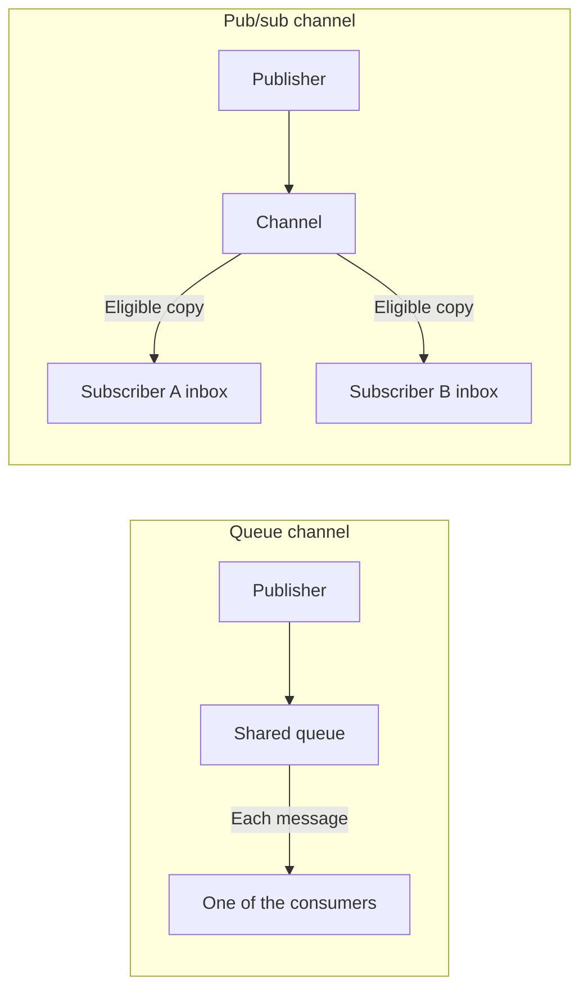

# Channels

📌 **TL;DR:** Two of the five record kinds are channels: 📮 hands each message
to one consumer, 📣 copies each publication to every subscriber. A channel is
the record; a topic is only a label carried on one message. What a channel
declares and what publishing puts on the message are owned here.

## Status

| MVP | Scope |
|---|---|
| Built | [The two channel kinds](#the-two-channel-kinds), [what a channel declares](#what-a-channel-declares), [what publish puts on the message](#what-publish-puts-on-the-message) and their listing observations. |
| Pending | 0.7 [PubSub routing](constitution.md#pubsub-routing); the tables below describe built behavior. |

## Channel, not topic

**A channel is the record; a topic is a label on one message.** They were the
same word until 0.6.7, and one word cannot be both: `send --topic t` labels a
message inside an exchange, while the thing published *to* is a record with an
owner, an ACL and a queue.

| | Is | Spelled |
|---|---|---|
| **Channel** | a 📮 or 📣 [record](03-records.md#five-record-kinds) | `channel create`, `publish --channel`, `subscribe <channel>`, and `channel` on the wire |
| **Topic** | a label on one [envelope](04-messaging.md#envelope), matched by a filtered read | `send --topic`, `consume --topic`, `reply --topic`, and `topic` on the wire |

The old spellings are not kept as aliases: before 1.1 there is no compatibility
obligation, and a second name for one thing is a second thing to explain.

## The two channel kinds

A channel is registered like any other record and is **first-class** in the
same registry. Two of the [five kinds](03-records.md#five-record-kinds) are
channels — the Redis model:

| Kind | Delivery | Retention | No subscribers at publish time | Redis analogue |
|---|---|---|---|---|
| 📮 **queue** | each message to **one** consumer (competing consumers take turns) | until consumed or **TTL**; bounded; overflow per its policy | fine — it waits for its TTL | list + `BRPOP` + `EXPIRE` |
| 📣 **pub/sub** | a **copy** to every name on its Deliver-To list, into that name's own inbox ([messaging § subscribers](04-messaging.md#subscribers)) | none of its own — each copy is kept by the inbox it is in | dropped, a no-op | `PUBLISH` / `SUBSCRIBE` |

<details>
<summary>Diagram: one consumer versus subscriber copies</summary>



Each recipient is checked again at publication, and `@group` entries are
expanded then. A copy that an inbox refuses is dropped; the other recipients
still receive theirs. With no eligible recipients, the 📣 channel retains
nothing.

</details>

## What a channel declares

A channel **declares its kind at creation** — a 📮 its TTL, bound and overflow
policy, a 📣 its [Deliver-To list](04-messaging.md#subscribers):

| Aspect | MVP behavior |
|---|---|
| Create and change | [Ownership](01-identity-and-roles.md#ownership) applies |
| Visibility and use | [Audience](05-discovery.md#audience) and the record ACL apply — on a 📣 the ACL is who may publish, and delivery follows its [Deliver-To list](04-messaging.md#subscribers) |
| Storage | [Restart persistence](04-messaging.md#durability), with messages in memory |
| Observations | [Listing state](05-discovery.md#what-a-listing-answers) |

Inboxes belong to registered names ([messaging § inbox queues](04-messaging.md#inbox-queues)). Signed records and upstream namespaces are proposed in [R1 registry](../Plans/R1/registry.md#registry-sync) and [federation](../Plans/R1/federation.md#chaining).

## What publish puts on the message

`publish` stamps the **channel's own name as the message's topic**, so the two
words meet on one envelope exactly once and deliberately:

```sh
agent-bus publish --channel alerts@srv1 "disk nearly full"
#   To:    alerts@srv1     the channel it went to
#   Topic: alerts@srv1     the label it carries
```

A subscriber can then pick out copies that came from that channel with a
filtered read, `consume --topic alerts@srv1`, without needing a second field.
Nothing else fills the topic in for a publication, and an ordinary `send` never
does it at all.
